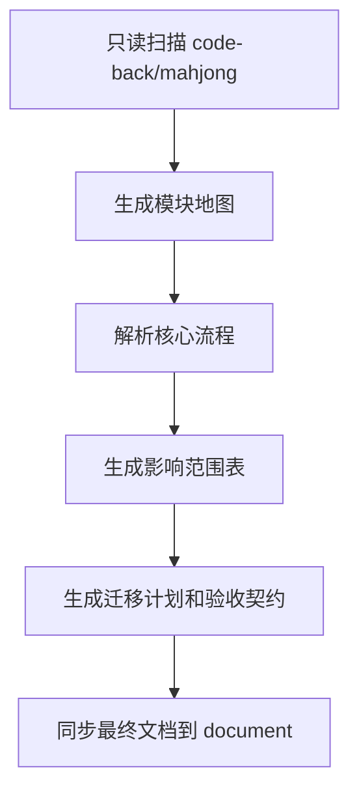

# Mahjong Project Parse 开发版

**版本**: v1
**完整 PRD**: output/PRD详细版.md
**阅读时长**: 30 分钟
**目的**: 让程序员或 Coding Agent 能据此继续做设计、TDD 和后续实现

## 1. 项目一句话

Mahjong Project Parse = 把已有 Go 麻将后端项目解析为文档、影响范围表、迁移计划和验收契约的内部工程链路。

## 2. 用户故事

- **US-1（必做）**: 作为 lei，我希望看到入口、包结构和模块地图，以便快速建立源码全局认知。
- **US-2（必做）**: 作为 lei，我希望看到房间、用户、牌局等核心流程，以便能讲清麻将后端如何运转。
- **US-3（必做）**: 作为 he，我希望看到新需求影响范围表，以便判断需求会影响哪些模块。
- **US-4（必做）**: 作为 he，我希望看到验收契约，以便知道第一版解析怎么算完成。
- **US-5（必做）**: 作为 Coding Agent，我希望有稳定 PRD 和验收入口，以便继续设计、TDD 和开发。

## 3. 功能需求

| FR ID | 功能 | 一句话 | 关键边界 |
|---|---|---|---|
| FR-1 | 项目画像 | 解析目录、文件、规模和项目形态 | 只读源码，不改业务代码 |
| FR-2 | 模块地图 | 梳理入口、包、文件族和职责 | 结论需回指源码 |
| FR-3 | 核心流程 | 解析房间、用户、牌局、RPC、匹配和异常/恢复 | 覆盖核心流程，不逐行翻译 |
| FR-4 | 影响范围表 | 建立需求到模块和流程的映射 | 支持 he 提需求 |
| FR-5 | 文档同步 | 将链路产物沉淀到 `document/` | 中间草稿不混入最终文档 |
| FR-6 | 轻量脚本 | 提供扫描或索引辅助 | 不做复杂自动化 |
| FR-7 | 验收契约 | 定义完成门禁 | 供 TDD master 和后续 Coding Agent 使用 |

## 4. 核心算法 / 目标函数

本项目无业务算法，核心目标函数是：

```text
第一版价值 = 源码可理解度 + 需求影响可判断度 + 交付可验收度 - 业务代码误改风险
```

## 5. 数据模型

### 5.1 核心实体

| 实体 | 字段（简） | 关系 |
|---|---|---|
| ProjectProfile | 名称、目录、语言、规模 | 产生模块地图 |
| ModuleMap | 模块、文件族、职责、依赖 | 支撑核心流程 |
| CoreFlow | 流程名、涉及模块、关键状态 | 支撑影响范围表 |
| ImpactMatrix | 需求类型、影响模块、验收点 | 支撑后续需求 |
| AcceptanceContract | 完成定义、检查清单、门禁 | 支撑 TDD |

### 5.2 关键约束

- 所有结论以本地源码和用户确认作为依据。
- 文档产物和最终项目文档分目录管理。
- 第一版不修改业务代码。

## 6. 关键流程



## 7. 验收标准

| AC ID | 场景 | 自动化优先级 |
|---|---|---|
| AC-1 | 项目画像可读 | 高 |
| AC-2 | 模块地图可追溯 | 高 |
| AC-3 | 核心流程覆盖完整 | 高 |
| AC-4 | 影响范围表能支持新需求 | 高 |
| AC-5 | 验收契约齐全 | 高 |
| AC-6 | 脚本不改业务代码 | 高 |

## 8. 技术栈建议

- **后端源码**: 保持现有 Go 项目不动。
- **文档**: Markdown。
- **脚本**: Shell 优先，必要时再补 Go 或 Python，但第一版保持轻量。
- **测试与门禁**: 由 tdd-master 后续生成分层测试设计和验收契约。

## 9. 工时预估

| 模块 | 工时 | 优先级 |
|---|---|---|
| 项目画像 | 小 | 必做 |
| 模块地图 | 中 | 必做 |
| 核心流程 | 大 | 必做 |
| 影响范围表 | 中 | 必做 |
| 轻量脚本 | 小 | 应做 |
| 验收契约 | 中 | 必做 |

## 10. 给 AI 编码助手的 5 个开工提示

1. 第一阶段只读 `code-back/mahjong`，不要改业务代码。
2. 先生成项目画像和模块地图，再深入核心流程。
3. 所有关键结论都要标注来源文件。
4. 影响范围表要服务 he 后续提需求。
5. 验收按完整 PRD §10 和后续 TDD 契约执行。

## 11. 详细补充

完整阶段路线图见 `PRD详细版.md` §0。
完整功能需求见 `PRD详细版.md` §5。
完整验收标准见 `PRD详细版.md` §10。
