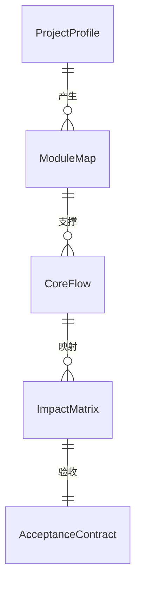
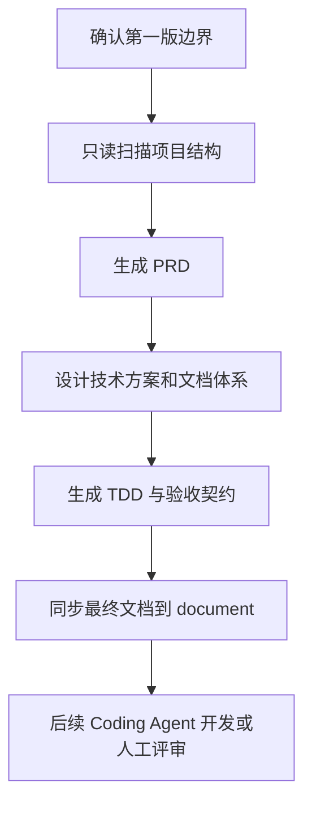
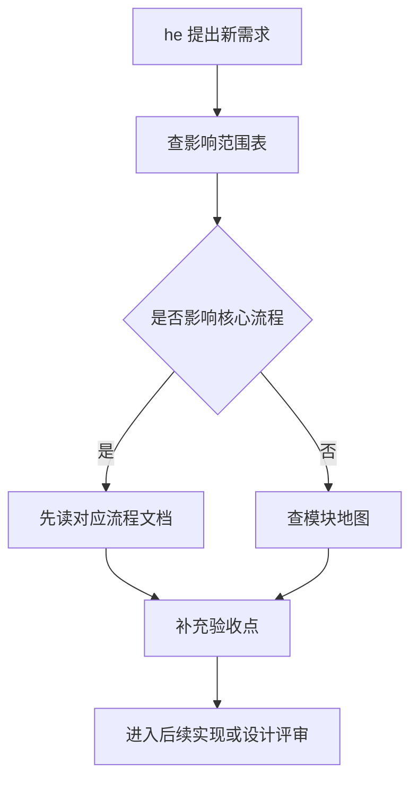

# Mahjong Project Parse PRD
## 0. 阶段路线图与 MVP 定义

### 0.1 阶段路线图

| 阶段 | 验证目标 | 功能模块 | 交付物 |
|---|---|---|---|
| 阶段一 MVP | 先把 `code-back/mahjong` 解析成可学习、可协作、可验收的知识包 | F1 项目画像、F2 模块地图、F3 核心流程、F4 影响范围、F5 文档同步、F6 轻量脚本、F7 验收契约 | PRD、项目解析文档、迁移计划、脚本、验收契约 |
| 阶段二 | 基于解析结果决定是否重构、迁移或补前端 | 代码迁移建议、前端调试界面、测试落地 | 技术方案、页面文档、TDD 文档 |
| 阶段三 | 进入实际代码实现和持续迭代 | 需求实现、测试补齐、文档持续维护 | 可执行代码、测试报告、更新后的文档 |

### 0.2 MVP 完成定义

完成 F1、F2、F3、F4、F5、F6、F7 即第一版 MVP 完成。

### 0.3 功能清单

| 功能 ID | 功能名称 | 所属阶段 | 完成标准 |
|---|---|---|---|
| F1 | 项目画像与目录结构解析 | 阶段一 MVP | 能说明项目形态、目录结构、文件分布和代码规模 |
| F2 | 模块地图 | 阶段一 MVP | 能说明入口、包结构、模块职责和依赖关系 |
| F3 | 核心流程解析 | 阶段一 MVP | 覆盖房间、用户、牌局、RPC、匹配、异常/恢复 |
| F4 | 新需求影响范围表 | 阶段一 MVP | he 能据此判断新需求可能影响哪些模块和流程 |
| F5 | 文档同步策略 | 阶段一 MVP | 链路产物能沉淀到 `document/`，关键决策能记录到 `command/` |
| F6 | 轻量扫描/索引脚本 | 阶段一 MVP | 脚本能辅助检查文件清单、模块索引或文档同步状态 |
| F7 | 验收契约 | 阶段一 MVP | 文档完整性、源码引用、影响范围表和门禁清单齐全 |

## 1. 项目背景与收益

### 1.1 背景

当前仓库已有 `code-back/mahjong`，其文件清单显示这是一个 Go 后端或 Go 后端子模块，核心代码集中在 `engine/`，包含房间、用户、牌、匹配、RPC、任务、异常恢复等方向的文件。

团队当前的协作方式是 lei 负责搭建项目、提取设计方案和学习源代码，he 负责提出新需求并推动项目更新。第一版最重要的事情不是直接改代码，而是让双方对已有麻将项目形成共同地图。

### 1.2 痛点

- 源代码已有，但缺少系统化项目文档。
- 后续提需求时，难以快速判断影响哪些模块、流程和验收点。
- 如果直接改业务代码，容易在没有共同理解的情况下放大风险。
- 当前目录中 `code-front/`、`command/`、`document/`、`script/` 已存在，但职责和产物关系需要明确。

### 1.3 收益

- lei 能用文档讲清项目结构、模块职责和搭建路径。
- he 能用影响范围表提出更清晰的新需求。
- 后续 design-master、tdd-master 和 Coding Agent 能以 PRD 和验收契约为入口继续工作。
- 原始业务代码在第一版保持不动，降低误改风险。

## 2. 用户画像与用户故事

### 2.1 用户角色

| 角色 | 主要目标 | 关心内容 | 不是谁 |
|---|---|---|---|
| lei | 搭建项目、理解源码、提取设计方案 | 目录结构、模块职责、核心流程、运行与依赖、后续开发路径 | 不是只看结果的业务方 |
| he | 提新需求并推动项目更新 | 需求影响范围、功能边界、验收标准、风险点 | 不是直接逐行读源码的人 |
| Coding Agent | 后续执行设计、测试和代码实现 | PRD、技术方案、测试契约、完成定义 | 不是产品拍板者 |

### 2.2 业务目标

- 让第一版交付从“凭感觉完成”变成“按文档完整性、源码引用、影响范围表和验收契约完成”。
- 降低直接修改业务代码前的误判风险，让后续设计、TDD 和开发建立在共同理解上。
- 让 `output/`、`document/`、`command/`、`script/` 的职责清晰，减少文档和代码资产混乱。

### 2.3 用户目标

- lei 能按文档讲清源码结构、模块职责、核心流程和搭建路径。
- he 能按影响范围表提出新需求，并判断新需求可能影响哪些模块、流程和验收点。
- 后续 Coding Agent 能读取 PRD、设计方案和验收契约继续执行。

### 2.4 用户故事

- US-1：作为 lei，我希望看到项目入口、包结构和模块地图，以便快速建立源码全局认知。由 FR-1、FR-2 实现。
- US-2：作为 lei，我希望看到房间、用户、牌局等核心流程的说明，以便能向他人讲清麻将后端如何运转。由 FR-3 实现。
- US-3：作为 he，我希望看到新需求影响范围表，以便提出需求时知道可能影响哪些模块。由 FR-4 实现。
- US-4：作为 he，我希望看到验收契约，以便知道第一版解析工作怎么算完成。由 FR-7 实现。
- US-5：作为后续 Coding Agent，我希望有稳定的 PRD 和验收入口，以便继续生成设计方案、TDD 文档和实现任务。由 FR-5、FR-6、FR-7 实现。

## 3. 核心目标函数

本项目不包含业务算法优化目标，核心目标是降低后续协作和开发的不确定性。

```text
第一版价值 = 源码可理解度 + 需求影响可判断度 + 交付可验收度 - 业务代码误改风险
```

约束：

- 不直接修改 `code-back/mahjong` 业务代码。
- 所有关键结论必须能回指到源码文件、目录或已确认的用户决策。
- 文档必须服务 lei 和 he 的真实协作方式。

## 4. 数据需求与文档模型

### 4.1 核心文档实体

| 实体 | 含义 | 主要来源 |
|---|---|---|
| 项目画像 | 项目形态、目录结构、文件规模、语言和模块分布 | 本地文件清单 |
| 模块地图 | 入口、包、模块职责、依赖关系 | `code-back/mahjong` |
| 核心流程 | 房间、用户、牌局、RPC、匹配、异常/恢复流程 | `engine/` 源码 |
| 影响范围表 | 新需求与模块、流程、验收点之间的映射 | 解析结果 |
| 迁移计划 | 文档、脚本、前端、后端后续整理策略 | PRD 和解析结果 |
| 验收契约 | 第一版完成定义、检查清单、TDD 入口 | PRD 和 TDD 阶段 |

### 4.2 文档实体关系



| 实体 | 字段 | 关联说明 |
|---|---|---|
| ProjectProfile | 项目名、源码目录、语言、代码规模、目录说明 | 关联 ModuleMap |
| ModuleMap | 模块名、源码文件、职责、依赖、待确认点 | 关联 CoreFlow |
| CoreFlow | 流程名、涉及模块、入口动作、结束条件、异常路径 | 关联 ImpactMatrix |
| ImpactMatrix | 需求类型、影响模块、影响流程、风险等级、验收点 | 关联 AcceptanceContract |
| AcceptanceContract | 完成定义、检查项、优先级、测试数据、门禁结果 | 关联 TDD 阶段 |

数据治理要求：

- 时区：如后续涉及日志或时间字段，文档统一说明时间口径，避免本地时间和 UTC 混用。
- PII：当前解析阶段不处理真实用户隐私数据；如源码或日志出现敏感字段，只记录字段含义，不复制真实值。
- 一致性：`output/` 是链路产物源，`document/` 是最终项目文档视图，同步检查以文件名和更新时间为准。

### 4.3 文档存放规则

- 链路标准产物放在 `mahjong-project-parse/output/`。
- 面向项目使用的最终文档同步到 `document/`。
- 对话和关键决策记录放在 `command/`。
- 轻量脚本放在 `script/`。
- `code-back/mahjong` 作为原始源码保留。

## 5. 详细功能说明

### 5.0 功能需求总表

FR-1: 项目画像与目录结构解析

第一版必须输出项目画像，说明 `code-back/mahjong` 的项目形态、源码目录、关键文件、代码规模和当前不确定项。该功能面向 lei 建立全局认知，也面向 he 判断后续需求是否属于麻将后端范围。输出不能只列文件名，必须说明这些文件和目录在项目理解中的作用，并标注依据来自本地文件清单或后续只读源码解析。

FR-2: 模块地图

第一版必须把入口、命令层、引擎层和主要文件族整理成模块地图。模块地图至少覆盖 `mahjong.go`、`cmds/`、`engine/`，并把 `room_*`、`user_*`、`match_*`、`rpc.go`、`task.go`、`failover.go` 等文件族归类。每个模块需要说明职责、可能依赖、影响范围和待验证点，避免后续需求直接跳进源码里盲改。

FR-3: 核心流程解析

第一版必须深入核心流程，覆盖房间生命周期、用户状态与行为、牌局运行、匹配玩法、RPC 外部边界、异常恢复和任务调度。该功能不是逐行翻译源码，而是把麻将后端的运行路径整理成能被 lei 复述、能被 he 用来判断需求影响的流程文档。所有核心判断都需要回指源码文件或目录。

FR-4: 新需求影响范围表

第一版必须提供需求影响范围表，用于把 he 的新需求映射到可能影响的模块、流程、文档和验收点。影响范围表要支持常见需求类型，例如新增玩法规则、调整房间流程、增加用户行为、修改匹配策略、补充日志或恢复机制。每一类需求都要给出风险等级和推荐先读文档。

FR-5: 文档同步策略

第一版必须明确 `mahjong-project-parse/output/` 与 `document/` 的关系。链路产物先按 master 链路落在 `output/`，最终面向项目长期阅读的文档再同步到 `document/`。该功能需要避免草稿、临时对话和最终项目文档混在一起，并说明 `command/` 与 `script/` 的职责边界。

FR-6: 轻量扫描/索引脚本

第一版必须提供轻量扫描或索引脚本，辅助文件清单、代码规模、模块索引或文档同步检查。脚本必须保持安全边界，默认只读源码或只写索引产物，不允许修改 `code-back/mahjong` 业务代码，不允许自动重构，不承担完整业务理解。脚本输出要能被文档引用或人工核查。

FR-7: 验收契约

第一版必须输出验收契约，定义文档完整性、源码引用、影响范围表和门禁检查清单。验收契约要能被后续 tdd-master 消费，并为 Coding Agent 提供完成定义。没有源码引用的结论只能标记为未验证，不能作为最终结论；缺少影响范围表或门禁清单时，第一版不得判定完成。

### F1 项目画像与目录结构解析

目标：建立项目第一眼地图。

必须包含：

- 项目语言和形态判断。
- 顶层目录说明。
- `code-back/mahjong` 文件清单。
- 代码规模粗略统计。
- 当前不确定项。

### F2 模块地图

目标：把源码从文件堆变成可讲述的模块结构。

必须包含：

- `mahjong.go` 的入口或导出职责。
- `cmds/` 的命令或外部调用职责。
- `engine/` 的核心职责。
- `room_*`、`user_*`、`match_*`、`rpc.go`、`task.go`、`failover.go` 等文件族的模块归类。
- 模块之间的初步依赖关系。

### F3 核心流程解析

目标：让 lei 能讲清麻将后端如何跑起来。

必须覆盖：

- 房间生命周期。
- 用户进入、准备、行为、离开或状态变化。
- 牌局运行主流程。
- 出牌、操作处理、提示或播放相关流程。
- 匹配和玩法差异。
- RPC 或外部调用边界。
- 异常、任务、容错或恢复。

### F4 新需求影响范围表

目标：让 he 能提出更可落地的新需求。

表格至少包含：

- 需求类型。
- 可能影响模块。
- 可能影响核心流程。
- 需要补充的验收点。
- 风险等级。
- 推荐先读文档。

### F5 文档同步策略

目标：解决链路产物目录和项目文档目录的关系。

规则：

- PRD、设计、TDD 产物先遵守链路标准，放在 `mahjong-project-parse/output/`。
- 最终面向项目阅读的文档同步到 `document/`。
- 对话和关键决策记录沉淀到 `command/`。
- 不把中间草稿混入 `document/`。

### F6 轻量扫描/索引脚本

目标：辅助项目解析，不替代人工判断。

第一版脚本只做：

- 文件清单扫描。
- 代码行数统计。
- 模块索引生成。
- 文档同步检查。

第一版脚本不做：

- 自动修改业务代码。
- 自动重构。
- 自动生成完整业务分析结论。

### F7 验收契约

目标：让后续交付有门禁。

必须包含：

- 文档完整性检查清单。
- 源码引用检查清单。
- 影响范围表检查清单。
- 后续 TDD master 可消费的验收入口。

## 6. 流程图与状态机

### 6.1 第一版交付流程



### 6.2 需求影响判断流程



## 7. 边界与异常

### 7.1 范围边界

第一版不做：

- 不移动 `code-back/mahjong`。
- 不修改业务代码。
- 不重构麻将核心逻辑。
- 不直接开发前端业务功能。
- 不做复杂自动化文档生成。

### 7.2 风险与处理

| 风险 | 表现 | 处理 |
|---|---|---|
| 文件名推断与真实职责不一致 | 初步文档误判模块职责 | 只读源码解析阶段必须回指源码 |
| 文档过散 | lei 和 he 找不到入口 | 提供总览、模块地图和影响范围表 |
| 文档与链路产物重复 | `output/` 和 `document/` 内容混乱 | 明确 `output/` 是链路产物，`document/` 是最终项目文档 |
| 脚本越界 | 脚本开始改代码 | 第一版脚本只读或只写文档索引 |

### 7.3 边界异常补充

- 空数据：如果扫描结果为空，脚本必须报告“未发现目标文件”，不能生成看似完整的文档。
- 超大文件：如果单个源码文件过大，解析文档只提炼职责、入口和关键流程，不逐行摘录。
- 并发冲突：如果多人同时更新 `document/`，以 Git 差异和更新时间为准，必要时人工合并。
- 第三方失败：如果后续工具或命令执行超时，允许降级为手工文件清单，并记录未完成项。
- 重试策略：轻量脚本失败时可以重试一次，仍失败则保留错误输出并停止生成索引。
- 兼容问题：脚本优先使用 macOS 默认可用命令，后续如要兼容其他平台需单独验收。
- 极端情况：如磁盘空间不足、工作区损坏或进程崩溃，必须停止写入并保留已有文档。

## 8. 成功度量

| 指标 | 当前状态 | 第一版目标 | 验证方式 |
|---|---|---|---|
| 源码结构可讲清 | 只有文件清单和初步计划 | lei 能按文档讲清入口、模块、核心流程 | 人工复述或文档走查 |
| 需求影响可判断 | 新需求影响范围不清 | he 能按影响范围表判断模块和流程影响 | 用 2 个模拟需求走查 |
| 交付可验收 | 没有明确门禁 | 有验收契约和检查清单 | TDD master 生成门禁 |
| 代码安全性 | 不确定是否会误改 | 第一版不改业务代码 | Git 状态确认 |
| 凭感觉完成转为门禁完成 | 第一版交付从凭感觉完成 | 文档完整性、源码引用、影响范围表和验收契约都齐 | 验收契约检查 |
| 目录职责清晰 | `output/`、`document/`、`command/`、`script/` 容易混用 | 四个目录的产物边界清晰 | 文档同步检查 |
| Coding Agent 可继续执行 | 后续 Coding Agent 缺少稳定入口 | Coding Agent 能读取 PRD、设计方案和验收契约继续执行 | 链路入口检查 |

### 8.1 成功指标

- 源码结构可讲清：lei 能按文档讲清入口、模块和核心流程。
- 需求影响可判断：he 能用影响范围表判断至少 2 个模拟需求的影响模块。
- 交付可验收：验收契约覆盖文档完整性、源码引用、影响范围表和门禁清单。
- 代码安全性：第一版交付后 `code-back/mahjong` 业务代码无非预期改动。
- 文档完整性：项目画像、模块地图、核心流程、迁移计划、影响范围表、验收契约全部存在。
- 源码引用：核心流程和模块地图中的关键结论能引用到 `code-back/mahjong` 的源码文件。
- 目录职责清晰：`output/`、`document/`、`command/`、`script/` 均有明确产物边界。
- Coding Agent 可继续执行：Coding Agent 能读取 PRD、设计方案和验收契约进入后续设计、TDD 或开发阶段。

## 9. 风险、依赖与待拍板问题

### 9.1 OPEN_QUESTION

当前无必须阻塞 PRD 的开放问题。

### 9.2 依赖

- 本地 `code-back/mahjong` 源码。
- 当前仓库目录约定。
- 后续 design-master 和 tdd-master 链路。
- lei 和 he 对文档走查的反馈。

### 9.3 主要风险

- 如果不读源码，只按文件名写文档，准确性不足。
- 如果直接进入代码实现，容易绕过共同理解。
- 如果验收契约过泛，后续 Coding Agent 无法判断完成。

## 10. 验收标准

### 10.1 主流程验收

| AC ID | 场景 | 优先级 | 测试数据 | 通过标准 |
|---|---|---|---|---|
| AC-1 | 查看项目画像 | P0 | 本地 `code-back/mahjong` 文件清单 | 能定位项目语言、目录、文件规模和主要模块 |
| AC-2 | 查看模块地图 | P0 | `mahjong.go`、`cmds/`、`engine/` | 能从入口追到 `cmds/` 和 `engine/` 的职责 |
| AC-3 | 查看核心流程 | P0 | `room_*`、`user_*`、`match_*` 文件族 | 能讲清房间、用户、牌局、匹配和异常/恢复的关系 |
| AC-4 | 提出新需求 | P0 | 模拟需求：新增玩法规则 | 能通过影响范围表判断可能影响模块和流程 |
| AC-5 | 检查交付 | P0 | 验收契约清单 | 能用验收契约判断第一版是否完成 |

### 10.2 异常验收

| AC ID | 场景 | 优先级 | 测试数据 | 通过标准 |
|---|---|---|---|---|
| AC-6 | 文档结论没有源码引用 | P0 | 任意核心流程结论 | 标记为未验证，不允许作为最终结论 |
| AC-7 | 脚本尝试改业务代码 | P0 | 脚本运行前后的 Git 差异 | 判定越界，不进入第一版 |
| AC-8 | `output/` 与 `document/` 不一致 | P1 | 同名最终文档 | 通过同步检查定位差异 |
| AC-9 | 新需求无法归类 | P1 | 模拟需求：新增恢复策略 | 标记为开放问题，补充影响范围表 |
| AC-10 | 扫描结果为空 | P1 | 空目录或错误路径 | 明确报告错误，不生成伪完整文档 |
| AC-11 | 脚本执行超时 | P1 | 人为中断或超时命令 | 降级为手工清单并记录失败原因 |
| AC-12 | 多人同时改文档 | P2 | 两处文档差异 | 通过 Git 差异人工合并 |

### 10.3 回归验收

- 新增文档后，原始 `code-back/mahjong` 业务代码无改动。
- 新增脚本后，脚本默认不修改源码。
- 同步到 `document/` 的最终文档能独立阅读。

## 10.4 技术栈建议

- 后端源码：保持现有 Go 项目不动。
- 前端：第一版不做业务前端；如阶段二需要调试界面，可再选 React 或 Vue。
- 数据库：第一版不引入数据库，文档和索引用 Markdown 与本地文件承载。
- 核心算法库/求解器：第一版不需要业务求解器；麻将规则解析以源码阅读和文档化为主。
- 部署/基础设施：第一版不部署线上服务；脚本可由本地 shell 执行，后续可接入 cron 或 CI 检查文档同步。

## 11. 依据清单

### 11.1 用户确认

- 第一版只做解析、文档和契约，不直接改业务代码。
- 第一版范围为全套解析文档、迁移计划和验收契约。
- 链路产物放 `mahjong-project-parse/output/`，最终文档同步到 `document/`。
- 成功标准为 lei 能讲清源码结构，he 能判断新需求影响范围。
- 解析深度深入核心流程。
- 验收口径为文档完整性、源码引用、影响范围表和验收契约都齐。
- 脚本边界为轻量扫描/索引脚本。

### 11.2 本地证据

- `code-back/README.md` 显示 `mahjong` 是后端代码中的推倒胡项目。
- `code-back/mahjong` 包含 `mahjong.go`、`cmds/cmds.go` 和 `engine/*.go`。
- `infi.txt` 说明 lei 和 he 的协作分工。
- 已生成 `document/mahjong-parse-plan.md` 和 `command/2026-07-09-mahjong-parse-discussion.md`。

## 12. 附录

### 12.1 术语

- 链路产物：按 prd-master、design-master、tdd-master 生成的标准产物。
- 最终项目文档：面向项目长期阅读和维护的文档，放入 `document/`。
- 验收契约：描述完成定义、测试入口和门禁规则的文档。
- 影响范围表：帮助新需求定位可能改动模块、流程和验收点的表格。

### 12.2 第一版后置事项

- 是否根据解析结果重排后端目录。
- 是否在 `code-front/` 新建调试或管理界面。
- 是否将轻量脚本升级为持续文档检查工具。
- 是否进入业务代码实现阶段。
