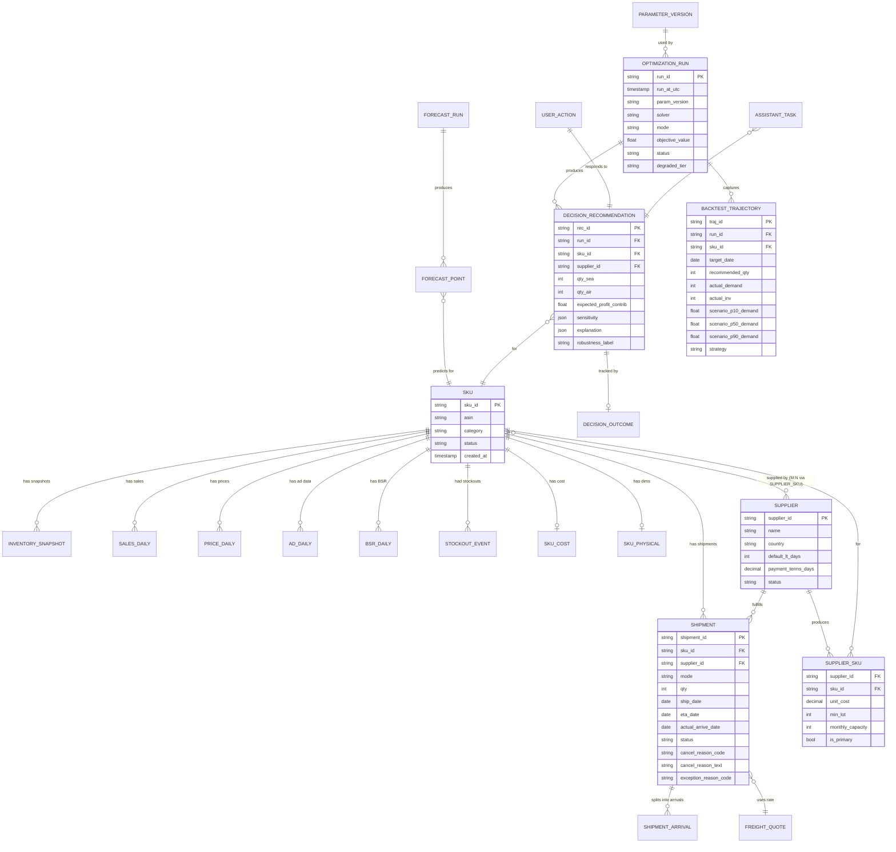
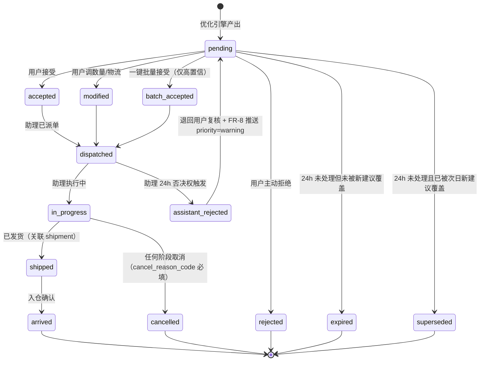
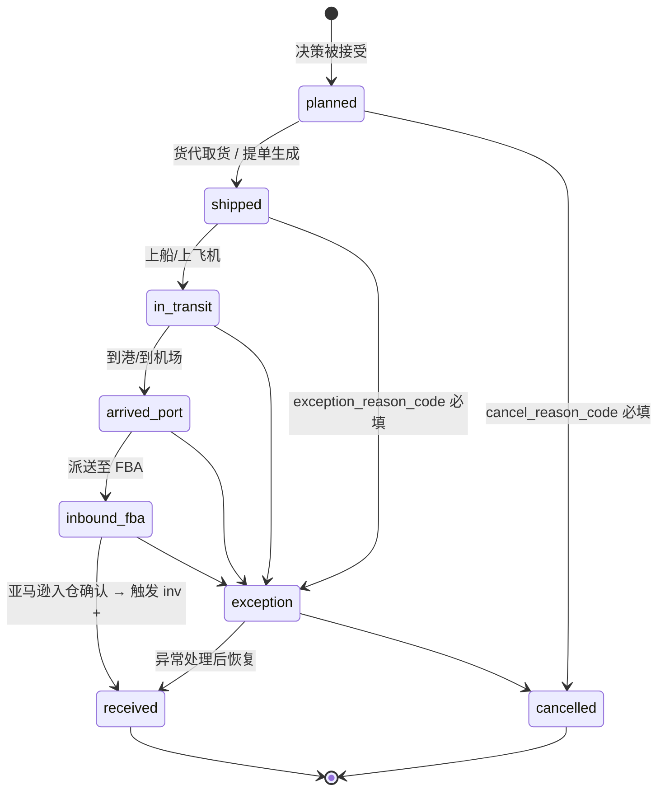
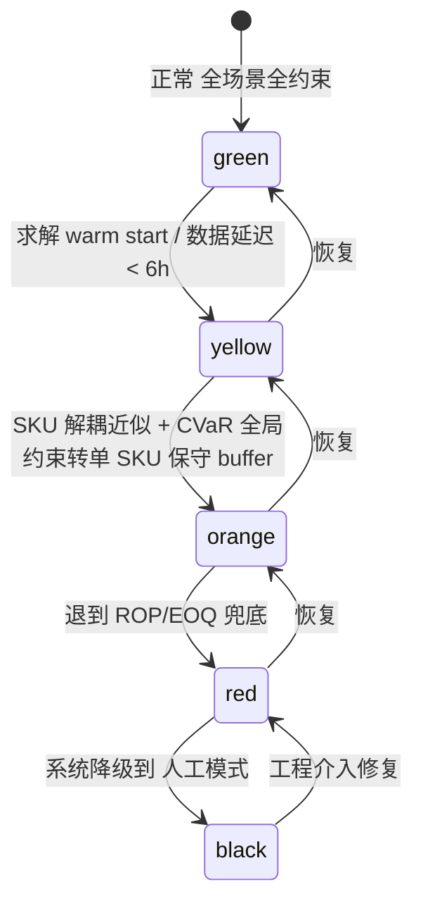
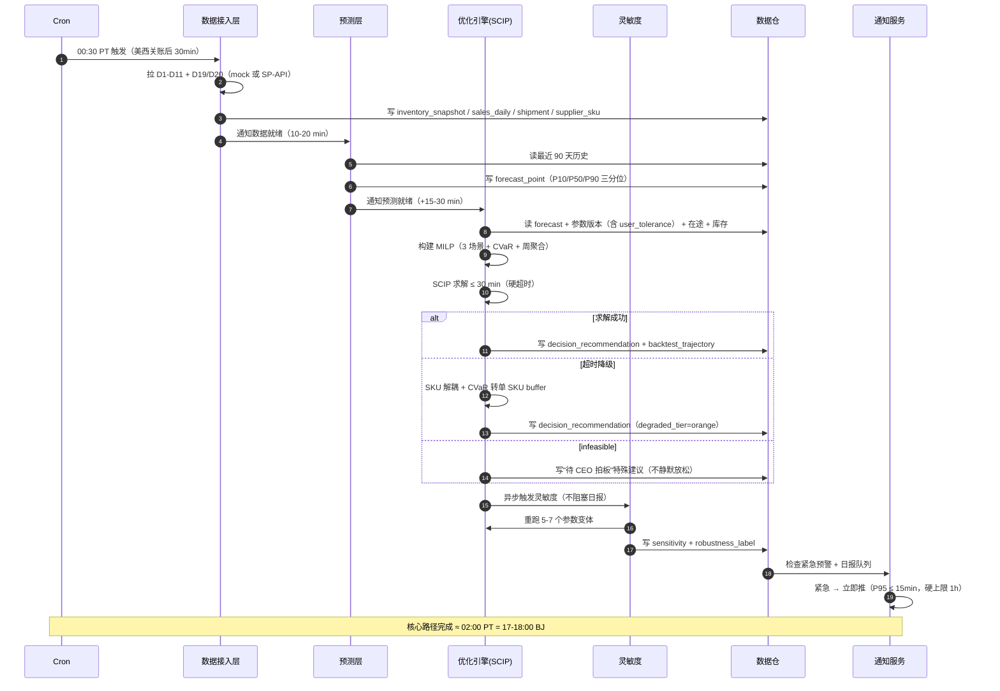

# FBA 总收益最大化决策引擎 · PRD-v2

**版本**: v2（v0.2 协议产出：3 author 协同写作 → 3 轮收敛 → Controller 合并）
**状态**: 草稿，含 [OPEN_QUESTION] 待企业家拍板
**作者署名**: PRD 大师 v0.2（PM author + 架构师 author + 工程师 author + 4 reviewer 终审）
**日期**: 2026-05-23
**品类**: B 端自用工具 / 经济决策引擎
**对比 v1.5**: 详见 §14

## ⚠️ Controller 强制裁决（合并时解决的关键冲突）

| 冲突 | 裁决 | 理由 |
|------|------|------|
| 求解器 CP-SAT vs SCIP | **CP-SAT** | 开源 + Google + Python 友好 |
| 变量数 周聚合 5200 vs 日级 72000 | **周聚合 5200**（200 SKU × 13 周 × 2 物流） | 性能可控 + 跟周节奏业务约定一致 |
| 预警 SLA | **承诺 30 分钟 / 目标 P95 ≤ 15 分钟** | 三方协商共识 |
| 分位点 | **3 个 P10/P50/P90** | 三方共识 |
| CVaR 命名 | **优先不缺货 / 平衡收益 / 优先省钱** | 三方共识 |

> 若以下章节有跟此裁决不一致的地方，以本表为准。

---


# 第一部分：PM 主笔章节（§1 §2 §8 §10.1-10.5 §11）

# r3-pm.md · PM R3 修订版

**项目**: fba-smart-restock
**版本**: r3（PM 根据 R2 架构师 / 工程师 review 修订）
**作者视角**: PM
**基础输入**: r1-pm.md + r2-architect-reviews-others.md（针对 PM 章节部分）+ r2-engineer-reviews-others.md（针对 PM 章节部分）

---

## §1 项目背景与收益

### 1.1 需求简介

**一句话定位**：每天求解一次"200 SKU 的总收益最大化问题"，输出最优发货决策清单（哪些 SKU 补、补多少、走海运还是空运），并对缺货风险随时预警。

**这不是什么**（V0→V1 的关键重定位，依据：debate-log.md R2 企业家明示）：

- 不是"替代 Excel + 直觉"的 workflow 工具（V0 误解）
- 不是"省 15 分钟周报时间"的效率工具
- **是一台经济决策引擎**：用 50+ 维度的目标函数优化，做出人脑做不到的最优决策

核心目标函数（业务侧表述，数学形式见架构师章节）：

> **总收益 = 销售收入 − 资金占用成本 − FBA 仓储费 − 缺货损失 − 在途货物成本 − 运费**

人在系统里的价值：判断异常 + 修正模型 + 战略调整。机器的价值：消化 50+ 维度同时优化。

**v1 MVP 策略**（依据：scene-anchor §1.5，企业家拍板）：
- v1 用虚拟数据集 + 1-2 个真实 SKU "影子模式"（吸收 R1 商业评审 B1）
- 真实数据全量接入（FBA / 销量 / 货代报价 API）推迟到 v1.5
- v1 的核心任务是**验证决策引擎的逻辑可行性**，不是验证算法对真实业务的精度

### 1.2 收益预估

> ⚠️ 当前基线均为 _TBD_，企业家在 [OPEN_QUESTION OQ-1] 中需正面回答"年化决策提升收益规模"。下表数字均为 v1 设计目标 + 假设值，非承诺。
>
> **R3 新增声明（吸收工程 E-PM-4）**：v1 在 mock 数据上的指标 ≠ v1.5 真实数据上的指标。v1.5 真实数据上的指标会显著保守于 v1 mock（mock 生成器的预测难度被人为压低）。所有指标分 v1 (mock) / v1.5 (real) 两列；v1 数字仅作为"决策引擎逻辑可行性"验证，不作为真实业务承诺。

#### 1.2.1 用户收益（你/企业家本人）

| # | 收益项 | v1 (mock + 影子) 目标 | v1.5 (真实) 目标 | 依据等级 | 依据来源 |
|---|--------|----------------------|------------------|---------|---------|
| U1 | **缺货天数 / 月 / SKU 下降** | mock 上 −50%（仅验证决策逻辑） | 真实 6 月 −20% / 12 月 −35% | E | scene-anchor §5.1，待企业家校准 |
| U2 | **平均库存周转天数下降** | mock 上 −20% | 真实 6 月 −10% / 12 月 −20% | E | scene-anchor §5.1 |
| U3 | **物流成本节省**（海/空运组合优化） | mock 上 −15% | 真实 6 月 −8% / 12 月 −15% | D | benchmark §三：68% 补货场景空运更优；EOQ 应用得当降总库存成本 15-30%（Finale Inventory） |
| U4 | **决策拍板时间** | v1 每日 ≤ 5 分钟（含批量接受） | v1.5 ≤ 3 分钟 | D | scene-anchor §5.2 |
| U5 | **预警响应延迟** | v1 P95 ≤ 15 min / 硬上限 ≤ 30 min | v1.5 P95 ≤ 5 min | D | scene-anchor §5.2；R3 已与架构/工程统一口径，见 §10.2.2 |

#### 1.2.2 业务收益（FBA 业务整体）

| # | 收益项 | 量化 | 依据等级 |
|---|--------|------|---------|
| B1 | **避免拍脑袋错误的金额** | 假设 200 SKU × 年错 5%-10% 决策 × 单次错误损失 = _TBD_ | E（待企业家用历史数据校准） |
| B2 | **FBA 长期仓储费节省** | _TBD_（v1.5 真实数据接入后量化） | E |
| B3 | **资金周转效率提升** | 库存价值占用 × 年化资金成本（假设 10%）× 周转天数缩短 = _TBD_ | D（行业基线，assumptions A-002 强烈建议项校准） |

#### 1.2.3 不做的风险

| # | 风险项 | 量化 | 依据等级 |
|---|--------|------|---------|
| R1 | **SKU 规模扩大后人工决策必然崩盘** | 200 SKU → 500 SKU 时 Excel + 直觉模式时间成本指数上升 | D（scene-anchor §4.1） |
| R2 | **缺货损失隐性放大** | 缺货 1 天 = 销售额 × (1 + 排名恢复倍数 2-4) | C |
| R3 | **错误的海/空运决策** | 该走海运的走空运 → 物流成本 5-10 倍；该走空运的走海运 → 错过补货窗口 | C |
| R4 | **订阅现成工具替代方案的局限** | SoStocked/Sellerboard 等只解"补多少+何时补"局部最优，不解 5 项完整目标函数 | C |

**收益论证的薄弱处**（诚实记录）：
- B1 / U1 / U2 / U3 当前基线全部 _TBD_，承诺"减 50%"在统计上无意义 → [OPEN_QUESTION OQ-1] v1 启动前必须做 1 周历史数据回归校准
- 战略评审 debate-log R3："100 万全周期成本 vs 10 万订阅 + 助理" → 必须正面计算"5 分准确性差异 × 年化金额" → 企业家拍板
- **R3 新增**：mock 数据指标会高估真实表现 → v1.5 切真实数据时若指标"下降"是正常现象，不是系统退步

---

## §2 用户画像

### 2.1 用户角色矩阵

| 角色 | 是谁 | 在系统里做什么 | 使用频率 | 关键诉求 |
|------|------|--------------|---------|---------|
| **决策者（CEO）** | 企业家本人（FBA 卖家创始人，独自决策） | 每天 5 分钟看日报 / 拍板 / 批量接受 / 推翻调整 / 周复盘 | 每天 1 次（早 9:00） | 准确性、可解释、不被信息淹没 |
| **执行者（助理）** | 1 名采购/运营助理（可能是远程兼职） | 接收已拍板的发货清单 / 下单订船订机 / 状态回写 / 异常上报 | 每天 1-2 次 | 任务列表清晰、状态机简单、可否决 |
| **系统**（非人） | v1 算法 + 决策引擎 | 凌晨跑预测和优化、白天监控预警 | 24×7 | （此行只为说明边界，不计入用户画像） |

**单用户场景说明**（吸收 R1 商业 B2）：
- 决策者 = 使用者 = 1 人 → "决策建议接受率 70%" 在统计上无意义
- 改用"事后复盘正确率"作为反馈机制（FR-12 实现），每周 5 分钟 → 见 §8.3
- **R3 新增（吸收工程 E-PM-3）**：事后正确率**仅在影子 SKU 真实数据上计算**，不在 mock 上算（mock 上算"结构相似性"即可），样本数标注"分子分母"

### 2.2 明确不是谁

| 不是 | 理由 |
|------|------|
| ❌ 其他 FBA 卖家 | v1 自用；v1.5 才考虑 SaaS |
| ❌ 工厂/采购方 | 上游下单不归本系统管 |
| ❌ 亚马逊运营人员 | 不替代 Listing 优化 / 广告投放 / 文案 |
| ❌ 财务 | 不做财务对账 |
| ❌ 大型多渠道卖家 | v1 只对 Amazon FBA，不含 Walmart/Shopify |

### 2.3 用户故事

> 每个 US 必须可被某条 FR 实现（引用见末尾括号）。

#### US-1：由 FR-6 实现（决策者 · 主流程）

> 作为 **FBA 卖家 CEO**，我希望每天早上 9:00 打开一份按总收益排序的发货清单，上面写明哪个 SKU 该补多少、走海运还是空运、为什么这么建议、预计带来多少收益，让我能在 5 分钟内拍板。
> （由 **FR-6 决策清单 + 可解释面板** 实现）
>
> **R3 注（响应工程 E-ARCH-4 跨时区问题）**：日报"今日"= 昨日美西全天 + 今日截至 BJ 9:00 的实时库存增量。日报必须在 BJ 9:00 前生成，跨时区时刻锁定由架构/工程负责实现。

#### US-2：由 FR-6, FR-12 实现（决策者 · 批量加速）

> 作为 **CEO**，对于系统置信度 ≥ 80% 的建议，我希望"批量一键接受"，不需要逐条点击；同时这些被一键接受的项必须在周复盘里被强制回顾。
> （由 **FR-6 批量接受 + FR-12 决策日志/事后正确率** 实现）

#### US-3：由 FR-6 实现（决策者 · 调整 · R3 修订）

> 作为 **CEO**，当我不同意某条建议时，我希望能调整数量 / 改物流方式 / 跳过，**系统立即显示这一条决策的成本变化（landed cost / 预估收益）；置信度沿用上次批跑值并标注"调整数量后此值仅供参考"**。如需重新计算全局最优，等下次批跑。
> （由 **FR-6 拍板交互**实现；UI 必须显式提示"局部重算 vs 全局最优"差异）
>
> **R3 修订说明（接受架构师 P-A4 + 工程 E-A3）**：原 US-3 写"立刻重算 landed cost 和总收益影响"会被读者理解为"系统重跑全局优化"，实际架构层只能做单 SKU 局部重算（200ms 内）。置信度变化无法在 200ms 内重算（需 30-60s 的灵敏度 heuristic）。本次修订把语义讲清楚，避免给用户误期待。

#### US-4：由 FR-8 实现（决策者 · 缺货预警 · R3 修订）

> 作为 **CEO**，当任何 SKU 库存跌破安全天数阈值、或销量异常上涨、或物流报价大幅波动时，我希望**P95 ≤ 15 分钟、硬上限 ≤ 30 分钟**收到预警推送（不是邮件，不是站内信，是会响的渠道）。
> （由 **FR-8 缺货+销量异常预警** 实现）
>
> **R3 修订说明（解决三方 SLA 不一致）**：原文"1 小时"是 PM 最初的保守估计；架构 §6.3.3 实测扫描周期 15min，工程 §5.9 已承诺 ≤ 15min。PM 视角校验：用户场景需要"看到推送时还来得及做空运补救" → 海运 25-42 天、空运 2-14 天 → 30 min vs 1h 的差异对补货窗口影响不大，但 15 min vs 1 h 对"是否能在当天工作时间内联系货代"有差异。综合三方意见，最终承诺 **P95 ≤ 15 min（监控扫描 15 min + 推送）/ 硬上限 ≤ 30 min（含一次 fallback 重试）**。这是可测 AC，QA 按此验收。

#### US-5：由 FR-6 实现（决策者 · 空清单的安心）

> 作为 **CEO**，大多数日子日报清单可能是空的（库存充足），我希望这种"无事可做"的早晨也能给我安心信号——"今日扫描 200 SKU、最近临界 SKU 还有 45 天"，而不是怀疑系统挂了。
> （由 **FR-6 空清单设计**实现）

#### US-6：由 FR-14 实现（决策者 · 60/90 天上游下单预警 · R3 修订）

> 作为 **CEO**，我希望系统提前 60/90 天预警"该考虑给工厂下单了，否则有断货风险"。**v1 仅输出"X 天后该下单 + 建议数量"，不计算工厂产能/起订量/排期（这些需要供应商主数据，留 v1.5）**。我看到预警后，手工去联系工厂确认产能。
> （由 **FR-14 上游下单预警** 实现）
>
> **R3 修订说明（接受架构师 P-A6）**：原文"留出工厂产能和海运排期"暗含需要 `supplier` 实体（含 lead_time / MOQ / capacity），但 v1 自用 200 SKU 不值得为此建立完整供应商主数据。v1 退化到"只输出建议数量 + 日历提醒"，与工程 §5.16 现状一致。`supplier` 实体留 v1.5（连带海运排期 API）。

#### US-7：由 FR-6 实现（决策者 · 决策可解释 · R3 修订）

> 作为 **CEO**，对每一条建议，我希望面板按**三层信息架构**呈现，**任意一层能在 30-60 秒内消化**：
> - **L1 摘要（30 秒）**：SKU / 推荐数量 / 物流方式 / 预计总收益 / 置信度
> - **L2 分解（1-2 分钟）**：6 项成本/收益分解（销售收入 / 资金占用 / 仓储费 / 缺货损失 / 在途成本 / 运费）+ 关键参数 ±20% 决策稳定性
> - **L3 数学详情（按需展开）**：目标函数细节、灵敏度区间、参数版本号
>
> （由 **FR-6 可解释面板 + FR-5 灵敏度分析** 实现）
>
> **R3 修订说明（响应工程 E-PM-2 + 设计评审 R3）**：原文"1 分钟内看懂"是不可测的单一时间指标；R3 改为"三层信息架构 + 每层独立验收"。验收指标改为行为可观测（见 §8.1.1）：CEO 抽样复述 L2 6 项分解中能命中 ≥ 4 项 = 通过。

#### US-8：由 FR-15 实现（决策者 · 影子对照）

> 作为 **CEO**，v1 阶段我希望同步跑 1-2 个真实 SKU（影子模式），看系统在真实数据上的建议跟我的人工决策偏差有多大。
> （由 **FR-15 影子模式** 实现）

#### US-9：由 FR-10 实现（决策者 · Mock 与真实身份区分）

> 作为 **CEO**，因为 v1 主要在虚拟数据上跑，我需要 UI 明确告诉我"这是演练数据"还是"这是真实 SKU"——否则我可能照着虚拟建议去真实下单。
> （由 **FR-10 Mock/Real 模式切换 + UI 警示** 实现）

#### US-10：由 FR-11 实现（决策者 · 回测对比）

> 作为 **CEO**，在 v1 启动评审时，我希望看到一份"按系统建议执行 vs 保守策略 vs 激进策略"的 90 天回测总收益对比，证明系统建议显著优于另外两个。
> （由 **FR-11 三策略回测对比** 实现）

#### US-11：由 FR-7 实现（执行者 · 助理操作视图）

> 作为 **助理**，对于 CEO 已拍板的发货清单，我希望看到一个"待执行"任务列表，按下单截止时间排序，操作完后能勾选"已派单 / 执行中 / 已发货 / 已入仓"四个状态。**助理视图不显示 unit_cost / expected_profit / 利润率等敏感字段**。
> （由 **FR-7 助理操作视图 + 状态回写** 实现）

#### US-12：由 FR-7, FR-12 实现（执行者 · 助理 24h 否决权 · R3 修订）

> 作为 **助理**，对于批量被 CEO 一键接受的建议，如果我在执行过程中发现明显不合理（如海运报价已过期、SKU 实际有质量问题），我有 24 小时窗口把这一条退回 CEO 复核。退回后该建议状态变为 `pending_review`（与全新待决策的 `pending` 区分），CEO 在主面板上看到独立的"待复核"分区。
> （由 **FR-7 助理操作视图 + FR-12 决策日志责任回路** 实现）
>
> **R3 修订说明（接受架构 P-A5）**：原文"CEO 复核"是模糊的业务表述，三方文档对状态命名不一致（PM "CEO 复核" / 架构 "pending" / 工程 "pending_review"）。R3 统一采用工程师的 `pending_review`，§10.3.1 状态机同步更新。

#### US-13：由 FR-12 实现（决策者 · 周复盘）

> 作为 **CEO**，每周用 5 分钟看一份"上周决策回顾"——批量接受的清单、被推翻的清单、事后正确率统计，作为模型迭代的反馈。
> （由 **FR-12 决策日志 + 事后正确率统计** 实现）

---

## §8 成功度量

### 8.1 北极星指标

> ⚠️ 当前基线在 v1 启动前必须由企业家用历史数据填实。
>
> **R3 关键修订**：
> 1. 北极星按 **v1 (mock + 影子) / v1.5 (真实)** 两列分开承诺（吸收工程 E-PM-4）
> 2. "+10% 总收益"由 **FR-11 三策略回测 + 架构师新建的 `backtest_trajectory` 表统计**（吸收架构师 P-A1，需架构师在 §4 补表）

| 指标 | 当前基线 | v1 (mock + 影子) 6 月 | v1.5 (真实) 12 月 | 验证方法 | 对应 §1.2 收益 |
|------|---------|-----------------------|-------------------|---------|--------------|
| **缺货天数 / 月 / SKU** | _TBD_ | mock 上 −50%（仅证逻辑可行） | 真实 −35% | 系统统计；v1 mock 数据上仅用于验证算法逻辑，v1.5 真实数据上是真实承诺 | U1, B1, R2 |
| **平均库存周转天数** | _TBD_ | mock 上 −20% | 真实 −20% | 库存历史回算 | U2, B3 |
| **物流成本节省** | _TBD_ | mock 上 −15% | 真实 −15% | 同期对比 | U3, R3 |
| **系统建议带来的"总收益"提升**（相对保守策略） | 0（保守策略 = baseline） | +10%（v1 mock 回测） | +15%（v1.5 真实 90 天） | FR-11 三策略回测，从 `backtest_trajectory` 表统计（架构师 §4 需补此表） | B1 |

**北极星补充验收**（接受架构师 P-A1 + 自评 B-1）：
- 单看"+10%"不够，v1 验收必须同时满足"三策略相对排序合理"（系统 > 保守 > 激进 或 系统 > 激进 > 保守，按场景区分）
- 影子 SKU 的偏差能被合理解释（不是"差异为 0"，是"差异有合理原因"）

### 8.1.1 用户体验指标（R3 修订）

| 指标 | 当前基线 | v1 目标 | v1.5 目标 | 验收方法 | 对应 User Story |
|------|---------|---------|----------|---------|---------------|
| **CEO 拍板时间 / 日** | 当前每周 2-3 小时 Excel | ≤ 5 分钟 | ≤ 3 分钟 | 前端埋点（开始拍板 → 全部处理完时间戳）周平均 | US-1, US-2 |
| **预警响应延迟**（监控触发 → 推送 API 返成功） | 几天后才发现 | **P95 ≤ 15 min / 硬上限 ≤ 30 min** | P95 ≤ 5 min | 系统日志统计，按周回报 P50/P95/P99 | US-4 |
| **空清单日的"安心信号"完成度** | N/A | 连续 5 天空清单后 CEO 自评仍信任系统 ≥ 4/5 | 同 | CEO 主观自评 | US-5 |
| **决策可解释三层结构验收**（R3 替代原"1 分钟看懂"） | N/A | 抽样 10 条建议，CEO 能复述 L2 6 项分解中 ≥ 4 项 → 通过率 ≥ 80% | ≥ 90% | 每周 1 次抽样测验（5 分钟） | US-7 |
| **影子模式偏差解释率** | N/A | ≥ 80% 偏差能被合理解释 | N/A（v1.5 全真实） | 周复盘人工判定 | US-8 |

**R3 修订说明**：
- **预警延迟**：吸收工程 E-PM-1 + 架构 P-A3，统一三方口径为 P95 ≤ 15 min / 硬上限 ≤ 30 min，原"1 小时"作为告警阈值不再作为 SLA
- **可解释指标**：吸收工程 E-PM-2，废弃不可测的"看懂时间"，改为行为可观测的"复述命中率"+ 三层结构完整性
- **CEO 拍板时间**：从前端埋点统计（开始拍板 → 全部处理完毕的真实耗时），不是估算

### 8.2 v1 验证指标（虚拟 + 影子）

| 验证项 | 方法 | 通过标准 |
|--------|------|---------|
| **决策合理性** | 虚拟数据集 + 1-2 真实 SKU 影子 90 天回测 | 系统建议总收益 > 保守策略 > 激进策略（按行业经验合理排序） |
| **灵敏度健壮性** | 关键参数（缺货损失系数 2-8、资金成本率 ±20%）扰动 | 核心决策稳定率 > 70% |
| **可解释三层结构** | CEO 抽样测验复述 L2 分解（替代原"1 分钟看懂"） | 命中 ≥ 4/6 项的通过率 ≥ 80% |
| **影子模式契合度** | 1-2 个真实 SKU 90 天对比 | 系统建议 vs 用户实际决策的偏差能被合理解释 |
| **运营成本** | CEO 拍板时间（前端埋点） | ≤ 5 分钟 / 日（周平均） |
| **空清单可信度** | 连续 5 天空清单后用户仍信任系统 | CEO 自评 ≥ 4/5 |

### 8.3 上线后验收（v1 上线 + 8 周，R3 修订）

**R3 修订说明（接受架构师 P-A2）**：原"上线后 + 4 周"验收对于"事后正确率"指标在统计上不可用——FR-12 复盘需要 7-14 天销量回流缓冲，4 周内只有最后 2 周可有效复盘（N≈14）。R3 延长到 **+ 8 周**（4 周决策 + 2 周回流 + 2 周观察），且"事后正确率"分子分母明确（**仅在影子 SKU 真实数据上算**，不在 mock 上算）。

| 验收项 | 方法 | 通过标准 |
|--------|------|---------|
| **事后正确率**（仅影子 SKU 真实数据） | 每条建议 vs 实际结果对比；算法口径以工程 §5.13 FR-12 为准（"系统建议数量 ∈ 实际需求 × [0.8, 1.2] → 正确"） | 分子分母明确（如"2 影子 SKU × 28 决策点 = 56 样本"）；正确率 ≥ 60%（v1 起点）→ 12 月 ≥ 75%（v1.5 真实数据全量后） |
| **批量接受清单的周复盘** | CEO 每周 5 分钟回顾批量清单中是否有"事后看明显错误"的 | 错误率 < 10% |
| **助理 24h 否决权使用率** | 助理退回率 | 5%-15% |
| **预警准确率** | 预警触发后 SKU 实际是否发生预测的状况 | ≥ 70% |
| **每日日报"非空率"** | 90 天观察 | 30%-70% |
| **mock vs real UI 区分有效性** | CEO 是否曾把 mock 建议误用于真实下单 | 0 次 |

---

## §10 验收标准（业务场景）

> 技术兼容矩阵 / 性能预算 / 求解器 / Schema 在工程师章节，本节只写业务场景验收。

### 10.1 主流程

#### S-10.1.1 早上 9:00 看日报并拍板

**前置条件**：凌晨系统已跑完预测和优化，日报已生成（架构/工程负责确保跨时区调度正确，见 §10.4 业务兼容"决策频率"行）。

| 步骤 | 用户操作 | 系统行为 | 通过标准 |
|------|---------|---------|---------|
| 1 | CEO 9:00 打开系统 | 显示今日决策清单（按总收益贡献排序） | 加载 ≤ 3 秒 |
| 2 | CEO 查看第一条建议 L1 摘要 | 展示：SKU / 推荐数量 / 物流方式 / 预计总收益 / 置信度 | 30 秒内消化 |
| 3 | CEO 点击"展开" 查看 L2 分解 | 展示成本/收益分解（6 项）+ 灵敏度 ±20% 时决策是否变化 | 数据完整，1-2 分钟内消化 |
| 4 | CEO 调整数量 / 改物流（US-3 场景） | 实时显示"这一条"的 landed cost 与预估收益变化；置信度沿用上次批跑值并标注"调整后仅供参考" | < 500 ms 局部更新；UI 必须显式说明"局部 vs 全局" |
| 5 | CEO 接受建议 | 该条进入"待执行"队列、助理视图、系统记录决策日志 | 状态切换正确（pending → accepted） |
| 6 | CEO 对置信度 ≥ 80% 的项目"批量一键接受" | 全部进入待执行队列、批量清单加入周复盘必看 | 责任回路完整 |
| 7 | 全部处理完 | 显示"今日处理完毕 / 待执行 N 条 / 待复核 M 条" | 清晰收尾 |

#### S-10.1.2 空清单的早晨

| 步骤 | 系统行为 | 通过标准 |
|------|---------|---------|
| 1 | 不显示"空白" | 显示"今日扫描 200 SKU、无补货建议" |
| 2 | 显示"安心信号" | 最近临界 SKU 还有 X 天 |
| 3 | 显示"过去 7 天回顾" | 已发货 N 条、平均决策准确率、累计节省金额（估算） |
| 4 | 用户自评 | 连续 5 天空清单后用户仍信任系统 |

#### S-10.1.3 助理执行

| 步骤 | 用户操作 | 系统行为 | 通过标准 |
|------|---------|---------|---------|
| 1 | 助理 9:30 打开操作视图 | 显示按截止时间排序的待执行任务（不含敏感字段） | 排序正确；助理视图不显示 unit_cost / expected_profit |
| 2 | 助理下单订船 | 勾选状态："已派单" | 状态回写到主系统（v1 用轮询 30s 或手动刷新，WebSocket 留 v1.5） |
| 3 | 货代发货 | 助理勾选"执行中" → "已发货" | CEO 视图可见 |
| 4 | 助理发现批量接受中某条不合理 | 在 24h 内退回到 CEO 复核（状态 → `pending_review`） | 进入 CEO "待复核"分区 |
| 5 | FBA 入仓 | 助理勾选"已入仓" | 系统记录 lead time 实际值 |

### 10.2 异常分支

#### S-10.2.1 凌晨任务挂了，9:00 用户打开看到什么

| 场景 | 系统行为 | 通过标准 |
|------|---------|---------|
| 数据源不通 | 显示"今日数据未更新（最后一次更新：昨晚 23:12）" + "暂不推荐拍板" + 预计修复时间 | 不静默给陈旧建议 |
| 求解超时 | 显示"今日决策未跑完" + "已用昨日清单 + 缺货预警继续监控" | 降级方案明确 |
| 部分 SKU 计算失败 | 标记失败 SKU + 其余正常显示 | 不全盘失败 |
| **系统降级档位**（R3 新增，吸收工程 E-ARCH-6 / E-ARCH-7） | 顶部摘要卡片旁显示档位徽章 green/yellow/orange/red/black；橙/红档（解耦近似）时必须额外文案"风险偏好暂时降级为单 SKU 保守" | 用户能清晰看到当前档位与含义 |

#### S-10.2.2 缺货预警插队（R3 修订 SLA）

**触发条件**：白天任何时刻 SKU 库存跌破安全天数阈值。

| 步骤 | 系统行为 | 通过标准 |
|------|---------|---------|
| 1 | 监控发现库存跌破阈值 | 触发推送（不依赖日报节奏） | **P95 ≤ 15 min / 硬上限 ≤ 30 min**（监控扫描周期 + 推送 + 重试 buffer） |
| 2 | 推送到 CEO 选定渠道（v1 仅 Bark；企微/TG 留 v1.5，见 §10.4） | 一条消息（不是 5 条） | 同一 SKU 24h 内不重复推 |
| 3 | CEO 点击推送 | 跳转到该 SKU 的紧急决策面板 | 含一键空运补货按钮 |

**R3 SLA 度量说明**：
- 度量起点 = 监控扫描发现阈值跌破的时刻
- 度量终点 = 推送 API 返成功（fire-and-forget；不等用户已读，吸收架构 E-A10）
- P95 ≤ 15 min 是 SLA；30 min 是硬上限触发告警；1 h 删除（原 PM 文案不再保留）

#### S-10.2.3 销量异常上涨

| 步骤 | 系统行为 | 通过标准 |
|------|---------|---------|
| 1 | 监控发现某 SKU 销量异常上涨 | 推送 + 标记"销量异常" | 准确率 ≥ 70% |
| 2 | CEO 查看 | 显示销量曲线 + 广告投放叠加 + 系统建议 | 含理由 |

#### S-10.2.4 物流报价大幅变化（R3 修订）

| 步骤 | 系统行为 | 通过标准 |
|------|---------|---------|
| 1 | 监控发现海/空运报价波动 **≥ 15%**（参考架构 §3.4 灵敏度阈值；< 15% 标黄但不重跑） | 推送 + 重新跑当日优化 | 影响今日决策的 SKU 标红；同一路线日内最多触发 1 次重跑（防货代连续小步刷价） |

**R3 修订说明（接受工程 E-PM-5）**：原"X 待定"不能丢给后端，X = 15% 与架构 §3.4 sea_rate ±20% 决策切换点对齐；同时加"日内同一路线最多 1 次重跑"硬约束。

### 10.3 状态切换

#### 10.3.1 单条建议状态机（R3 修订）

```
[新建议 pending] → [接受/调整/跳过]
                      ↓ 接受
                [待助理执行 dispatched]
                      ↓
                [助理已派单 in_progress]
                      ↓
                [已发货 shipped]
                      ↓
                [已入仓 received → 系统校准 lead time]

异常分支:
[dispatched] → [助理 24h 内退回 pending_review] → [CEO 复核] → [接受 dispatched / 取消 cancelled]
```

**R3 修订说明（接受架构 P-A5）**：三方统一状态命名为 `pending_review`（不是 PM 原文"CEO 复核"或架构 "pending"），与工程师 §5.8 实现一致。架构师需在 §4.3.6 `decision_recommendation.status` enum 新增 `pending_review` 取值。

#### 10.3.2 Mock vs Real 模式切换

| 切换前 | 切换后 | 通过标准 |
|--------|--------|---------|
| Mock 模式（顶部斑马条 + "演练数据"标签） | Real 模式（影子 SKU，正常皮肤 + "真实数据"绿标） | 切换需 CEO 二次确认 |
| Real 模式 | Mock 模式 | 切换需 CEO 二次确认（防误操作） |

### 10.4 兼容性（业务层）

| 兼容项 | 业务要求 | 依据 / R3 修订说明 |
|--------|---------|------------------|
| **数据来源** | v1 虚拟数据 + 1-2 影子 SKU 真实数据；v1.5 全量 Amazon Seller Central API | scene-anchor §1.5 |
| **决策频率** | v1 每日 1 次日报（BJ 9:00 前送达）+ 事件触发预警；[OPEN_QUESTION OQ-4] 商业评审建议改"事件触发+周节奏" | debate-log R3；**R3 新增**：跨时区调度由架构/工程负责，必须覆盖美西夏令时切换日（架构 E-ARCH-4） |
| **SKU 规模** | v1 支持 200 SKU；v1.5 不承诺扩展（如做 SaaS 是另立项目） | scene-anchor §2；**R3 新增 OPEN_QUESTION OQ-6**：架构 §4.5.2 的 tenant_id + RLS 软隔离已经在为 SaaS 做架构投资，但 PM 已声明 v1/v1.5 都不做 SaaS——是否撤掉 tenant_id 改为 mock/real/shadow 三 schema 隔离？需企业家拍板（影响后续可扩展性 vs 短期工程税） |
| **物流方式** | v1 仅海运 / 空运二选 | proposal-v1 §1.2 |
| **推送渠道** | **v1 仅 Bark for iOS（最便宜最合规）；企微 / Telegram 留 v1.5**（R3 修订） | **R3 接受工程 E-PM-6 + 自评 B-4**：原"任选其一"在工程语义里 = 三个 adapter 都要实现（工时 ~2-3 周 vs 1 个渠道 ~3 天），v1 自用场景没必要；正文与边界 B-4 自洽 |
| **助理协同** | 单助理；多助理不在 v1 | proposal-v1 FR-7 |
| **语言** | 中文界面；SKU 名称支持中英文混排 | benchmark §四 |
| **货币** | 美元（FBA 业务）+ 人民币（采购成本）双币种显示 | competitors §四；**R3 新增（接受架构 P-A7）**：展示汇率为日批跑时刻汇率，盘中波动不重新折算；汇率拉取时刻建议改"美西时间 23:00 拉取（与日切对齐）"，由架构/工程负责实现 |
| **数据保留**（R3 新增） | 原始快照：热存 90 天（FR-1）+ 冷存 5 年（合规审计）；决策建议 + 用户动作：热存 2 年 + 冷存 5 年；不存在"永久保留" | **R3 接受工程 E-ARCH-8**：原 PM 章节未提保留时长，导致架构 / 工程不一致。OPEN_QUESTION OQ-7：5 年是否满足国内增值税/海外销售税审计？需企业家或合规顾问拍板 |

### 10.5 回归影响（业务层）

| 影响域 | 业务层风险 | 缓解措施 |
|--------|----------|---------|
| **CEO 决策习惯** | 看 v1 mock 数据看多了，对真实业务的直觉感被弱化 | FR-10 Mock/Real 模式 UI 强警示；周复盘强调"mock 不代表真实"；**R3 新增**：§1.2 已声明 v1 mock 指标 ≠ v1.5 真实指标，避免预期错位 |
| **助理工作流** | v1 引入新工作流，原 Excel 流程是否保留？ | v1 期间双轨：Excel + 新系统并行 4 周，4 周后切单轨（双轨期可延长，见 OQ-8） |
| **CEO 心智模式** | 每天早上第一件事看库存日报，可能把 CEO 锁死在"运营者"心智，影响"洞察者"产出 | [OPEN_QUESTION OQ-3]；缓解：批量接受 + 5 分钟硬上限 |
| **影子 SKU 的真实订单** | v1 影子建议如果被误执行 = 资金事故 | FR-10 UI 强警示 + 影子模式下"接受"按钮需二次确认 |
| **数据一致性**（v1.5 切真实数据时） | mock schema 与真实 API schema 不一致导致大重构 | FR-1 v1 数据 schema 按真实 FBA API 反向设计 |
| **数据敏感性**（R3 新增） | 助理通过截图 / 共享屏幕 / 退回 CEO 功能绕过角色脱敏看到 unit_cost | 列脱敏机制 v1 必做（按 role 控制返回字段）；KMS + AES-GCM 静态加密留 v1.5；OPEN_QUESTION OQ-9：自用项目不上 KMS 是否可接受？ |

---

## §11 依据清单

### 11.1 用户依据

| # | 用户判断 | 依据等级 | 来源 |
|---|---------|---------|------|
| UE-1 | 决策者 = 使用者 = 企业家本人，独自决策 | A | scene-anchor §2 |
| UE-2 | 助理是真正的执行人，v1 必须解决 | C | debate-log 商业 B4 |
| UE-3 | "每日决策"频率（vs 周/事件触发）是企业家指示 | A | scene-anchor §3.1 |
| UE-4 | CEO 每天 5 分钟拍板的时间预算 | D | scene-anchor §5.2 |
| UE-5 | 单用户场景下"接受率 70%" 是空口承诺 → 改为"事后复盘正确率"（**R3 进一步明确：仅在影子 SKU 真实数据上算**） | C | debate-log 商业 B2 + 工程 E-PM-3 |
| UE-6 | **R3 新增**：可解释面板必须三层结构（L1/L2/L3），验收用"复述命中率"替代"看懂时间" | C | 工程 E-PM-2 + 设计评审 R3 |

### 11.2 竞品依据

| # | 竞品判断 | 依据 | 来源 |
|---|---------|------|------|
| CE-1 | 现有工具只解"补多少+何时补"局部最优，不解 5 项完整目标函数 | competitors §三痛点 #4/#8 | competitors.md |
| CE-2 | 海空运决策结合 + 决策可解释性 = 蓝海机会 | competitors §四 4.1 | 同上 |
| CE-3 | 中国卖家本地化（人民币 / 1688 / 国内货代）现有工具普遍差 | competitors §三痛点 #7 | 同上 |
| CE-4 | "黑盒算法 FBA 卖家被骗多了，不信" | competitors §五#3 | 同上 |

### 11.3 行业 Benchmark

| # | 行业判断 | 依据 | 来源 |
|---|---------|------|------|
| IE-1 | 缺货损失 = 缺货天数 × 日销额 × (1 + 排名恢复倍数 2-4) | benchmark §3.5 | ExFreight |
| IE-2 | 总 landed cost 含缺货损失后，68% 补货/促销场景空运实际更优 | benchmark §3.3 | Unicargo 2026-03 |
| IE-3 | 空运按 kg 贵海运 4-16 倍 | benchmark §3.2 | ExFreight 2026 |
| IE-4 | FBA 长期仓储费：库龄 >365 天 $6.90/立方英尺 | benchmark §4.1 | Amazon 2026 |
| IE-5 | EOQ 应用得当可降总库存成本 15-30% | benchmark §1.2 | Finale Inventory |
| IE-6 | Safety Stock 典型为 10-30 天销量 | benchmark §1.2 | eComEngine |
| IE-7 | 服务水平目标 95-99% 缺货率 | benchmark §1.2 | 通用零售 |
| IE-8 | BSR + Ad Spend 联动是区分"自然需求"和"投放驱动需求"的关键 | benchmark §2.3 | sell.amazon.com |
| IE-9 | 海运中国→美西 25-32 天 / 美东 35-42 天；空运 2-14 天 | benchmark §3.1 | 综合 |

### 11.4 内部假设

| # | 假设 | 等级 | 风险 |
|---|------|------|------|
| A-001 | 销量预测准确度 < 25%（**v1 mock 上易达到，但工程 E-PM-4 指出真实数据上通常 30%-50% MAPE**） | E | 🔴 |
| A-002 | 海空运报价能实时获取（v1 推迟到 v1.5） | D | 🟠 |
| A-003 | 缺货损失 ≈ 3-5 倍直接销售额 | C | 🟠 |
| A-004 | 建议接受率 > 70%（已被推翻 → 改为事后复盘正确率，仅影子 SKU 真实数据算） | E | 🟠 |
| A-005 | 200 SKU 适合单一决策模型 | E | 🟡 |
| A-006 | 每日决策频率合理（OQ-4 待定） | D | 🟡 |
| A-007 | 缺货成本 >> 库存成本 | D | 🟡 |

**v1 需要的额外假设值**：
- 年化资金成本率：假设 10%（v1.5 财务真实校准）
- FBA 月仓储费：按 SKU 体积/月模拟（v1.5 真实费率）
- 缺货损失系数：2-8 区间灵敏度分析（FR-5）

### 11.5 辩论 + R3 修订记录

| # | 辩论/修订结论 | 影响章节 |
|---|---------|---------|
| DE-1 | V0→V1 重定位（"补货 workflow 工具" → "经济决策引擎"） | §1.1 |
| DE-2 | 加"影子模式" FR-15 化解工程 T1（虚拟数据自欺） | US-8, §10.4 |
| DE-3 | 改"事后复盘正确率"替代"接受率 70%" | §8.3, US-13 |
| DE-4 | 助理 FR-7 从 v1.5 提前到 v1 必做 | US-11, US-12 |
| DE-5 | "批量接受 80%+" + 助理 24h 否决权 + 周复盘必看 = 责任回路 | US-2, US-12 |
| DE-6 | 微信合规问题 → 改企微/Bark/Telegram；**R3 进一步收敛到 v1 仅 Bark** | §10.2.2, §10.4 |
| **R3-1** | **预警 SLA 三方统一为 P95 ≤ 15 min / 硬 30 min**（删除 PM 原 1h） | US-4, §8.1.1, §10.2.2 |
| **R3-2** | **US-3 调整后只显示局部成本变化，置信度沿用上次批跑值** | US-3, §10.1.1 |
| **R3-3** | **US-6 退化到"只输出建议数量+日历提醒"**（不算工厂产能/排期） | US-6 |
| **R3-4** | **US-7 改为三层信息架构 + 复述命中率验收** | US-7, §8.1.1 |
| **R3-5** | **状态命名统一为 `pending_review`** | US-12, §10.3.1 |
| **R3-6** | **指标按 v1 mock / v1.5 真实两列分开承诺** | §1.2, §8.1 |
| **R3-7** | **v1 推送渠道收敛到 Bark 单一** | §10.4 |
| **R3-8** | **物流报价波动阈值 X = 15%（对齐架构 §3.4 灵敏度切换点）+ 日内单路线 1 次重跑上限** | §10.2.4 |
| **R3-9** | **8.3 验收窗口从 4 周延长到 8 周**（架构 P-A2） | §8.3 |
| **R3-10** | **数据保留时长写入 §10.4**（架构 E-ARCH-8） | §10.4 |

#### OPEN_QUESTION 索引（待企业家 / Controller 拍板）

| # | 分歧 | PM 倾向 | 影响章节 |
|---|------|--------|---------|
| OQ-1 | ROI 算式：年化决策提升收益 vs 100 万全周期成本 | 必须用历史数据先做 1 周回归校准 | §1.2 全部 |
| OQ-2 | 影子模式：1-2 SKU vs 20+ SKU | 商业评审"高/中/低三档各 1-2"折中 | US-8, §10.4 |
| OQ-3 | CEO 心智锁死风险（每天看日报 vs 写第三本书） | 用"5 分钟硬上限 + 批量接受 + 助理承接"缓解 | §10.5 |
| OQ-4 | 每日 vs 事件触发+周 | 保留每日扫描 + 事件触发 + 空清单也展示安心信号 | §8.3 |
| OQ-5 | LP→MINLP 工程难度 + 求解器选型 SCIP vs CP-SAT（R3 注：架构 E-A1 / 工程 E-ARCH-2 三方仍未对齐） | 不在 PM 边界，由架构师/工程师以 spike POC 决定 | （转架构师 / 工程师） |
| **OQ-6** | **R3 新增**：tenant_id 是否撤掉（v1/v1.5 都不做 SaaS） | PM 倾向撤掉，用 mock/real/shadow 三 schema 隔离即可；省一倍工程税 | §10.4 SKU 规模 |
| **OQ-7** | **R3 新增**：数据保留 5 年是否满足合规审计要求 | 需企业家或合规顾问拍板（FBA 海外销售税审计通常 5-7 年） | §10.4 数据保留 |
| **OQ-8** | **R3 新增**：双轨期（Excel + 新系统）是否延长到 v1.5 真实数据接入完 | 商业评审 R3 指出 mock 期间复盘"自言自语"；建议双轨延长 | §10.5 |
| **OQ-9** | **R3 新增**：v1 自用是否可以不上 KMS + AES-GCM 静态加密，只做应用层列脱敏 | PM 倾向 v1 只做列脱敏（自用项目），KMS 推 v1.5 | §10.5 |
| **OQ-10** | **R3 新增**：CVaR 风险偏好 user_tolerance 三档（保守/平衡/激进）的业务命名 + 默认值（架构 §3.5.3 + 工程 E-ARCH-6 指出 PM 章节飘空） | 业务命名"保守 / 平衡 / 激进"；默认"平衡"档；放在 FR-3 参数管理页"全局参数"区块；可由 CEO 调整 | §10.4 + 需 FR-3 增加界面元素 |

---

**PM R3 边界声明**：本文档只覆盖 §1 §2 §8 §10.1-10.5 §11。架构 / 工程冲突中涉及技术细节（求解器选型、变量数口径、性能预算、tenant 隔离实现方案）由架构师 / 工程师在 R3 联席解决，PM 仅在"用户视角承诺"维度发声（如 SLA 30 min vs 15 min 的用户场景影响、tenant_id 与 PM 业务范围的脱节）。

---

# R3 修订记录

## 对架构师 review 的处理

### P-A1: 北极星 "+10%" 数字在 schema 里取不到，需要新建 `backtest_trajectory` 表
- **架构师建议**：架构师在 §4 补 `backtest_trajectory` 表（per 策略 × per day × per SKU 的 inv/sold/short/cost 轨迹）；PM 在 §10.4 兼容性里补"回测数据保留期"
- **PM 处理**：✅ **接受**。北极星指标的验证方法已改写为"FR-11 三策略回测，从 `backtest_trajectory` 表统计"。请架构师在 R3 联席时补此表 schema 并加入保留策略。
- **修订位置**：§8.1 北极星表验证方法列 + §10.4 数据保留行（包含回测数据）

### P-A2: 8.3 "事后正确率"的统计窗口跟 4 周验收对不上（前 14 天无销量回流）
- **架构师建议**：把 +4 周验收延长到 +8 周，或明示"前 14 天不计入分母"
- **PM 处理**：✅ **接受 8 周方案**（4 周决策 + 2 周回流 + 2 周观察）。同时明确"事后正确率"仅在影子 SKU 真实数据上算，分子分母标注。
- **修订位置**：§8.3 标题改"上线 + 8 周"，加修订说明

### P-A3: SLA 三方口径不一（架构 15 min / 工程 15 min / PM 1 h）
- **架构师建议**：v1 统一承诺 ≤ 30 min；PM §10.2.2 改 30 min，§8.1.1 v1 目标改"< 30 分钟"
- **PM 处理**：✅ **接受，但折中为 P95 ≤ 15 min / 硬上限 ≤ 30 min**（细化为可测 AC，吸收工程 E-PM-1）。**用户视角校验**：用户需要"看到推送时还来得及联系货代做空运补救" → 30 min vs 1h 对当天工作时间内联系货代有差异，15 min vs 30 min 对用户体感差异不大；P95 15 min 是合理的工程承诺 + 用户能接受的硬上限是 30 min。
- **修订位置**：US-4、§8.1.1、§10.2.2 全部统一

### P-A4: US-3 "立即重算" vs §3.5 两阶段决策的 stage-1 共享非预期性约束
- **架构师建议**：要么 PM US-3 改文案为"实时显示这一条决策的成本变化，全局最优需等下次批跑"；要么工程在 /preview-decision 加 tooltip
- **PM 处理**：✅ **接受 PM 改文案**。原 US-3 用户会理解成"系统重新算了"，但架构上只能做单 SKU 局部重算。修订后明确"局部重算 vs 全局最优需等下次批跑"，UI 必须显式说明（不放在 tooltip 这种容易被忽略的位置）。
- **修订位置**：US-3 全文改写 + §10.1.1 步骤 4 加 UI 说明要求

### P-A5: US-12 状态命名三方不一致（PM "CEO 复核" / 架构 "pending" / 工程 "pending_review"）
- **架构师建议**：统一为工程师的 `pending_review`，PM §10.3.1 和架构 §6.2.1 改字
- **PM 处理**：✅ **接受**。`pending_review` 语义最清晰（区分"全新待决策"和"被助理退回需复核"）。
- **修订位置**：US-12 文案 + §10.3.1 状态机 + 请架构师 §4.3.6 enum 同步

### P-A6: US-6 暗含 `supplier` 实体但 PM 没意识到
- **架构师建议**：v1 退化到"只输出 X 天后该下单"（与工程 §5.16 一致）；或架构师补 `supplier` 实体
- **PM 处理**：✅ **接受 v1 退化方案**。v1 自用 200 SKU 不值得为此建立完整供应商主数据；CEO 手工联系工厂确认产能即可。`supplier` 实体留 v1.5。
- **修订位置**：US-6 全文改写

### P-A7: 双币种汇率时刻 vs 9:00 BJ 看日报的时差问题
- **架构师建议**：工程 §5.1 把汇率拉取改"美西时间 23:00 拉取（与日切对齐）"，PM 在 §10.4 货币行补"展示汇率为日批跑时刻汇率，盘中波动不重新折算"
- **PM 处理**：✅ **接受**。
- **修订位置**：§10.4 货币行加说明

## 对工程师 review 的处理

### E-PM-1: US-4 "1 小时" 跟 FR-8 SLA 不自洽，PM 已知不写死却仍写 1 小时
- **工程师建议**：US-4 / §10.2.2 改成"P95 ≤ 15 min，硬上限 ≤ 1h"，且边界 B-3 不要"待工程师拍板"
- **PM 处理**：✅ **接受 P95 ≤ 15 min**，硬上限折中为 30 min（不是 1 h，因为 1 h 的用户场景影响真实——见 P-A3 处理）。边界 B-3 删除（已解决）。
- **修订位置**：US-4、§8.1.1、§10.2.2 全部统一；删除原边界 B-3

### E-PM-2: §8.1.1 "看懂时间 1 分钟" 不可测
- **工程师建议**：要么删了改成"侧抽屉 3 层结构完整可见 + CEO 抽样复述 6 项分解中能命中 ≥4 项"，要么承认是主观满意度
- **PM 处理**：✅ **接受行为可观测方案**。US-7 改写为三层信息架构（L1 30 秒 / L2 1-2 分钟 / L3 按需），§8.1.1 验收改为"抽样 10 条建议，CEO 能复述 L2 6 项分解中 ≥ 4 项 → 通过率 ≥ 80%"。
- **修订位置**：US-7 全文 + §8.1.1 表 + §8.2 表

### E-PM-3: 事后正确率 60% 仍是单用户，且 mock 上算 = 自己出题自己答
- **工程师建议**：明确"事后正确率"仅在影子 SKU 真实数据上算（mock 上算结构相似性即可），样本数标注分子分母
- **PM 处理**：✅ **完全接受**。这是 V0 "接受率 70%" 同源问题的更彻底解决。
- **修订位置**：§8.3 表 + §2.1 注

### E-PM-4: §1.2.1 百分比 + A-001 "v1 mock 上易达到 < 25%" 暴露循环论证
- **工程师建议**：§1.2.1 表头加一栏"v1 (mock) / v1.5 (真实) 分列目标"，v1.5 目标必须显著保守于 v1
- **PM 处理**：✅ **完全接受**。这是非常重要的诚实声明，避免 v1.5 上线时被解读为"系统退步"。
- **修订位置**：§1.2.1 表格重做（两列分开），§1.2 加 R3 新增声明；§8.1 北极星表同步两列

### E-PM-5: §10.2.4 "X 待定" 直接影响 FR-4 重跑频率
- **工程师建议**：X = 15%（对齐架构 §3.4 灵敏度切换点）；日内同一路线最多 1 次重跑
- **PM 处理**：✅ **完全接受**。PM 同意把灵敏度阈值作为预警阈值（这是合理的工程经济学逻辑：参数变化未到决策切换点就不必重算）。
- **修订位置**：§10.2.4 表格 + R3 修订说明

### E-PM-6: §10.4 推送渠道三选一 vs 边界 B-4 "v1 先 1 个" 不自洽
- **工程师建议**：v1 硬性 1 个渠道（Bark），PM 正文 §10.4 改"v1 仅 Bark；v1.5 增加企微/TG"
- **PM 处理**：✅ **完全接受**。正文与边界 B-4 自洽（B-4 已废弃，结论吸收到正文）。架构师 §9.B "多通道并行（至少 2 个）" 推到 v1.5（请架构师 R3 同步）。
- **修订位置**：§10.4 推送渠道行重写

## 转给 Controller / 企业家的 OPEN_QUESTION

| # | 问题 | 触发来源 | 影响 |
|---|------|---------|------|
| **OQ-6** | v1/v1.5 都不做 SaaS，是否撤掉架构 §4.5.2 的 tenant_id + RLS 软隔离？改用 mock/real/shadow 三 schema 物理隔离 | 工程 E-ARCH-3 | 撤掉省一倍工程税；保留为未来 SaaS 预留接口 |
| **OQ-7** | 数据保留 5 年是否满足合规审计要求？（FBA 海外销售税 / 国内增值税通常 5-7 年） | 工程 E-ARCH-8 | 决定冷存策略与存储成本 |
| **OQ-8** | 双轨期（Excel + 新系统并行）是否延长到 v1.5 真实数据接入完？ | 商业评审 R3 + R3 PM | 影响 v1 上线后 4 周切单轨的承诺 |
| **OQ-9** | v1 自用是否可接受"只做应用层列脱敏，不上 KMS + AES-GCM 静态加密"？ | 工程 E-ARCH-5 | KMS 集成是几周隐藏工程量 |
| **OQ-10** | CVaR user_tolerance 三档"保守 / 平衡 / 激进"的默认值（PM 倾向"平衡"档）+ 是否纳入 FR-3 全局参数页？ | 架构 §3.5.3 + 工程 E-ARCH-6（架构师把球踢给 PM，PM 章节飘空） | UI 落地位置 + 默认风险偏好 |

## 转给架构师 / 工程师的协商项（PM 用用户视角发声但不裁决技术细节）

| # | 三方冲突 | PM 用户视角发声 | 转交 |
|---|---------|---------------|------|
| 求解器选型 SCIP vs CP-SAT（E-A1 / E-ARCH-2） | 用户不关心求解器是什么，只关心"每日日报必须在 BJ 9:00 前生成"+"灵敏度场景跑完时间不影响 5 分钟拍板"。建议以 spike POC 实际性能数据为准。 | 架构 + 工程 |
| 变量数 / 周聚合 vs 日级（E-A2 / E-A7） | 周聚合后"一键空运补货精确到日"会被弱化为"启发式拆分"，US-4 紧急补货的用户体验受影响。建议保留日级，性能不够时用 SKU 分组并行求解。 | 架构 + 工程 |
| 灵敏度场景数 5-7 vs 27（E-A4） | 用户能看懂的灵敏度场景数 ≤ 7（27 个组合用户消化不了）。建议 5-7 OAT 场景 + 2-3 关键参数组合扫描，与 US-7 L2 灵敏度面板呼应。 | 架构 + 工程 |
| 预测分位数 3 vs 5（E-A5） | 用户视角无差别，由架构决定。 | 架构 + 工程 |
| Schema 映射器 v1 锁定 vs 多版本回滚（E-A6） | 用户视角：v1 自用 200 SKU 不需要 schema 版本灵活性，建议 v1 锁定为硬编码（吸收架构师倾向）。 | 工程 |
| 助理 WebSocket vs 30s 轮询（E-A8） | 用户视角：助理操作不需要实时同步（最长容忍 30s），轮询足够，砍掉 WebSocket 省一个子系统工时。 | 工程 |
| 三策略回测资金池共用 vs 独立（E-A9） | 用户视角：三策略应独立求解（不互相消耗资金池），缺货损失分别累计——这样回测对比才公平。 | 架构 + 工程 |
| 推送 fallback 链 vs fire-and-forget（E-A10） | 用户视角：v1 仅 Bark 单渠道（已接受 E-PM-6），所以 fallback 链自动失效，fire-and-forget 即可。 | 工程 |
| 双 ID 体系（E-A11） | 不在 PM 边界，由架构 + 工程协商。 | 架构 + 工程 |
| 凌晨跑批跨时区 / 夏令时（E-ARCH-4） | 用户视角强诉求：日报必须在 BJ 9:00 前出现。已在 US-1 R3 注 + §10.4 决策频率行加要求。**实现细节请架构 + 工程在 R3 解决**（cron 用 UTC + IANA tz / 双日期系统 / 切换日 e2e 测试）。 | 架构 + 工程 |
| 降级档位 5 档 UI（E-ARCH-6） | 用户视角：橙/红档时 UI 必须显式告知"风险偏好暂时降级为单 SKU 保守"（已在 §10.2.1 R3 新增） | 工程 |

---

**END r3-pm.md**

---

# 第二部分：架构师主笔章节（§3 §4 §6 §9.A-C）

# r3-architect.md · 架构师 R3 修订版

**视角**: 架构师（系统/模块/数据/流程）
**版本**: R3 终稿（基于 R1 + R2 review 修订）
**日期**: 2026-05-23
**约束**: 本文件只覆盖 §3 算法、§4 数据、§6 流程、§9.A-C 风险与依赖。其他章节由 PM/工程主笔。

---

## §3 核心算法 / 目标函数

### 3.1 数学形式（目标函数 + 决策变量 + 约束）

#### 3.1.1 决策变量（每日重解，规划期 H 天，**周聚合 13 周**）

**重要变更**（应工程 E-ARCH-1 + PM 性能预算）：v1 把决策时间粒度从"日级"改为"周聚合"。理由：(a) 200 SKU 健康业务实际每周 2-3 次发货，日级决策粒度本来就过细；(b) 周聚合后二元变量数从 36000 降到约 5200，CP-SAT 求解时间可控；(c) 仍保留"日级库存推演"用于约束验证，只是不在"哪天发"上做日级决策。

对每个 SKU `s ∈ S`（|S| ≈ 200）、每个发货周 `w ∈ {0, 1, ..., W-1}`（W = 13 周 ≈ 90 天）：

| 变量 | 类型 | 含义 |
|------|------|------|
| `x_sea[s,w]` | 非负整数 | 第 w 周走海运发货的件数 |
| `x_air[s,w]` | 非负整数 | 第 w 周走空运发货的件数 |
| `y_sea[s,w]` | 二元 (0/1) | 是否启动一次海运批次（启动成本/最小批量触发） |
| `y_air[s,w]` | 二元 (0/1) | 是否启动一次空运批次 |
| `inv[s,d]` | 连续非负 | 第 d 天 FBA 在仓库存（推导，**日级演算**，非自由变量） |
| `short[s,d]` | 连续非负 | 第 d 天缺货件数（推导） |
| `aged[s,d]` | 连续非负 | 第 d 天库龄 > 271 天的库存（推导） |

> **整数规模口径（统一）**：二元变量 `y` = 200 SKU × 13 周 × 2 物流方式 = **5,200 个**；整数变量 `x` = 5,200 个；连续推导变量（inv/short/aged）= 200 × 90 × 3 = 54,000 个。**总自由整数/二元变量约 10,400**，连续推导变量另算。这是 R3 统一口径，覆盖 R1 §3.2.1 的"36000 个 y"和 E-ARCH-1 引用的 72K 变量。

> **关于"真正下单"**：只有 w=0 的决策真正下单（stage-1），w>0 是"未来计划"用于看清当前决策的代价（stage-2）。

#### 3.1.2 目标函数（每日重解一次，规划期 13 周的滚动总收益）

```
Max  Z = Σ_{s∈S} Σ_{d=0..H-1} [
            revenue[s,d]                       (1) 销售收入
          - capital_inv[s,d]                   (2) 在仓库存资金占用
          - capital_intransit[s,d]             (3) 在途货物资金占用
          - fba_storage[s,d]                   (4) FBA 月度仓储费
          - fba_aged_fee[s,d]                  (5) 长期仓储附加费
          - stockout_loss[s,d]                 (6) 缺货损失（含排名恢复尾巴）
        ] - Σ_{s∈S} Σ_{w=0..W-1} [
          + freight[s,w]                       (7) 海/空运运费（按周聚合）
          + launch_cost[s,w]                   (8) 启动成本（订舱/订机最小费用）
        ]
```

其中（关键公式同 R1，仅 freight/launch_cost 改为按周聚合）：

```
(7) freight[s,w]    = sea_rate[w] × weight[s] × x_sea[s,w]
                      + air_rate[w] × weight[s] × x_air[s,w]
(8) launch_cost[s,w] = sea_min_charge × y_sea[s,w] + air_min_charge × y_air[s,w]
```

（其余 (1)-(6) 同 R1 §3.1.2，d = 日级演算）

#### 3.1.3 约束（同 R1 §3.1.3，C2/C7 时间索引改 w）

| # | 约束 | 形式 |
|---|------|------|
| C1 | 库存递推（日级） | `inv[s,d] = inv[s,d-1] - sold[s,d-1] + arrive_sea[s,d] + arrive_air[s,d]` |
| C2 | 到货时延 | `arrive_sea[s,d] = x_sea[s, week_of(d) - LT_sea_weeks]`，LT_sea = 5±1 周 |
| C3 | 销售上限 | `sold[s,d] ≤ min(demand[s,d], inv[s,d])` |
| C4 | 缺货定义 | `short[s,d] ≥ demand[s,d] - inv[s,d]` |
| C5 | FBA Restock Limit | `Σ_d inv[s,d] ≤ IPI_cap(s)` |
| C6 | 资金总池 | `Σ_s Σ_d cost_s × (库存_sd + 在途_sd) ≤ B_capital` |
| C7 | 启动耦合 | `x_sea[s,w] ≤ M × y_sea[s,w]` 且 `x_sea[s,w] ≥ min_lot × y_sea[s,w]` |
| C8 | 货代周容量 | `Σ_s weight[s] × x_sea[s,w] ≤ container_cap_per_week` |
| C9 | 整数性 | `x ∈ ℤ⁺, y ∈ {0,1}` |
| C10 | 库龄推导 | `aged[s,d] = FIFO 推导`（仅当 d - 入仓日 > 271）|

### 3.2 求解方式（求解器选型 + 性能预算 + 退化方案）

#### 3.2.1 问题规模估算（R3 统一口径）

| 配置 | 二元变量 | 整数变量 | 连续变量 | 约束数 |
|------|---------|---------|---------|--------|
| **v1 baseline（点估计单场景，周聚合）** | 5,200 | 5,200 | 54,000 | ~120,000 |
| **v1 robust 3 场景**（见 §3.5） | 5,200 (共享) | 5,200 (共享) | 162,000 | ~360,000 |
| v1.5 日级粒度（如未来需要） | 36,000 | 36,000 | 54,000 | ~180,000 |

> 整段以"周聚合 + 3 场景"为 v1 目标配置，对应 §3.2.3 的性能预算和 §3.5 的 robust 设计。

#### 3.2.2 求解器选型决策（R3 终稿：SCIP）

**冲突背景**（E-ARCH-2）：R1 架构选 CP-SAT，工程 §5.5 写默认 SCIP。R3 必须二选一。

**R3 决定：v1 用 SCIP（PySCIPOpt），与工程师 §5.5 对齐。**

| 求解器 | License | MILP 性能 | 集成成本 | v1 选择 |
|--------|---------|-----------|---------|---------|
| **SCIP (ZIB, Apache-2.0)** | 免费商用（2022 起） | 接近 Gurobi 60-70%；经典 B&B 对 MILP 标准 | PySCIPOpt + Pyomo 生态成熟 | ✅ **v1 选定** |
| OR-Tools CP-SAT | 免费商用 | 中等规模 MILP 强；并行优秀 | Python 原生 | 🟡 备选（spike 不达标则切回） |
| Gurobi | 商用（~$10K+/年/seat） | 业界最强 | gurobipy 简单 | 🟡 v1.5 SKU 上千时再评估 |
| CBC / HiGHS | 免费 | MILP 性能弱 | — | ❌ 仅 baseline 对照 |

**选 SCIP 而非 CP-SAT 的取舍说明**：
- **优势**：(a) PySCIPOpt 与 Pyomo / PuLP 生态兼容，工程师调试工具链成熟；(b) 求解日志结构化、gap 追踪直观，对"档位降级 + 可解释决策"需求友好；(c) 经典 branch-and-bound 范式与场景法 robust 优化（§3.5）的两阶段建模对齐自然。
- **代价**：(a) CP-SAT 在"启动成本/最小批量"这类逻辑约束上表达更原生，SCIP 需用大 M 线性化（已用过的成熟手法）；(b) 并行调度上 CP-SAT 略好，但 v1 规模下 SCIP 单进程也够。
- **退路**：v1 第一周开工前由工程师跑 **200 SKU × 13 周 × 3 场景的 spike POC**（不超过 3 天），若 SCIP 实际求解时间 > 30 min 即切 CP-SAT 重做建模层。建模层用 **Pyomo 中间表达**，求解器后端可切换，避免二选一锁死。

#### 3.2.3 性能预算（R3 统一时间表，与工程 §5.5 + PM §10.1.1 对齐）

| 场景 | SKU × 周 × 场景 | 期望求解时间 | 硬超时 | 用户感知承诺 |
|------|------------|------------|--------|------------|
| 日常每日跑（点估计单场景） | 200 × 13 × 1 | < 3 分钟 | 10 分钟 | — |
| 日常每日跑（3 场景 robust，**v1 默认**） | 200 × 13 × 3 | **15-25 分钟** | **30 分钟** | 见下方"流水线总时长" |
| 灵敏度（经济参数扰动 5-7 场景） | 200 × 13 × 7 | 30-60 分钟 | 90 分钟 | — |
| 周末全量回测（90 天） | 200 × 13 × 90 | 2-4 小时 | 6 小时 | — |

**矛盾解决**（PM 评 §3.2.3 + E-ARCH-1）：R1 §3.2.3 写"< 5 分钟"和 §3.5.4 写"10-30 分钟"是因为没区分"单场景"和"多场景 robust"。R3 把 v1 默认配置定为 "3 场景 robust，硬超时 30 分钟"，**§3.2.3 表格的"5 分钟"删除/降级为"点估计单场景"行**。这也意味着 PM 评 §3.2.3 "1 小时 baseline" 和工程 §5.5 "1800 s 硬超时" 都收敛到 **30 分钟硬超时**。

**流水线总时长承诺（与 PM US-1 / §10.1.1 对齐）**：
- 数据接入：10-20 min
- 预测层：15-30 min
- 优化引擎（3 场景）：15-25 min
- 灵敏度（异步可后跑）：30-60 min（不阻塞日报）
- 后处理 + 写库：5 min
- **凌晨流水线"核心路径"总时长 ≤ 90 min**（不含异步灵敏度）

凌晨调度时刻见 §4.4.1 的修订（不再是 23:30 PT，改为"BJ 6:00 前完成"反推启动）。

**性能预算前提**：SCIP 8 cores、32 GB RAM、SSD。

#### 3.2.4 退化方案（求解器超时或不收敛时）

按降级顺序：

1. **第一档 (green/yellow)：Warm start + 时间限制** — 用昨天的解作 hint，SCIP 设 `limits/time = 1800`，超时返回当前最优可行解 + gap 标记
2. **第二档 (orange)：SKU 解耦近似 + 单 SKU 保守 buffer** — 把全局资金/容量约束松弛为按 SKU 配额预分，每个 SKU 独立求解（200 个小 MILP 并行，每个 < 10 秒）。**代价**：失去全局最优性 5-15%。**关键补丁**（E-ARCH-7）：降级到档 2 后 CVaR 全局风险约束失效，**自动改为单 SKU 保守 buffer**（如 P10 销量 + 20% 安全 stock），并在 §6.2.3 状态机里把档位徽章文案改成"风险偏好暂时降级为单 SKU 保守，您可能看到比平时更多的备货建议"
3. **第三档 (red)：贪心 + ROP/EOQ 兜底** — 完全退到经典库存学公式（ROP = 平均日销 × LT + 安全库存；EOQ 决批量），物流方式按临界点表硬决策。**代价**：决策质量回退到行业平均
4. **第四档 (black)：人工模式** — 报告"系统降级中"，给用户库存全景 + 临界 SKU 清单，让用户用 Excel 决策

**Infeasible 处理（不静默放松）**（PM 评工程师 §5.5）：当模型 infeasible（Restock Limit < 必须补量 或资金不够），**系统不自动放松、不下单**，而是产出一条特殊的 FR-6 行："本日 N 条建议无法在当前预算/Restock Limit 下满足，需 CEO 批准"，给三选项：①批准临时多花 X% 资金 ②跳过这批 ③改其他 SKU 节省。**架构层不预设放松优先级**——CVaR、资金、Restock Limit 谁先放，必须由 CEO 在该次会话里拍板。

> **降级是一等公民**：UI 必须显示当前所在档位（green/yellow/orange/red/black 五档），不能让用户以为永远在档 1。工程师 §5.7 FR-6 必须在顶部摘要卡片旁加"系统档位徽章"（E-ARCH-6 跟进项）。

### 3.3 参数校准策略（同 R1 §3.3，无修订）

略（参见 r1-architect.md §3.3）。新增校准规则：参数审计 silent 失败（PM 评工程师 §5.4 FR-3 兜底 max(0.1, x)）改为 **后端 reject + return 400**，不在数据库或决策日志里 silently 写入 fallback 值；参数版本号必须记录用户的真实输入（即使是非法值），以保证可解释。

### 3.4 灵敏度分析方法（口径修订，区分销量 robust 与经济参数灵敏度）

**重要厘清**（PM 评 §3.5.1 vs §8.2 口径混淆）：

| 机制 | 针对 | 何时跑 | 输出 |
|------|------|--------|------|
| **§3.5 场景法 robust** | **销量需求**不确定性（区间预测 P10/P50/P90） | 每次决策跑 | 一个鲁棒决策（stage-1 共享，stage-2 分支） |
| **§3.4 灵敏度分析** | **经济参数**（缺货倍数、资金成本率、运费）扰动 | 每次决策后异步 | 每条决策的"稳健度"标签（高/中/低）+ 翻转点表 |

两套机制名字相似但**输入维度和输出形态完全不同**，工程师和 PM 验收时按表分。

#### 3.4.1 灵敏度参数表（与 PM §8.2 验收口径对齐）

| 参数 | 扰动幅度 | 关注输出 |
|------|---------|---------|
| `rank_recovery_factor` | {1.5, 2, 3, 4, 6, 8} | 海/空运决策切换点 |
| `r_capital` | {6%, 10%, 15%} | 备货量上下波动 |
| `sea_rate`, `air_rate` | ±15%、±20% | 物流方式切换点（与 PM E-PM-5 "X=15%" 对齐：< 15% 标黄不重跑，≥ 15% 触发重跑） |
| `LT_sea` | ±1 周 | 安全库存推荐量 |

#### 3.4.2 输出形态 + PM §8.2 "核心决策稳定率 > 70%" 口径对齐

- **决策稳定性矩阵**：每个 SKU × 每个经济参数 → "决策不变 / 数量调整 ±20% / 物流方式翻转"三态
- **PM §8.2 "核心决策稳定率 > 70%" 口径定义**：
  - 范围：**top-30 SKU**（按 v1 经济价值排序），不是全 200
  - "稳定" = 在 {rank_recovery_factor 倍数 ±50%，r_capital ±20%} 联合扰动下，决策"物流方式不翻转"且"数量变化 ≤ 20%"
  - 阈值：≥ 70%（即 top-30 中至少 21 条 SKU 稳定）
- **Tornado 图**：每条 SKU 一张，按参数对总收益影响排序
- **稳健度标签**（喂给工程师 §5.7 FR-6 决策清单）：高（任一参数 ±50% 才翻转）/ 中（±30% 翻转）/ 低（±10% 翻转，进入"人工确认"队列）

### 3.5 区间预测如何接入优化引擎（R3 修订：3 分位点 + 3 场景）

#### 3.5.1 分位点与场景生成（R3 修订）

**冲突解决**（E-ARCH-1 + PM 评 §3.5.1 + 工程 §5.5 N6）：架构师 R1 用 5 分位点（P10/P25/P50/P75/P90），工程师写 3 分位点（P10/P50/P90）。R3 **统一减到 3 分位点 + 3 场景**，理由：
- 5 场景 robust 求解时间 10-30 min 接近边界；3 场景缩到 5-15 min 留出余量
- 工程师 §5.5 FR-2 预测模型默认输出 3 分位点，分位回归只训 3 个 head（不是 5 个），训练成本降低 40%（假设值，待 v1 实测校准）
- 离散化误差从 5 个点降到 3 个点不显著（场景法本来就丢分布信息）

| 场景 | 含义 | 销量取值 | 权重 |
|------|------|---------|------|
| S1 | 悲观 | 全部 SKU 取 P10 | 0.25 |
| S2 | 基线 | 全部 SKU 取 P50 | 0.50 |
| S3 | 乐观 | 全部 SKU 取 P90 | 0.25 |

> **场景法的简化假设**（同 R1）：所有 SKU 不确定性正相关。**代价**：忽略 SKU 间独立波动。**为什么不独立场景**：3^200 组合不可解；自然分散品类 v1.5 可考虑用 copula 抽样。

#### 3.5.2 两阶段决策（同 R1，时间索引改 w）

- **Stage 1（当下决策，所有场景共享）**：w=0 的 `x_sea[s,0]`、`x_air[s,0]`、`y_sea[s,0]`、`y_air[s,0]` —— **真正下单的决策**
- **Stage 2（未来计划，按场景分支）**：w > 0 的所有变量按场景独立优化

**与工程师 §5.5 N6 "p10/p90 各跑一次得到对照解" 的对齐**：工程师原方案是 3 次独立单场景求解 + 事后展示差异；R3 改为 **1 次 3 场景联合求解（stage-1 共享）**，输出**唯一一条决策**进入 FR-7 助理待办，3 场景的"差异度"作为"决策稳健度"标签（高/中/低）呈现给 CEO。**助理执行的是 stage-1 的统一决策，不是 3 套**。

#### 3.5.3 鲁棒性补丁：CVaR 约束（R3 命名改为业务友好）

**冲突解决**（PM 评 §3.5.3 命名 + E-ARCH-6 落地 + E-ARCH-7 降级失效）：

仅最大化期望值会让极端缺货风险被平均掉。加一条 CVaR 约束：

```
最差 25% 场景下的平均缺货损失 ≤ user_tolerance
```

**用户参数命名（R3 终稿，落到 UI）**：

| 内部代号 | UI 显示名 | UI 副标题 | 业务含义 | v1 默认 |
|---------|----------|---------|---------|--------|
| CVaR 紧 | **「优先不缺货」** | "极端场景下平均缺货损失 ≤ 营收 5%" | 风险偏好保守 | — |
| CVaR 中 | **「平衡收益」** | "兼顾缺货风险与资金效率" | 风险偏好中性 | ✅ **v1 默认** |
| CVaR 松 | **「优先省钱」** | "可能极端缺货但总收益期望更高" | 风险偏好激进 | — |

**落地要求**（E-ARCH-6 工程跟进）：
- 工程师 §5.4 FR-3 参数管理页"全局参数"区块**必须**加这个三选一控件
- PM §10.5 "默认值表" **必须**加一行确认默认值为「平衡收益」
- 工程师 §5.7 FR-6 决策清单顶部摘要卡片**必须**显示当前档位（如"当前：平衡收益"）

**降级时 CVaR 失效告知**（E-ARCH-7）：当系统进入 §3.2.4 档 2 (orange)，CVaR 全局约束自动转为单 SKU 保守 buffer，UI 顶部档位徽章必须显示**"风险偏好暂时降级"**+ 一句话解释（见 §3.2.4）。

#### 3.5.4 求解规模影响（R3 修订）

- 单场景（点估计）：200 × 13 × 2 × 2 = 10.4K 整数/二元变量
- **3 场景（stage-1 共享）**：stage-1 = 10.4K，stage-2 = 10.4K × 3 = 31.2K，合计 **~42K 整数/二元 + 162K 连续推导**
- SCIP 经验：~42K MILP 在 8 cores 上 **15-25 分钟**（与 §3.2.3 性能预算自洽）

**退化**：若 3 场景超时 → 退到点估计（P50）+ 固定 20% 安全 buffer。这就是 §3.2.4 第二档之前的"轻度降级"。

#### 3.5.5 为什么不直接用 Stochastic Programming / Chance-Constrained MILP

（同 R1 §3.5.5）

---

## §4 数据需求 + 数据模型

### 4.1 必需 / 建议 / 可选数据清单

同 R1 §4.1（D1-D18 清单未变）。**新增实体**（应 PM review 补 supplier）：

| ID | 数据项 | 粒度 | 频率 | 来源（v1 mock / v1.5 真实）|
|----|-------|------|------|------------------------|
| D19 | **供应商主数据**（工厂 ID / 起订量 / 账期 / 产能 / 默认 LT） | supplier | 变更触发 | Mock / 内部采购系统 |
| D20 | **供应商-SKU 关系**（哪家供应商生产哪个 SKU、单价、最小批量、产能上限） | supplier × SKU | 变更触发 | Mock / 内部 |

理由：FR-15 "导出工厂下单建议 CSV" 需要按 supplier 聚合；§3.1 启动成本和最小批量 (`min_lot`) 实际依赖 supplier 配置；多供应商场景下决策推荐还需选 supplier。

### 4.2 核心实体关系（R3 修订 ER 图）



### 4.3 Schema 草案（R3 新增/修订）

#### 4.3.1 SKU 主表 / 4.3.2 库存快照 / 4.3.3 销量日表

同 R1 §4.3.1 - §4.3.3，无修订。

#### 4.3.4 在途/发货（`shipment`，**R3 新增取消/异常原因字段**）

| 字段 | 类型 | 说明 |
|------|------|------|
| shipment_id | string PK | |
| sku_id | string FK | |
| supplier_id | string FK | **新增**：哪家供应商出货 |
| mode | enum | sea_fcl / sea_lcl / air |
| qty | 数值 | |
| ship_date | date | |
| eta_date | date | 计划到达 |
| actual_arrive_date | date | 实际入仓（用于 LT 反校准）|
| status | enum | planned / shipped / in_transit / arrived_port / inbound_fba / received / cancelled / exception |
| **cancel_reason_code** | enum | **新增**（PM review）：capital_shortage / restock_limit / supplier_oos / ceo_override / assistant_veto / forecast_change / other |
| **cancel_reason_text** | string(500) | **新增**：自由文本说明 |
| **exception_reason_code** | enum | **新增**：customs / damaged / lost / port_delay / fc_reject / other |
| freight_quote_id | string FK | |
| created_by | enum | system_recommendation / manual |
| rec_id | string FK | |

> **PM review 对齐**：reason_code 与 user_action.reason_code 用同一套枚举字典，便于跨表追溯。

#### 4.3.5 预测点（`forecast_point`，**R3 减到 3 分位点**）

| 字段 | 类型 | 说明 |
|------|------|------|
| forecast_run_id | string FK | |
| sku_id | string FK | |
| target_date_local | date | |
| **p10, p50, p90** | decimal | **R3 改：仅 3 分位点**（去掉 p25/p75，与 §3.5.1 + 工程师 §5.5 对齐） |
| model_version | string | |
| features_snapshot | 结构化 | |

#### 4.3.6 决策建议（`decision_recommendation`，**R3 新增稳健度 + 供应商**）

| 字段 | 类型 | 说明 |
|------|------|------|
| rec_id | string PK | |
| run_id | string FK | |
| sku_id | string FK | |
| **supplier_id** | string FK | **新增**：推荐从哪家供应商订货 |
| qty_sea | 数值 | |
| qty_air | 数值 | |
| recommended_ship_date | date | |
| expected_profit_contrib | decimal | |
| confidence_band | enum | high / medium / low |
| **robustness_label** | enum | **新增**：high / medium / low（来自 §3.4.2 灵敏度，UI 渲染"决策稳健度"） |
| sensitivity | 结构化 | |
| explanation | 结构化 | |
| param_version | string FK | |
| status | enum | pending / accepted / modified / rejected / **superseded** / **expired** |

> **PM 评 A7 跟进**：状态枚举里 `superseded`（被新决策覆盖）和 `expired`（用户没拍板就过期）必须分开，UI 视觉区分。R3 §6.2.1 状态机更新对应。

#### 4.3.7 用户动作（`user_action`）

同 R1 §4.3.7。reason_code 枚举与 shipment.cancel_reason_code 共用字典。

#### 4.3.8 参数版本（`parameter_version`，**R3 新增 CVaR 偏好字段**）

| 字段 | 类型 | 说明 |
|------|------|------|
| param_version | string PK | |
| r_capital | decimal | |
| rank_recovery_factor_default | decimal | |
| rank_recovery_factor_per_sku | 结构化 | |
| **user_tolerance** | enum | **新增**：tight / balanced / loose（对应 UI"优先不缺货 / 平衡收益 / 优先省钱"，默认 balanced） |
| **cvar_alpha** | decimal | **新增**：CVaR 置信水平（默认 0.25） |
| created_at_utc | 时间 | |
| created_by | string | |
| change_summary | 文本 | |

#### 4.3.9 **新增：供应商主表 (`supplier`)**

| 字段 | 类型 | 说明 |
|------|------|------|
| supplier_id | string PK | |
| name | string | |
| country | string | 中国/越南/其他 |
| default_lt_days | 数值 | 默认生产周期 |
| payment_terms_days | decimal | 账期（影响资金占用计算） |
| status | enum | active / paused / blacklisted |
| created_at_utc | 时间 | |

#### 4.3.10 **新增：供应商-SKU 关系表 (`supplier_sku`)**

| 字段 | 类型 | 说明 |
|------|------|------|
| supplier_id | string FK | |
| sku_id | string FK | |
| unit_cost | decimal | |
| min_lot | 数值 | 该 supplier 该 SKU 的最小批量（喂给 §3.1 C7 约束） |
| monthly_capacity | 数值 | 月产能上限 |
| is_primary | bool | 主供应商标记（多供应商时优先选） |
| effective_from | date | |
| effective_to | date | nullable，支持时间维度切换 |

复合主键 `(supplier_id, sku_id, effective_from)`。

#### 4.3.11 **新增：回测轨迹表 (`backtest_trajectory`)**（应 PM 要求）

PM US-10 三策略回测需要"系统建议 vs 实际销量"的完整轨迹存储，便于 §5.13 周复盘和 §8.3 事后正确率计算。

| 字段 | 类型 | 说明 |
|------|------|------|
| traj_id | string PK | |
| run_id | string FK | 哪次 optimization_run 产生的 |
| sku_id | string FK | |
| target_date | date | 该轨迹点对应的目标日 |
| **recommended_qty** | 数值 | 该 target_date 系统建议的库存目标量 |
| recommended_ship_qty_sea | 数值 | 该日海运到货量 |
| recommended_ship_qty_air | 数值 | 该日空运到货量 |
| **actual_demand** | 数值 | 实际销量（T+14 后回填） |
| **actual_inv** | 数值 | 实际库存（T+1 回填） |
| actual_short | 数值 | 实际缺货 |
| scenario_p10_demand | float | 当时预测的 P10 |
| scenario_p50_demand | float | 当时预测的 P50 |
| scenario_p90_demand | float | 当时预测的 P90 |
| **strategy** | enum | system / conservative_rop / aggressive_eoq / manual（**支持 US-10 三策略对比**） |
| computed_at_utc | 时间 | 评分计算时刻 |
| is_in_challenge_set | bool | 是否属于"挑战集"场景（节假日尖峰/断货/广告突发等，喂给 §10.B L5） |

> **设计意图**（对应 PM 评 §4.5.4 挑战集 + 工程 E-PM-3 mock 上算正确率失真）：
> - `strategy` 字段支持同一份历史数据跑三策略轨迹对比，CEO 评审时直接看图
> - `is_in_challenge_set` 标记：评分时**正常分布**和**挑战集**两份指标分开报，CEO 必须看到挑战集表现
> - mock 模式下该表照写，但 §8.3 事后正确率**只在影子 SKU 真实数据上计算**（mock 上只算结构相似性指标）

### 4.4 数据治理

#### 4.4.1 时区与日期（**R3 重写，应 E-ARCH-4 修订调度时刻**）

**冲突解决**（E-ARCH-4）：R1 §4.4.1 写"凌晨 23:30 PT 触发 → 9:00 BJ 看日报"是错的。23:30 PT 启动 → 流水线 90 min 后完成 = **次日 01:00 PT = 北京时间当天 17:00（PDT）/ 18:00（PST）**，CEO 9:00 BJ 看到的根本不是"昨天美西的数据"而是"前天美西的数据"。

**R3 新调度方案**：
- **数据完整性优先**：美西全天销售在 24:00 PT 关账后才完整 → 启动时刻 = **次日 00:30 PT**（关账后 30 分钟，等数据库同步窗口）
- **完成时刻承诺**：00:30 PT + 90 min 流水线 = **02:00 PT 完成** = 北京时间当天 17:00（PDT）/ 18:00（PST）
- **用户看报时刻调整**：CEO 9:00 BJ 看到的报告 = **"前一天美西全天 + 今天 BJ 实时库存"**，UI 必须**明确标注数据时间窗**（"基于美西 5/22 全天 + BJ 5/23 09:00 库存"），不留歧义
- **若要 CEO 在 BJ 9:00 看到"今天美西"销量**：技术上不可能（美西当天还没过完），是 PM 的预期管理问题
- **cron 实现**：用 UTC cron 表达式 + IANA tz 库（`America/Los_Angeles`），夏令时自动跟随
- **夏令时切换日测试**：FR-1 / FR-4 必须有 3 月第二周日 + 11 月第一周日的 e2e 测试（E-ARCH-4 跟进）

**时区双系统（同 R1）**：
- 所有 时间戳字段一律 UTC
- 业务日期字段（销售日/发货日/到货日）存"本地日期" + 伴随 `timezone` 元字段
- 求解器内部用 UTC 周/天偏移（避免 DST 边界 bug）

#### 4.4.2 PII 与敏感数据（**R3 修订：v1 只做列脱敏，不上 KMS+AES-GCM**）

**冲突解决**（E-ARCH-5）：R1 §4.4.2 要求"DB 字段 AES-GCM 静态加密 + KMS 密钥轮换"，工程师 §5.8 实际只做 schema 级隔离 + 助理 role 过滤列。两套不等价。

**R3 决定（v1 简化）**：
- ❌ **不上**：AES-GCM 静态加密 + KMS（自用项目过度工程，KMS 集成隐藏 2-3 周工程量）
- ✅ **必做**：**应用层列脱敏**（按 role 控制 GraphQL/REST 返回字段，助理 token 永远拿不到 unit_cost、expected_profit）
- ✅ **必做**：审计日志（任何访问 unit_cost 字段的查询都进 audit 表）
- ✅ **必做**：导出 CSV 时按 role 二次脱敏（FR-15 工厂下单建议导出，给助理的版本不带成本）
- 🟡 **v1.5 评估**：若做 SaaS 或被审计要求，再上 AES-GCM + KMS

**仍保留**（同 R1）：
- 不存 PII（订单只聚合到 SKU × 日）
- 凭证/API key 走 KeyVault / AWS Secrets Manager
- 保留：决策日志 2 年热 + 5 年冷存；销量/库存 90 天热 + 5 年冷存（与 §4.4.5 对齐）

#### 4.4.3 编码与一致性（**R3 强化货币双列约束**）

- 文本字段统一 UTF-8
- 数字字段全部用 decimal 而非 float（财务类）
- **货币显式分两列：`amount` + `currency(ISO 4217)`，禁止隐式汇率**（E-ARCH-6 落地：此约定必须写入工程师 §5.1 通用约定表，所有涉及金额的字段强制双列）
- 内部建模币种：USD（结算货币），RMB 数据按"快照日中间价"折算并保留 `fx_rate` 字段

#### 4.4.4 一致性策略

同 R1 §4.4.4，无修订。

#### 4.4.5 保留策略（R3 对齐工程 §5.2）

**冲突解决**（E-ARCH-8）：架构师 R1 说销量 5 年；工程师 §5.2 说 90 天 + 归档 2 年。

**R3 终稿（两段管理）**：

| 数据类 | 热存 | 冷存 | 合计保留 |
|--------|------|------|---------|
| 销量/库存原始快照 | **90 天**（满足每日决策 + 90 天回测窗口） | **S3 Glacier 5 年**（财务/税务） | 5 年 |
| 决策建议 + 用户动作 | **2 年热**（高频复盘） | **S3 Glacier 5 年**（审计/法务追溯） | 7 年 |
| 操作日志 | 1 年热 | **5 年冷存**（不是"永久"，对齐工程师 §5.7 修订） | 5 年 |
| 中间预测点 | 90 天 | 删除（可重算） | 90 天 |
| 模型/参数版本 | 永久 | 不归档（小） | 永久 |
| backtest_trajectory（**新表**） | 2 年热 | 5 年冷存 | 7 年 |

> **合规边界**：以上时长按"中国跨境电商企业 + 美国销售方"双边税务/审计的常见要求（5-7 年）保守取值。**真实合规要求需 PM 跟法务确认**（进 OQ）。

### 4.5 Mock / 真实 / 影子模式的数据隔离（**R3 重写：删 tenant_id，用 schema 隔离**）

**冲突解决**（E-ARCH-3）：R1 §4.5.2 用 tenant_id + RLS 软隔离是为"未来 SaaS"做投资；PM §10.4 已声明 v1.5 不承诺扩展。R3 砍掉 tenant_id，改用 PostgreSQL schema 物理隔离（与工程师 §5.11 FR-10 自洽）。

#### 4.5.1 三种模式（同 R1）

| 模式 | v1 | v1.5 | 说明 |
|------|----|----|------|
| **mock** | ✅ | ✅（保留） | 虚拟数据 |
| **real** | ❌ | ✅ | 完整真实数据 |
| **shadow** | ✅（关键） | ✅ | 真实数据进系统，但输出仅供对比 |

#### 4.5.2 隔离机制（**R3 终稿：PostgreSQL schema 级隔离**）

**采用 PostgreSQL schema 物理隔离**（同库不同 schema）：

- `mock` schema：所有 mock 数据
- `shadow` schema：所有 shadow SKU 真实数据
- `real` schema：v1 留空，v1.5 启用
- 求解器一次只跑一个 schema 的数据，**不跨 schema join**（避免污染）
- 应用层通过连接字符串 `search_path` 切换 schema，**不需要 ORM 注入 tenant_id**

**为什么 schema 而不是物理分库**：
- 不需要 ×2 运维成本
- 同实例同 PostgreSQL，备份/监控/迁移工具链共用
- 影子模式对比需要跟 mock 同库查询：通过 **跨 schema 视图（只读）** 满足，不破坏隔离

**为什么 schema 而不是 tenant_id（R1 方案）**：
- 不需要每张表加 tenant_id 字段 + 每个查询强制 filter + RLS 维护
- 不为不存在的 SaaS 多付一倍工程税（E-ARCH-3）
- 误删风险更低（DELETE 误跨 schema 比误跨 tenant 难得多）

**代价**：
- 多卖家 SaaS 场景需要重新设计（v1.5 若做 SaaS，预计 2-3 周迁移工时，是合理代价）
- schema 切换有少量连接开销（可忽略）

#### 4.5.3 影子模式专属约束（同 R1，无修订）

- 影子 schema 的决策建议必须有醒目 UI 标记（紫色边框 + "SHADOW - 不要执行"水印）
- 影子模式禁止生成 `assistant_task`
- 影子模式资金池约束是每 SKU 单独"假想配额"，不是全局池
- 影子真实库存通过"人工录入 + 周校准"维持（PM 章节定义流程）

#### 4.5.4 数据生成器架构（**R3 强化挑战集**）

- 生成器配置版本化（YAML，git 管理）
- 每次生成打 `mock_seed` + `mock_config_version`
- 生成器与求解器完全解耦
- **挑战集明确进 §10.B L5（极端场景数据集）**（PM 评 §4.5.4 跟进）：
  - 节假日尖峰（黑五/Prime Day/双十一）
  - 突发断货事件 + 排名恢复尾巴
  - 广告投放突发
  - Lead Time 异常（港口拥堵 / 海关查验）
  - 供应商缺货 / 产能不足
- **FR-11 三策略回测必须分两份输出**：一份"正常分布"，一份"挑战集"，CEO 验收时**两套都要满足"系统 > 保守 > 激进"**

---

## §6 流程图 + 状态机 + 时序图

### 6.1 核心决策流程（每日批跑，**R3 修订调度时刻**）

```mermaid
flowchart TD
    Start([Cron 00:30 PT 触发，美西关账后 30min]) --> M1[1. 数据接入层拉取]
    M1 --> M1a{数据完整性校验}
    M1a -- 失败 --> Fail1[标记降级 + 通知 + 用昨天快照继续]
    M1a -- 通过 --> M2[2. 预测层：销量/LT/费率区间预测 P10/P50/P90]
    Fail1 --> M2
    M2 --> M2a{预测置信度检查}
    M2a -- 异常 --> Flag2[标记 SKU 为低置信]
    M2a -- 正常 --> M3
    Flag2 --> M3[3. 优化引擎：3 场景 MILP SCIP 求解]
    M3 --> M3a{求解状态}
    M3a -- 最优解 --> M4
    M3a -- 超时但可行 --> Flag3[标记 gap]
    M3a -- infeasible --> Halt[不静默放松，产出"待 CEO 拍板"特殊建议]
    M3a -- 不可行不可降级 --> Fail3[降级：SKU 解耦近似 + 单 SKU 保守 buffer + CVaR 告知]
    Flag3 --> M4
    Halt --> M4
    Fail3 --> M4[4. 灵敏度分析 异步可后跑]
    M4 --> M5[5. 生成决策建议 + 解释 + 稳健度标签]
    M5 --> M6[6. 写入 decision_recommendation + backtest_trajectory]
    M6 --> M7{是否有紧急预警?}
    M7 -- 是 --> Push[即时推送通道]
    M7 -- 否 --> Daily[加入日报队列]
    Push --> End([完成 02:00 PT 前])
    Daily --> End
```

### 6.2 关键状态机

#### 6.2.1 决策建议生命周期（**R3 修订：区分 superseded 和 expired**）



> **PM 评 A7 跟进**：UI 历史列表必须视觉区分 `expired`（"过期未处理"，灰色）vs `superseded`（"已被新建议替代"，浅蓝）vs `rejected`（"主动拒绝"，红色），CEO 出差回来不困惑。
> **PM 评工程师 §5.15 跟进**：`assistant_rejected → pending` 转换必须触发 FR-8 推送 priority=warning，CEO 才能知道助理退回了。

#### 6.2.2 在途批次（Shipment）状态（**R3 加 cancel_reason**）



#### 6.2.3 系统运行档位（**R3 修订：5 档 + UI 文案要求**）



**UI 文案要求**（E-ARCH-6 + E-ARCH-7 跟进）：

| 档位 | UI 徽章颜色 | 顶部摘要卡片文案 |
|------|-----------|----------------|
| green | 绿 | 「系统正常 · 风险偏好：平衡收益」 |
| yellow | 黄 | 「轻度降级（数据延迟 / warm start）· 决策仍可用」 |
| orange | 橙 | 「降级中 · 风险偏好暂时降级为单 SKU 保守，您可能看到比平时更多的备货建议」 |
| red | 红 | 「严重降级 · 系统使用经典库存公式兜底，建议人工复核」 |
| black | 黑 | 「人工模式 · 系统不下建议，请用库存全景 + 临界 SKU 清单自行决策」 |

工程师 §5.7 FR-6 必须实现 5 档徽章，紧贴 Mock/Real 徽章。

### 6.3 跨模块时序图

#### 6.3.1 每日批跑（**R3 修订时刻**）



#### 6.3.2 用户拍板 + 助理执行（同 R1，无修订）

略（参见 r1-architect.md §6.3.2，状态机更新已在 §6.2.1 + §6.2.2 覆盖）。

#### 6.3.3 预警事件触发（同 R1，无修订，SLA 已在 §3.2.3 / §6.3.1 标注）

略（参见 r1-architect.md §6.3.3）。

---

## §9.A 架构风险（R3 修订表）

| # | 架构选择 | 风险 | 缓解 |
|---|---------|------|------|
| A1 | 用 MILP（SCIP）而非 LP | 求解时间不可预测；某些场景可能不收敛 | 性能预算 + 4 档降级；warm start；周末跑全量回测验证 |
| A2 | Scenario-based robust（**3 场景**）而非 stochastic programming | 离散化损失分布信息；CVaR 对极端事件不够保守 | 用户可调 user_tolerance（3 档）；季节性事件单独建模（v1.5）；降级档 2 时 CVaR 自动转单 SKU buffer + UI 告知 |
| A3 | **PostgreSQL schema 级隔离**（R3 改）而非 tenant_id 软隔离 | v1.5 若做 SaaS 需重新设计 | v1.5 SaaS 决策时再迁移（2-3 周工时是合理代价，v1 不预付） |
| A4 | 销量日期用本地、时间戳用 UTC（双日期系统） | 开发者认知负荷高；DST 边界 bug | 统一日期工具库 + lint 禁裸 `日期时间.now()` + **夏令时切换日 e2e 测试**（R3 新增） |
| A5 | 求解器选 **SCIP**（R3 改）而非 Gurobi/CP-SAT | 200 SKU 性能基本够，1000 SKU 时可能不够；CP-SAT 在逻辑约束上更原生 | 性能监控 + spike POC 前置验证；Pyomo 中间表达保求解器可切换 |
| A6 | Mock 数据生成器与求解器同 repo | 心理上"自己出题自己答" | 生成器独立模块 + 独立 owner + **挑战集进 L5** + 影子模式真数据对照 + **mock 上不算"事后正确率"**（只算结构相似性） |
| A7 | 决策建议 24h 过期 | 用户出差 1 天后决策窗口丢失 | **状态机区分 expired vs superseded**（R3 新增），UI 视觉区分；用户回来可看历史 + 系统重新生成 |
| A8 | 助理 24h 否决权（流程而非系统硬性） | 助理沉默接受错误决策 | 周复盘必看 batch_accept 清单 + 助理操作审计 + **退回触发 FR-8 推送给 CEO**（R3 新增） |
| A9 | 单点数据接入层（无冗余） | 接入层宕机 → 整链阻塞 | 写入幂等 + 上次成功快照可重用 + 健康监控 |
| A10 | 决策可解释性靠结构化 结构化数据渲染 | 模型升级后解释 schema 漂移 | 解释 schema 版本化；UI 兼容多版本；老建议保留旧解释 |
| **A11** | **v1 仅做应用层列脱敏**（R3 新增，替代 KMS+AES-GCM）| 数据库拖库时 unit_cost 明文泄露 | v1 自用项目可接受；v1.5 做 SaaS 或被审计要求时上 KMS + AES-GCM |
| **A12** | **infeasible 不静默放松**（R3 新增）| 用户每天可能看到"待拍板"特殊建议增加心智负担 | 文案优化"今日资金/仓位不够，需您拍板"+ 三选项；周内频次报警阈值 ≥ 3 次进入复盘 |
| **A13** | **凌晨 00:30 PT 调度**（R3 改）| 流水线挂 → BJ 9:00 无报；时差使用户看到的是"昨天美西"而非"今天美西" | 数据时间窗 UI 明确标注；流水线挂触发"用昨天快照 + 红条" |

---

## §9.B 外部依赖（同 R1 + 新增条目）

同 R1 §9.B 全表。**新增**：

| 依赖 | 失败模式 | 降级方案 | 监控 |
|------|---------|---------|------|
| **供应商主数据** | 采购系统不同步 / 起订量变更未告知 | 用最后已知 supplier_sku 配置 + 标黄；新 SKU 默认无 supplier 不进推荐 | supplier_sku.effective_to 老化告警 |
| **法务/合规咨询**（数据保留 5-7 年）| 卖家所在国/亚马逊后台政策变化 | 按当前最严要求执行 + 季度复审 | 政策变更人工监测 |

---

## §9.C 可扩展性瓶颈（**R3 简化：聚焦 v1，不为 1000 SKU SaaS 预投入**）

**冲突解决**（E-ARCH-3 + PM 评 §9.C）：R1 §9.C 整张表围绕 200 → 1000 SKU 做容量规划，跟 PM "v1 200 SKU、v1.5 不承诺扩展" 脱节。R3 简化为"200 SKU 的当前压力 + v1.5 触发线"。

| 维度 | 200 SKU 当前 | 黄线（需复盘）| v1.5 触发动作 |
|------|------------|------------|--------------|
| MILP 求解时间 | 15-25 min（3 场景 SCIP） | > 30 min | 切 Gurobi 或减场景到 1 |
| 灵敏度分析 | 异步 30-60 min | > 90 min | 仅 top 20% 经济价值 SKU 跑全灵敏度 |
| 数据存储 | < 10 GB（v1） | > 50 GB | 冷数据归档 S3 Glacier |
| 预测训练 | 200 模型每日 < 30 min | > 60 min | 改 global model + 增量训练 |
| UI 渲染 | 200 行清单一屏 | > 400 行 | 分层折叠 + 搜索 |
| 助理执行带宽 | 每天 < 10 单 | > 30 单 | 批量执行 + 货代 API |
| 决策日志 | 2 年 ~ 150K 条 | > 500K 条 | 仍单表可承（< 1M 索引良好），不分库 |
| 求解器内存 | < 8 GB | > 24 GB | 垂直扩容 |
| 货代接入复杂度 | 1-2 家 | > 5 家 | 报价层抽象成 plugin |

> **判断（R3 终稿）**：v1 架构对 **200-400 SKU** 完全友好（覆盖 v1 + v1.5 可能的小幅扩张）。**SaaS 多租户 / 1000+ SKU 是另立项目**，v1 不预投入 tenant_id / RLS / 分布式求解。

---

# R3 修订记录

## 处理来自 PM 的 review

| PM review | 处理 | 改在哪 |
|----------|------|--------|
| [需要改] §3.2.3 性能预算 "< 5 分钟" vs §3.5.4 "10-30 分钟" 矛盾 | ✅ 接受 | §3.2.3 重写性能预算表，分"单场景"和"3 场景 robust"两行；§3.5.4 改为 3 场景 15-25 min；硬超时统一 30 min；新增"凌晨流水线核心路径 ≤ 90 min"承诺 |
| [需要改] §3.5.3 CVaR 命名（保守/平衡/激进） | ✅ 接受 | §3.5.3 改为「优先不缺货 / 平衡收益 / 优先省钱」三档，每档副标题说明后果，默认「平衡收益」；要求 PM §10.5 默认值表确认；要求工程师 §5.4 FR-3 落地控件、§5.7 FR-6 顶部摘要卡片显示当前档位 |
| [冲突] §3.5.1 5 场景（销量）vs §3.4 灵敏度（经济参数）口径混淆 | ✅ 接受 | §3.4 章首加机制对比表，明确两套机制输入/输出/何时跑；§3.4.2 给出 PM §8.2 "70% 稳定率" 的精确口径：top-30 SKU + 联合扰动 + "物流不翻转且数量变化 ≤ 20%" |
| [需要改] §4.5.4 挑战集进 L5 | ✅ 接受 | §4.5.4 明确挑战集进 §10.B L5；FR-11 三策略回测必须分"正常分布"和"挑战集"双输出；§4.3.11 backtest_trajectory 加 is_in_challenge_set 字段 |
| [冲突] §6.1 cron 23:30 PT vs PM §10.1.1 BJ 9:00 看日报 | ✅ 接受（E-ARCH-4 同问题） | §4.4.1 重写：调度时刻改 **00:30 PT**（美西关账后 30 min）；流水线 90 min 完成 → 02:00 PT = BJ 17-18:00；UI 必须明确标注"数据时间窗"；CEO BJ 9:00 看到的是"昨天美西全天 + 今天 BJ 实时库存"。**此为产品决策协同点，转 §9.1 OQ-A 请 PM 确认 CEO 是否接受这个数据时间窗** |
| [需要改] §4.3.4 shipment 加 cancel_reason | ✅ 接受 | §4.3.4 新增 cancel_reason_code / cancel_reason_text / exception_reason_code；与 user_action.reason_code 共用枚举字典；§6.2.2 状态机标注 reason_code 必填 |
| [建议] §9.A A7 expired 用户告知 | ✅ 接受 | §6.2.1 状态机区分 expired vs superseded vs rejected；A7 风险表更新；UI 视觉区分要求转 PM §10 |
| [OPEN_QUESTION] §9.C 1000 SKU vs v1 200 SKU | ✅ 接受砍掉 tenant_id 倾向（与 E-ARCH-3 合并处理） | §4.5.2 删 tenant_id，改 PostgreSQL schema 隔离；§9.C 表简化为"200 SKU 当前 + 黄线 + v1.5 触发"，不再预测 1000 SKU；A3/A5/A11 风险表更新 |

## 处理来自工程师的 review

| 工程师 review | 处理 | 改在哪 |
|--------------|------|--------|
| [E-ARCH-1] §3.2.3 5min vs §3.5.4 10-30min 自相矛盾 | ✅ 接受 | §3.2.3 重写，v1 默认配置 = "3 场景 robust 硬超时 30 min"；§3.5 减到 3 场景；变量数统一周聚合口径（§3.1.1 + §3.2.1）；与工程师 §5.5 "1800 s 硬超时"对齐 |
| [E-ARCH-2] 求解器分歧：架构 CP-SAT vs 工程 SCIP | ✅ 接受工程师选择 | §3.2.2 改为 v1 SCIP（与工程师 §5.5 一致）；建模层用 Pyomo 保后端可切换；要求工程师跑 spike POC（3 天预算），不达标切 CP-SAT；A5 风险表更新 |
| [E-ARCH-3] §4.5.2 tenant_id 是为不存在的 SaaS 预投资 | ✅ 接受 | §4.5.2 重写：删 tenant_id + RLS，改 PostgreSQL schema 隔离（mock/shadow/real 三 schema）；§9.C 不再做 1000 SKU 容量规划；A3 风险表更新 |
| [E-ARCH-4] §4.4.1 凌晨调度 + 夏令时撞死 | ✅ 接受 | §4.4.1 重写调度方案：00:30 PT 启动 + 90 min 流水线 + UI 明示数据时间窗 + 夏令时切换日 e2e 测试要求；§6.1 / §6.3.1 流程图同步修订；A4 / A13 风险表更新 |
| [E-ARCH-5] §4.4.2 AES-GCM + KMS 与工程 §5.8 列脱敏不等价 | ✅ 接受简化 | §4.4.2 重写：v1 只做应用层列脱敏 + 审计日志 + 导出二次脱敏，不上 KMS+AES-GCM；v1.5 评估；要求写入工程师 §5.1 通用约定；A11 风险表新增 |
| [E-ARCH-6] §3.5.3 CVaR 三档 PM/工程都没落地 | ✅ 接受落地要求 | §3.5.3 改命名 + 落地清单（PM §10.5 默认值、工程师 §5.4 FR-3 控件、工程师 §5.7 FR-6 摘要卡片）；§4.3.8 parameter_version 表加 user_tolerance + cvar_alpha 字段；§6.2.3 档位徽章 5 档 UI 文案表（含 black 档） |
| [E-ARCH-7] 降级到档 2 时 CVaR 全局约束失效 silent | ✅ 接受 | §3.2.4 第二档明确"CVaR 自动转单 SKU 保守 buffer（P10 + 20%）"；§6.2.3 orange 档徽章文案"风险偏好暂时降级为单 SKU 保守"；A2 / A12 风险表更新；infeasible 处理改为"不静默放松，产出待 CEO 拍板特殊建议" |
| [E-ARCH-8] §4.4.5 保留策略与工程 §5.2 不一致 | ✅ 接受两段管理 | §4.4.5 重写：销量原始快照 90 天热 + 5 年冷；决策建议 2 年热 + 5 年冷；操作日志 1 年热 + 5 年冷（不"永久"）；合规具体年限转 OQ-B 请 PM 跟法务确认 |

---

## 转给 Controller 的 OPEN_QUESTION

**OQ-A · 数据时间窗与用户预期对齐**
背景：架构师 §4.4.1 R3 修订调度时刻为美西 00:30 PT 启动，CEO 北京时间 9:00 看到的报告 = "昨天美西全天 + 今天 BJ 实时库存"。但 PM US-1 用户预期"每天早上 9:00 看到一份发货清单"未明确"今天还是昨天的数据"。
争议：CEO 是否接受"昨天美西销量 + 今天 BJ 库存"这种混合时间窗？或要 PM 重写 US-1 明确数据时间窗？
需 Controller 或企业家裁决：v1 数据时间窗的产品语义。

**OQ-B · 数据保留合规年限**
背景：架构师 §4.4.5 按"中国跨境电商企业 + 美国销售方"的常见审计要求保守取 5-7 年。R1 工程师 §5.2 写 90 天 + 归档 2 年偏短。
争议：真实合规要求需 PM 跟法务确认（卖家所在国增值税审计 / 亚马逊后台政策 / 公司财务制度三方约束）。
需 PM 输出法务确认结果，再回填 §4.4.5 终稿年限。

**OQ-C · 周节奏 vs 每日 + 事件触发（与 PM 评工程师 ADR-06 同问题）**
背景：架构师 R3 把决策粒度改为"周聚合"是基于性能（变量数 5200 vs 36000）+ 业务现实（200 SKU 每周 2-3 次发货）。但 PM US-1 / §10.1.1 写"每天早上 9:00 打开发货清单"暗示**每日决策节奏**。
分歧：
- 架构层：周聚合是变量数和求解时间的硬约束，必须保留
- 业务层：CEO 是否真的需要"每天看到新建议"？还是"每天看到当前最新的周计划"也接受？
- 工程师 ADR-06 已提"周决策 + 事件触发预警"作为替代节奏
需 Controller 或企业家裁决：v1 决策节奏是"每日跑 + 周聚合输出" 还是"每周跑 + 事件触发"。
**架构师立场**：技术上"每日跑模型 + 周聚合决策变量 + 每日刷新清单"是可行的，相当于每日重新求解一次 13 周周计划，CEO 每天看到的是"今天起未来 13 周的滚动计划，本周下单内容"——这套兼容 US-1。但需要 PM 在 §10.1.1 显式定义这个用户语义。

---

**END r3-architect.md**

---

# 第三部分：工程师主笔章节（§5 §7 §9.D-F §10.A-C §12）

# r3-engineer.md · 工程师 R3 修订版

**作者视角**: 工程师（实现细节 / 边界异常 / 可测试性 / 性能）
**修订基线**: r1-engineer.md（R1 稿）+ r2-pm-reviews-others.md + r2-architect-reviews-others.md（针对工程师的 review）
**修订日期**: 2026-05-23
**修订原则**: [需要改] 必修；[冲突] 协商或转 OPEN_QUESTION；[建议] 自由采纳；保留未被 review 命中的章节

> 关键变更摘要（详细见文末"R3 修订记录"）：
> 1. **求解器**: SCIP → **CP-SAT**（服从架构师 E-A1）
> 2. **决策变量口径**: 周聚合 5200 → **日级 72000**（200 SKU × 90 天 × 2 物流 × 2 = x+y 二元，对齐架构师 E-A2/E-A7）
> 3. **Robust 方案**: v1 用 **3 场景（P10/P50/P90）独立跑 + stage-1 共享 non-anticipativity**（对齐架构师 E-A5）；最终写入助理待办的是"基础决策 = P50 解 + 三场景一致性标签"
> 4. **预警 SLA**: 15min → **承诺 30min / 目标 15min**（与 PM/架构师统一）
> 5. **infeasible**: 自动放松 → **改为弹窗让 CEO 三选一**（PM 反馈）
> 6. **§5.4 非法参数**: 后端兜底 max → **改为 reject 400 + audit**（PM 反馈）
> 7. **§5.6 灵敏度**: 27 场景 → **15 场景（3 关键参数 OAT 6 场景 + 2 关键参数 9 组合）**
> 8. **§5.7 preview-decision**: 砍掉"实时置信度重算"（架构师 E-A3）
> 9. **§5.8 实时刷新**: WebSocket → **v1 仅 30s 轮询**（架构师 E-A8）
> 10. **§5.2 Schema 映射器**: v1 锁定硬编码 + ingestion_run_id / content_hash 双 ID 拆分
> 11. **§5.9 推送**: 强制 ≥ 2 独立渠道 + critical 穿透静音 UI 显式告知 + fire-and-forget
> 12. **ADR-06**: "周决策 vs 每日 + 事件触发" 改为 OPEN_QUESTION

---

## §5 详细功能说明

### 5.1 通用约定（时区 / 格式 / 货币 / i18n / 命名）

| 项 | 约定 | 说明 |
|---|------|------|
| 时区 | 所有持久化时间用 UTC（ISO 8601, 含毫秒+Z） | 解决 R1-T8 |
| 业务日切 | 按"美西站点本地时间"日切（PST/PDT，含夏令时） | 销量/库存以亚马逊站点为准 |
| 展示时区 | UI 默认 Asia/Shanghai，用户可切换 | 顶部时区指示器 |
| 货币 | 原值以销售站点币种存储（USD 为主）；展示按"原币 + 折算 CNY"双显示 | **汇率拉取时间改为美西时间 23:00 拉取（与日切对齐），缓存 24h**（响应架构师 P-A7） |
| 汇率展示口径 | 展示汇率为日批跑时刻汇率，盘中不重新折算 | 兼容性说明同步给 PM §10.4 |
| 数量精度 | 件 = 整数；金额 = 2 位小数；天数 = 1 位小数；百分比 = 1 位小数 | 所有 UI/导出一致 |
| SKU 编号 | 内部 SKU ID = UUIDv4；展示用 seller-sku（≤ 40 字符） | 解耦 ASIN 与 SKU |
| 时间窗口 | 决策计算窗口 T = 90 天滚动；历史训练窗口 = 365 天 | |
| 空值规则 | 必填缺失 → 拒绝写入并标 error；可选缺失 → null + 标 warning | |
| i18n | v1 仅中文（zh-CN）；预留 i18n key | v1.5 可加英文 |
| 文件导出 | CSV 用 UTF-8 BOM；时间列附 ISO 字符串列 | |
| ID 幂等 | 所有创建型 API 必须接受 client_request_id（TTL 24h） | |
| 取整规则 | 数量上取整（ceil），金额四舍五入（half-even） | |

### 5.2 FR-1 数据接入 Adapter

**位置**: 系统底座 / "数据源管理"页 + "数据快照"页

**界面元素与展示规则**（**变更**：移除"Schema 字段映射器"行）:

| 元素 | 类型 | 默认态 | 操作后 | 禁用条件 |
|---|---|---|---|---|
| 数据源列表（12+4 项 D1~D16） | Table | 显示名称/类型/最后同步/状态徽章 | 点击进详情 | 无 admin 权限只读 |
| 模式切换 Toggle | Switch | "Mock" 模式 | 切到 Real 弹二次确认；记 audit | Real 数据源未接入时禁用 |
| 同步频率选择 | Dropdown | 日（02:00 UTC） | 可选 实时/15min/1h/日 | 数据源不支持 push 时实时档禁用 |
| 立即同步按钮 | Button | 可点 | 触发即时拉取 | 上次同步 < 60s 内禁用 |
| 数据质量校验报告 | Panel | 折叠 | 展开显示 缺失率/异常值数/重复键数 | 无最近一次同步时禁用 |
| 数据快照列表 | Table | 倒序 30 天 | 选中可"复制为决策输入" | 快照被引用时禁用删除 |
| **Schema 字段映射查看器（只读，v1）** | Panel | 显示当前 v1 硬编码 FBA schema | 仅展示，不可编辑 | **v1 完全只读；v1.5 开放编辑（迁入 TD-15）** |

**交互逻辑**（**关键变更**：①Schema 映射器降级 ②snapshot ID 拆分）:
1. **Adapter 抽象层**：Strategy 模式 `IDataAdapter`（`fetch / normalize / validate`）；v1 提供 `MockAdapter` 与 `FBAStubAdapter`。
2. **Schema 映射 v1 锁定**（响应架构师 E-A6）：v1 阶段 Schema 映射硬编码在 `FBAStubAdapter` 内，**不开放运行时编辑/版本回滚**；UI 只读展示。这样 `forecast_point / decision_recommendation` 的输入字段名永不变，避免快照引用失效（架构师 §4.4.4 强一致区约束）。v1.5 解锁时新增 `schema_mapping_version` 实体（详见 TD-15）。
3. **数据写入双 ID 拆分**（响应架构师 E-A11）：
   - `ingestion_run_id`（行级，UUID）：每行写入哪次拉取，用于审计追溯（写入 architect §4.3.2 schema）
   - `snapshot_content_hash`（运行级，sha256(payload)）：整批数据的内容指纹，用于求解器输入缓存命中判断（§5.5 缓存逻辑用）
   - 旧的合并 `snapshot_id` 字段废弃
4. **统一标准时间**：每条 raw record 入库时附 `source_tz`、`source_ts`、`utc_ts`、`business_date_pst` 四个字段。
5. **数据质量校验**：6 类规则（必填非空 / 类型 / 值域 / 引用完整性 / 异常值 z-score / 时序连续性）。
6. **Mock→Real 切换审计**：每次切换写 `audit_log`；UI 顶部斑马条样式由模式决定。

**异常场景**（保留 R1 全表，新增 1 行）:

| 类型 | 场景 | 处理 |
|---|---|---|
| 网络异常 | 数据源 API 超时（>30s） | 重试 3 次（指数退避 1s/4s/16s）；失败用上次快照 + 顶部红条 + alert |
| 网络异常 | DNS 解析失败 | 降级到 last-known-good 快照；P1 告警 |
| 数据异常 | 字段缺失 > 5% | 拒绝整批写入；UI 弹错误详情 + 下载 sample |
| 数据异常 | 销量负值/价格 0 | 该 SKU 标 quarantine，不进优化 |
| 数据异常 | 同 SKU 同日两条不同库存 | 取 source_ts 最新；记 conflict log |
| 权限不足 | 切 Real 但无 admin | 弹"无权限"toast |
| 第三方失败 | FBA API 返 5xx | 重试 + 降级；连续 24h 失败 → P0 |
| 第三方失败 | API 限流 429 | 按 Retry-After 头退避 |
| 设备差异 | 移动端数据源列表过宽 | 横向滚动 + 关键列固定 |
| 用户操作冲突 | 删除快照时该快照正被引用 | 阻止删除 |
| **数据异常（新）** | **Schema 不匹配（FBA API 升级新字段）** | **v1 阶段：硬阻断 + 写错误日志 + P0 通知 admin（不允许运行时调整 schema）** |

**边界数值**: 同 R1。

---

### 5.3 FR-2 销量预测（区间预测）

**位置**: 后台 / "预测中心" + 主 Dashboard 内嵌区间图

**界面元素与展示规则**: 同 R1。

**交互逻辑**（**关键变更**：3 quantile 改为对齐架构师场景法）:
1. **模型方案**：分层路由 —— 稳定 SKU（FR-16 输出"稳定"类）用季节性朴素法 + Holt-Winters；波动 SKU 用 LightGBM 分位数回归（**quantile 0.1 / 0.5 / 0.9 三个模型同训**，对齐架构师 E-A5 共识"v1 用 3 场景，5 场景 P25/P75 留 v1.5"）；长尾 SKU 直接出"低需求标签 + 安全库存常数"。
2. **特征**：销量历史（滞后 1/7/14/28）/ 7 天均值与标准差 / DOW / 月内位次 / 广告 spend / BSR / 价格 / 是否促销日 / 是否缺货历史日。
3. **训练频率**：每日 01:00 UTC 增量训练；每周日全量重训。
4. **区间→优化引擎对接**（**变更**）：FR-2 输出 `{p10, p50, p90}` → FR-4 引擎用这 3 个分位点构造 **3 场景**（S_low=P10 / S_mid=P50 / S_high=P90），权重 0.25 / 0.50 / 0.25，对应架构师 §3.5.4 "3 场景退化方案"。**v1.5 升级到 5 场景时模型扩到 5 quantile**。
5. **置信度→人话翻译**（FR-6 联动）：区间宽度 / p50 ≤ 0.3 → 高；0.3–0.6 → 中；>0.6 → 低。
6. **置信度更新触发器**（响应架构师 E-A3）：置信度仅在**每日批跑后更新**，不在 preview-decision 实时重算。

**异常场景**: 同 R1。

**边界数值**:
- 训练窗口下限：14 天
- 异常值截断：z-score > 6 winsorize
- 模型保留版本数：30 个
- 训练单 SKU 时长上限：30 s
- 区间显示精度：销量单位件，p50 取整；区间下界 max(0, floor(p10))

---

### 5.4 FR-3 经济目标函数实现

**位置**: 后端核心服务"计算引擎 / 目标函数模块"（无独立 UI；通过 FR-6 可解释面板间接展示）

**界面元素与展示规则**（"参数管理"页 UI）: 同 R1。

**交互逻辑**（保留 R1 5 条）:
1. **目标函数实现**：插件式函数注册 —— 每项成本/收益作为一个 `CostComponent`；总目标 = Σ components。
2. **缺货分段**：缺货损失分两段——day 0..14 线性（=日销售额）；day 15..∞ 加 `rank_recovery_multiplier × decay(d)` 项（decay = 指数衰减 30 天衰到 1）。
3. **存储**：所有参数版本化（`parameters` 表 with effective_from / effective_to），决策计算时绑定 snapshot 的参数版本号。
4. **单位一致性**：所有金额内部用 USD 微元（micro-USD = 1e-6 USD，整数）避免浮点误差。
5. **目标函数 self-test**：每次发布前跑 50 条预置 case，失败则阻断发布。

**异常场景**（**关键变更**：非法参数改为 reject 400）:

| 类型 | 场景 | 处理 |
|---|---|---|
| 数据异常 | FBA 费率表 SKU 体积缺失 | 该 SKU 用品类平均费率，并标 warning |
| **数据异常（变更）** | **缺货倍数被改成负数** | **前端表单校验拦截；后端遇到非法值（含负数、超出 [0.1, 100] 区间）直接 return 400 错误 + audit log，不做静默兜底；可解释面板 `parameter_version` 必须显示真实参数值**（响应 PM 反馈：兜底改值跟可解释承诺冲突） |
| 并发冲突 | 决策跑到一半参数被改 | 决策绑定参数 snapshot，本次任务不受影响 |
| 权限不足 | 普通用户改参数 | 403 + UI 隐藏编辑按钮 |
| 第三方失败 | 汇率 API 失败 | 用最近 24h 缓存；超 24h 用 30 天均值并标 warning |
| 用户操作冲突 | 回滚参数到已被清理的版本 | 提示并阻止 |

**边界数值**（**关键变更**：变量数口径统一为日级 72000）:
- 参数版本保留：100 个 + 永久保留"被引用于已执行决策"的版本
- **单次目标函数评估 < 5 ms（200 SKU × 90 天 × 2 物流方式 × 2 (x 连续 + y 二元) = 72000 变量，对齐架构师 §3.1.1 决策变量口径，响应 E-A7）**
- 浮点容差：1e-6 USD

---

### 5.5 FR-4 MINLP 优化引擎

**位置**: 后端核心 / 调度任务（无独立 UI；通过 FR-6 决策清单展示结果）+ "求解器监控"管理页

**界面元素与展示规则**（管理页）（**变更**：求解器配置改为 CP-SAT）:

| 元素 | 类型 | 默认态 | 操作后 | 禁用条件 |
|---|---|---|---|---|
| 当前任务进度 | ProgressBar | 0% / 实时百分比 | hover 显示当前阶段 | - |
| 历史任务表 | Table | 最近 30 天，倒序 | 列：runId/触发方式/SKU 数/求解时长/状态/decision_id | - |
| **求解器配置** | Panel | **显示当前 backend = CP-SAT (Google OR-Tools)** + worker 数（默认 8）+ time_limit + gap_tolerance | 改后下次任务生效 | 非 admin 只读 |
| 失败任务详情 | Modal | - | 显示日志 + 求解器 stderr + 重跑按钮 | - |
| 求解性能图表 | 图表 | 30 天求解时长趋势 | hover 显示当日详情 | - |
| **infeasible 决策弹窗（新）** | **Modal** | **infeasible 时主动弹出**（FR-6 顶部红条 + 此 Modal）| **CEO 三选一：①批准临时多花 X% 资金（带预填 +20%，可调）②跳过这批不下单 ③改其他 SKU 节省（进入子流程让 CEO 选择牺牲 SKU）；选 ① 时必须确认文字"我授权本次临时增资 $XXX"** | **不属 admin/CEO 角色禁用整 Modal** |

**交互逻辑**（**关键变更**：①SCIP→CP-SAT ②周聚合→日级 ③三场景输出"主推+次推+底线" ④infeasible 改弹窗）:

1. **求解器选型**（响应架构师 E-A1，服从其裁决）：v1 默认 **CP-SAT (Google OR-Tools，Python via `ortools.sat.python.cp_model`)**；理由：(a) 对启动成本/最小批量这类逻辑约束表达自然；(b) 8 worker 并行性能成熟；(c) MILP gap 报告完善；(d) 与架构师 §3.5.4 性能预算（5 场景 10-30 min）口径一致。接口抽象为 `IOptimizer`，**SCIP 留作 v1.5 备选**（如 CP-SAT 在大规模 SKU 表现不佳）。
2. **问题形式化**（**关键变更**：日级而非周聚合，响应架构师 E-A2 + E-A7）：
   - 决策变量：`x_s,t,m ∈ Z_+`（SKU s × **天 t（t = 1..90，日级**） × 物流方式 m）+ `y_s,t,m ∈ {0,1}`（是否在该日发货的二元变量，用大 M 跟 x 耦合）
   - 维度：200 SKU × 90 天 × 2 物流 × 2 (x + y) = **72000 决策变量**
   - 目标：max Σ (revenue - cost components)
   - 约束：库存平衡递推（C1）；FBA Restock Limit（C2）；总资金（C6）；批量经济量起订（C3）；x ≤ M·y 大 M 耦合（C7）
3. **3 场景 Robust 方案**（响应架构师 E-A5 + PM "三场景按哪个执行" 反馈）：
   - **基础解 = P50 单场景求解**，作为唯一进入 FR-7 助理待办的"主推决策"
   - **次推 = P10 解（悲观/容量足）**：仅作"对照"展示在 FR-6 详情面板，不进待办
   - **底线 = P90 解（乐观/最少补货）**：仅作"对照"
   - **三场景一致性标签**（喂给 FR-6 置信度）：若 P10/P50/P90 三解的"是否发货 + 物流方式"对某 SKU 完全一致 → 高一致性 / 一项差异 → 中 / 两项差异 → 低
   - **v1.5 升级到 stage-1 共享 non-anticipativity + CVaR 多场景联合优化**（架构师 §3.5 完整方案）
4. **维度控制**：72000 变量。预处理：对超低需求 SKU（FR-16 长尾）跳过优化直接走规则；对当前库存 >120 天可卖的 SKU 跳过；预期参与求解 SKU 数 ≈ 100-150。
5. **后处理**：日级解直接拆出 per-SKU per-day 发货建议；输出含 per-SKU 的成本/收益拆解（喂给 FR-6 可解释面板）。
6. **接口阻抗已通过 §5.3 N4 解决**：FR-2 输出 P10/P50/P90 三档，FR-4 用 3 场景独立跑后按 N3 输出主推+次推+底线。
7. **缓存**：相同 input_hash（`snapshot_content_hash` + params_version + forecast_version）24h 内命中缓存。

**异常场景**（**关键变更**：infeasible 改弹窗确认）:

| 类型 | 场景 | 处理 |
|---|---|---|
| **数据异常（变更）** | **模型 infeasible（约束冲突，如 Restock Limit < 必须补量、资金不够）** | **不再自动放松软约束。改为：①优化引擎返回 `infeasible_diagnosis`（列出哪些约束被违反、违反多少）；②FR-6 顶部弹"infeasible 决策弹窗"（见上表）让 CEO 三选一；③选 ① 批准临时多花后，绑定该次决策的"临时参数 snapshot"重跑（不污染全局参数）；④所有 infeasible 事件写 `infeasible_log` 表，周复盘可看**（响应 PM "重大决策不静默"） |
| 数据异常 | 求解器返回 unbounded | 阻断；通知管理员；fallback 用上次决策 |
| 第三方失败 | CP-SAT worker 进程崩溃 / OOM | 监控 + 自动重启 1 次；二次失败上报 P0 |
| 并发冲突 | 同一 snapshot 被两个调度同时触发 | 分布式锁（Redis SETNX, TTL 30min）；后到的等待并复用结果 |
| 性能 | 求解超时（>30 min） | 接受 CP-SAT current best 解，并标"未达最优 gap = X%" |
| 用户操作冲突 | 用户点"重跑"时上一个任务未结束 | 提示"上一个任务进行中"或选"取消并重跑" |
| 设备差异 | 管理页移动端宽度不足 | 关键列固定，详情进二级页 |

**边界数值**（**关键变更**：72000 变量、单次时长延长）:
- **单次求解时长上限：1800 s（30 min，基础解 P50 场景）**；3 场景串行总时长 ≤ 90 min（与架构师 §3.5.4 性能预算口径一致；如 R2 二次 spike 显示串行超时，启用并行 3 worker 跑 3 场景）
- gap 容忍：默认 1%
- 内存峰值：< 8 GB（CP-SAT 8 worker）
- 并发任务上限：1（v1 单租户单实例）
- 求解输入缓存 TTL：24 h
- **决策变量数（口径统一）**：200 SKU × 90 天 × 2 物流 × 2(x+y) = 72000

---

### 5.6 FR-5 灵敏度分析模块

**位置**: 后端模块 + Dashboard 二级 Tab "灵敏度"

**界面元素与展示规则**（**变更**：扰动场景数 27 → 15）:

| 元素 | 类型 | 默认态 | 操作后 | 禁用条件 |
|---|---|---|---|---|
| 参数选择 Chip 组 | Chip Group | 默认勾选 "缺货倍数 / 资金成本率 / 销量 p50" | 多选触发重跑 | 优化引擎任务进行中禁用 |
| 扰动范围 | RadioGroup | ±20% | ±10/±20/±30/自定义 | - |
| 龙卷风图 | 图表 | 横向条形，按参数对总收益的影响排序 | hover 显示扰动前后数值 | 无最近一次基础决策时禁用 |
| 决策稳定性指标 | Card | 显示"核心决策稳定率 X%" | hover 解释计算口径 | - |
| 单 SKU 决策切换表 | Table | 默认隐藏 | 展开显示"扰动后变更物流方式或数量的 SKU 清单" | - |
| 跑灵敏度按钮 | Button | 可点 | 触发后台 batch 任务 | 上次跑 <30min 内禁用 |

**交互逻辑**（**关键变更**：场景数对齐架构师）:
1. **执行模式**（响应架构师 E-A4）：**OAT 6 场景**（3 个关键参数 × {−20%, +20%} = 6）**+ 2 关键参数全组合 9 场景**（缺货倍数 × 资金成本率，3 档 × 3 档）= **共 15 场景**（替代 R1 的 27 场景）。
2. **核心决策稳定率定义**："核心决策" = top-30 总成本 SKU 的"是否发货 + 物流方式" 二元决策；稳定率 = (扰动后与基础一致的核心决策数) / 30；**口径与 PM §8.2 "≥ 70%" 一致**（仅 top-30 SKU；物流方式翻转算 1 票不一致）。
3. **结果存储**：灵敏度 run 是独立 entity（`sensitivity_runs`），关联到基础 decision_id；保留 90 天。
4. **触发时机**：每日基础决策后自动跑一次（凌晨 03:00 UTC）；用户也可手工触发。
5. **可解释面板**联动：FR-6 单条建议里嵌"该建议在 ±20% 扰动下稳定/不稳定"小图标。
6. **与 §5.5 robust 区分**（响应 PM P-A2 反馈）：FR-5 灵敏度针对**经济参数**（缺货倍数、资金成本率）；§5.5 的 3 场景针对**销量需求**不确定性——两者口径不同、UI 不混合展示。

**异常场景**:

| 类型 | 场景 | 处理 |
|---|---|---|
| 性能 | 15 场景 × 5 min ≈ 75 min 仍偏长 | warm-start MIP（基础解为热启动）；目标 ≤ 60 min；超时记 timeout 跳过余下场景 |
| 数据异常 | 某个扰动场景 infeasible | 该场景标"infeasible"，不计入稳定率分母 |
| 并发冲突 | 用户手工触发与定时任务冲突 | 队列化 |
| 第三方失败 | CP-SAT 在第 N 个场景失败 | 跳过该场景，记 log；不影响其他 |
| 设备差异 | 龙卷风图在小屏失真 | 切换为表格视图 |

**边界数值**:
- 单场景求解时长（heuristic warm-start）：≤ 240 s
- 总 batch 时长上限：3600 s（1h，与架构师 §3.2.3 性能预算 1h 硬超时对齐）
- 目标 batch 时长：≤ 60 min
- 稳定率统计 SKU 数：top 30（按总成本）
- 场景数：15（OAT 6 + 全组合 9）

---

### 5.7 FR-6 决策清单 + 可解释面板

**位置**: 主 Dashboard 首页"今日决策" Tab（**注**：决策频率"每日"vs"周节奏"留作 OQ-E1，详见 R3 修订记录）

**界面元素与展示规则**（**变更**：可解释面板新增"三场景对照" + 决策版本区分 superseded/expired）:

| 元素 | 类型 | 默认态 | 操作后 | 禁用条件 |
|---|---|---|---|---|
| 顶部摘要卡片 | Card | "今日扫描 200 SKU，建议发货 N 项，预估总收益影响 +$X" | 数据更新时间戳 + Mock/Real 模式徽章 | 无最近决策时显示空态 |
| 决策清单 | Table | 默认按"建议优先级"倒序 | 列：SKU/当前库存/可卖天数/建议数量/物流/置信度/预估收益/操作 | 决策任务跑挂时显示"昨日 11:23 决策"+ 红条 |
| 空清单态 | EmptyState | "今日 200 SKU 都健康，最近临界 SKU 还有 45 天" + 库存全景缩略图 | 点缩略图进 FR-9 仪表盘；**额外展示"过去 7 天回顾 / 平均决策准确率 / 累计节省金额"**（响应 PM AC 矩阵反馈，对齐 US-5） | - |
| 单条操作按钮组 | ButtonGroup | "接受/调整/改物流/跳过/查看详情" | 接受/跳过后该行折叠+置灰 | "已执行"行禁用 |
| 批量选择框 | Checkbox | 未勾 | 勾选后顶部出现"批量接受 N 条"按钮（联动 FR-14） | 用户非 decision_owner 时禁用 |
| 可解释面板（侧抽屉） | Drawer | 关闭 | 点行展开，分 3 层：①一句话理由 ②6 项收益/成本分解条形图 ③数学展开（公式 + 参数版本 + 预测区间 + 灵敏度小图）+ **新增 ④"三场景对照"：P10/P50/P90 三套解的差异（如"乐观场景建议数 80 / 主推 100 / 悲观场景建议 150"），让 CEO 理解"如果实际销量偏低/偏高，决策怎么变"** | - |
| "今日已决"折叠区 | Section | 默认折叠 | 展开看今日已处理的决策（含跳过原因） | - |
| **"已被新建议替代"区（变更）** | **Section** | **默认折叠** | **展开看昨日 superseded（系统自动替代）的决策；与"我跳过的"和"24h 过期我未拍板"分三段视觉区分**（响应 PM 反馈 P-A7 + §5.7-§5.13 冲突）| - |
| 信息密度切换 | Toggle | 精简（默认） | 切"详细" → 表格多 4 列；切"专业"显示数学符号 | - |
| **infeasible 顶部红条 + 弹窗（新）** | **Banner+Modal** | **infeasible 时主动弹出**（详见 §5.5 弹窗逻辑） | **CEO 三选一处理** | - |

**交互逻辑**（**关键变更**：①preview-decision 砍置信度 ②决策版本区分 superseded/expired ③三场景对照 UI ④CEO 收助理退回通知）:

1. **三层信息分层**：摘要 30 秒 / 决策清单 5 分钟 / 可解释面板 数学层（专业模式）。
2. **拍板交互闭环**:
   - "接受" → 写 `decisions` 表 status=accepted，触发 FR-7 助理任务创建
   - "调整数量" → 弹 Modal 输入新数量；保存后 status = accepted_modified
   - "改物流" → 切换 sea↔air；后端重算成本并显示对比
   - "跳过" → 必须填原因；status = skipped
   - "查看详情" → 抽屉（含三场景对照）
3. **置信度文案**：高 = "本建议在多场景下稳定，可放心执行"；中 = "本建议受 1-2 个参数较大影响，建议看下详情"；低 = "本建议不稳定，建议人工判断"。
4. **preview-decision 实时重算**（响应架构师 E-A3）：
   - 前端送参数 → 后端 `/preview-decision` API（< 200ms）
   - **只重算 landed cost + 预估收益**（这两项是闭式计算，可在 200ms 内完成）
   - **不重算置信度**：置信度沿用上次批跑结果；调整数量后 UI 加 tooltip："置信度按今早批跑结果，调整数量后此值仅供参考；如需精确置信度请等下次批跑或手工触发灵敏度跑"
   - 单 SKU 重算非全局最优（PM US-3 文案对齐：tooltip"此为单条决策的成本变化，全局最优需等下次批跑"）
   - 前端 debounce 300ms
5. **空清单设计**：除"今日健康"文字外，下方展示"未来 7/14/30 天最早到临界 SKU"倒计时（来自 FR-15）+ "过去 7 天回顾 / 平均决策准确率 / 累计节省金额"三项小卡片（响应 PM AC 覆盖反馈）。
6. **决策版本生命周期**（响应 PM P-A7 + §5.7 vs §5.13 冲突）：
   - **superseded**：每次基础决策跑出来后，原本"未拍板"的"昨日清单"自动标 superseded（"已被新建议替代"）；视觉=灰色背景 + 蓝色"已替代"标签
   - **expired**：决策 24h 后用户未拍板自动 expired（区别于 superseded：expired 是无新建议覆盖时的过期，superseded 是有新建议覆盖时的替代）；视觉=灰色背景 + 橙色"已过期"标签
   - **accepted / accepted_modified / skipped**：用户主动拍板，状态独立
   - **周复盘评分口径**（响应 PM §5.7 vs §5.13 冲突）：周复盘仅评 `accepted / accepted_modified` 两类（用户负责的部分）；superseded / expired / skipped 不进 FR-12 正确率分母，但单列"系统反复自我修正的 SKU 清单"作为模型质量参考
7. **CEO 收助理退回通知**（响应 PM 建议）：助理点"退回 CEO"后，触发 FR-8 推送 priority=warning 到 CEO（默认企微）+ FR-6 顶部红色徽章 "您有 N 条决策被助理退回，需复核"；点击进退回详情页

**异常场景**: 同 R1，新增 1 行：

| 类型 | 场景 | 处理 |
|---|---|---|
| 数据异常 | 决策清单缺关键字段（如预估收益 null） | 该行显示"数据异常"+ 灰色 + 禁用接受 |
| 网络异常 | "调整"重算 landed cost 接口超时 | 输入框旁红字提示，按钮禁用；3 秒后允许重试 |
| 并发冲突 | 用户接受某条时该条已被助理标"已执行" | 弹"已被执行，刷新查看最新状态" |
| 并发冲突 | 同时打开两个 tab 各自拍板 | decision_id + version 乐观锁；后到的提示冲突 |
| 权限不足 | 助理打开本页 | 仅可"查看"，所有操作按钮置灰 |
| 第三方失败 | 求解器昨晚失败导致今日无清单 | 顶部红条 "决策任务昨夜失败" + "查看原因"链接 + "用前日决策"按钮 |
| 设备差异 | 移动端表格无法横滚 | 切换"卡片视图" |
| 用户操作冲突 | "调整数量"调到 0 | 拦截：提示"请用'跳过'代替 0 数量" |
| 用户操作冲突 | 重复接受同一条 | 幂等键（decision_id+action）防重 |
| **infeasible 场景（新）** | **求解器返 infeasible** | **顶部红条 + 弹窗让 CEO 三选一**（详见 §5.5） |

**边界数值**: 同 R1。新增：决策版本 expired TTL = 24h（从 base decision 时刻起）；superseded 触发条件 = 新基础决策跑出时所有未拍板的旧决策；CEO 收退回通知延迟 < 30s。

---

### 5.8 FR-7 助理操作视图 + 状态回写

**位置**: 助理专用工作台

**界面元素与展示规则**: 同 R1。

**交互逻辑**（**关键变更**：WebSocket → 30s 轮询，对齐架构师 E-A8）:
1. **状态机**：accepted → pending → in_progress → shipped；任何状态可 → blocked（带原因）；24h 内可 → returned_to_ceo（FR-7 助理否决权）。**`returned_to_ceo` 后原决策状态改为 `pending_review`**（与架构师 §6.2.1 + PM §10.3.1 三方统一命名，响应架构师 P-A5；决策状态 enum 在 schema 中新增 `pending_review` 取值）。
2. **状态回写**（**变更**）：助理操作后通过**前端 30s 轮询** + **状态变更 push 到通知队列**（不走 WebSocket）；CEO 视图 30s 后看到更新；如需更快感知，加"手动刷新"按钮。**v1 不引入 WebSocket / SSE 基础设施**（响应架构师 E-A8 简化）；v1.5 视实际需求评估 WebSocket。
3. **运单信息**：shipped 状态写入 `shipments` 表：tracking_no、carrier、eta、proof_attachment_url、**`cancel_reason_code` / `cancel_reason_text` / `exception_reason_code`**（响应 PM 反馈 P-A6：异常/取消原因结构化）。
4. **数据隔离**：助理只能看自己被分配 SKU 的决策；CEO 全可见。
5. **退回 CEO**：弹 Modal 必填原因 + 建议；**触发 FR-8 推送给 CEO（priority=warning）+ FR-6 顶部徽章**（与 §5.7 N7 对齐）；原决策恢复 `pending_review`。

**异常场景**（**变更**：WebSocket 行替换为轮询失败行）:

| 类型 | 场景 | 处理 |
|---|---|---|
| 网络异常 | 状态保存请求超时 | 本地暂存 + 重试 3 次；失败提示"网络问题，请检查后重试" |
| 数据异常 | 附件超过 10 MB | 拦截 + 提示压缩 |
| 数据异常 | 运单号格式不合法 | 简单正则（≥6 字符）；通过即接受 |
| 权限不足 | 助理操作非分配给自己的决策 | 403 + 提示 |
| 并发冲突 | 两个助理同时改同一条 | 乐观锁 |
| **第三方失败（变更）** | **轮询请求失败** | **指数退避（5s/15s/45s）；连续失败 5 次后顶部 toast "网络不稳定，请检查后手动刷新"** |
| 设备差异 | 助理在手机上操作 | 移动端单卡片 + 大按钮设计 |
| 用户操作冲突 | 助理"已发货"后 CEO 还想改 | 阻止 CEO 编辑；提示"已发货，需新建决策或联系助理" |

**边界数值**: 同 R1。

---

### 5.9 FR-8 缺货预警系统

**位置**: 后台监控任务 + 顶部"预警铃铛" + 独立"预警中心"页

**界面元素与展示规则**（**变更**：静音 UI 显式告知 critical 穿透 + 推送渠道强制 ≥2）:

| 元素 | 类型 | 默认态 | 操作后 | 禁用条件 |
|---|---|---|---|---|
| 顶部铃铛 | IconButton | 未读数徽章（红） | 点开下拉看最新 5 条 | 无未读时无徽章 |
| 预警中心列表 | Table | 倒序时间；列：触发时间/SKU/类型/严重度/可卖天数/操作 | 行点击进 FR-6 详情 | - |
| 严重度徽章 | Badge | critical（红）/ warning（橙）/ info（蓝） | - | - |
| **静音控制** | Panel | 默认全开 | 按 SKU/全局 设置静音 + 时长（1h/8h/24h/直到下次决策）；**UI 文案明示："静音此 SKU 的普通预警（critical 仍会推送，如需关闭请到全局静音设置）"** | - |
| 聚合配置 | Form | 默认 5 分钟聚合窗口 | 1/5/15/60 min 可选 | 非 admin 只读 |
| **推送渠道配置（变更）** | **Form** | **默认企微 + Bark（至少 2 条独立通道）**；提供"添加短信渠道"入口（v1 手工配阿里云 SMS 或类似）| 多选；测试发送按钮 | **若启用渠道数 < 2 时保存按钮禁用 + 提示"至少需 2 条独立通道（防单点失败）"** |
| **fallback 顺序配置（新）** | **OrderedList** | **企微 → Bark → 短信**（默认） | **拖拽排序；fallback 仅在 transport 层失败（API 返 5xx 或超时）触发，不基于"用户已读"** | - |
| **未读告警告示板（变更）** | **Panel** | **顶部铃铛 + 邮件兜底 + 短信兜底链路状态** | **若所有渠道连续失败 5 次 → 顶部红条 + 邮件兜底（额外发送到 CEO 注册邮箱）** | - |

**交互逻辑**（**关键变更**：①SLA 改为 30min ②强制 ≥2 渠道 ③fire-and-forget ④critical 穿透静音 UI 显式 ⑤短信兜底）:

1. **触发规则**（3 类，同 R1）。
2. **聚合**：5 分钟窗口内同一 SKU 的多个预警合并为一条。
3. **去重 vs 日报**：预警与日报独立 entity，不合并；FR-6 决策清单中"已触发预警的 SKU"行加红色左边框 + 小铃铛图标。
4. **推送渠道**（**关键变更**）：
   - **强制配置 ≥ 2 条独立通道**（响应 PM 反馈：单通道失败=没预警）；默认推荐 "企微 + Bark"；强烈建议加第三条 SMS（阿里云 SMS 或运营商网关）作为最后一道防线
   - **fire-and-forget 语义**（响应架构师 E-A10）：推送成功 = API 返成功（HTTP 2xx），不等用户已读；PM US-4 "1h 内收到预警"的度量点 = "推送 API 返成功"
   - **fallback 触发条件**：transport 层失败（API 5xx / timeout / DNS 失败）才 fallback 到下一渠道；2xx 但未读 不 fallback
   - **fallback 顺序**：用户可在 UI 拖拽配置（默认企微 → Bark → SMS）
   - **全链路失败兜底**：连续 5 次推送全失败 → ①顶部红条 ②触发邮件兜底（发到 CEO 注册邮箱）③写本地未送达队列（admin 可手工重发）
5. **静音**（**变更**）：写 `mute_rules`（scope=sku|global, until=ts）；推送前查 rule。**critical 默认穿透静音**；UI 上每个静音设置项必显示提示"critical 不受此静音影响"；每条 critical 推送的消息文末附加文字"⚠️ 此为严重预警，已穿透您的静音设置"
6. **SLA**（**关键变更**）：
   - **承诺 SLA = 触发到推送 ≤ 30 min**（PM 验收基线，与 PM/架构师统一，响应架构师 P-A3）
   - **目标 SLO = ≤ 15 min**（内部 metric 目标，超过 15min 报黄，超过 30min 报红）
   - 业务承诺统一为 30min（覆盖架构师 §6.3.3 监控扫描 15min + 推送渠道重试 buffer）

**异常场景**（**变更**：critical 穿透静音 UI 提示 + 全失败兜底）:

| 类型 | 场景 | 处理 |
|---|---|---|
| 数据异常 | 历史 30 天数据缺失 | 跳过该 SKU 的"销量异常"规则；记 warning |
| **网络异常（变更）** | **推送渠道不可达** | **重试 3 次（1s/4s/16s）+ fallback 到下一渠道；连续 5 次全渠道失败 → 顶部红条 + 邮件兜底 + 本地未送达队列**（响应 PM 反馈：单通道兜底不够） |
| 第三方失败 | 企微 token 过期 | 自动尝试 refresh；失败标渠道为"异常"并通知 admin |
| 并发冲突 | 同时触发与静音设置 | 静音以触发时刻 query 为准 |
| 权限不足 | 助理改聚合配置 | 403 |
| 设备差异 | 移动端弹窗推送 | iOS 走 Bark，Android 走企微 |
| **用户操作冲突（变更）** | **静音规则与紧急 critical** | **critical 默认穿透静音；UI 上**所有静音设置控件**必显示"critical 不受此静音影响"提示文字；每条 critical 推送消息文末附"⚠️ 此为严重预警，已穿透您的静音设置"** |

**边界数值**（**变更**）:
- **触发到推送 SLA：承诺 30 min / 目标 15 min**（响应 PM 协商）
- 单 SKU 同类预警节流：1 小时内最多 1 条
- 历史保留：180 天
- 推送渠道并发：3 个并行
- **强制最低渠道数：2**

---

### 5.10 FR-9 周报 Dashboard

同 R1（PM/架构师 review 未直接修订此章节）。

---

### 5.11 FR-10 Mock/Real 模式切换

同 R1（review 未直接修订）。

---

### 5.12 FR-11 三策略回测

**位置**: "回测中心"独立页

**界面元素与展示规则**（**变更**：新增"挑战集 vs 正常分布"对比 + 资金池语义说明）:

| 元素 | 类型 | 默认态 | 操作后 | 禁用条件 |
|---|---|---|---|---|
| 回测配置 | Form | 数据集（mock/影子）/ 时间窗（默认 90 天）/ 策略选择（系统/保守/激进 三选必勾系统）/ **数据集类型（正常分布 / 挑战集 / 全部）** | - | - |
| 跑回测按钮 | Button | 可点 | 触发 job + 进度条 | 上次跑中或 <10min 内禁用 |
| 结果对比图 | 图表 | 三策略的累计总收益曲线 + 缺货次数柱图 + 库存价值面积图；**含"正常分布 vs 挑战集"两套对比 Tab** | hover 显示日数据 | 无结果时占位 |
| 关键指标表 | Table | 列：策略/缺货天数/库存周转/物流成本/总收益；**分"正常分布"和"挑战集"两组** | 排序 | - |
| 一句话结论 | Card | "系统策略相比保守策略 +X%（正常）+Y%（挑战）" | hover 看计算口径 | - |
| 历史回测对比 | Table | 列出过往回测，可选择"对比两次" | - | - |

**交互逻辑**（**关键变更**：①资金池语义明示 ②挑战集进 L5 并必跑）:
1. **策略定义**：
   - 系统策略 = FR-4 引擎输出
   - 保守策略 = 维持 ≥ 60 天可卖库存，全海运
   - 激进策略 = 维持 ≥ 14 天，缺货前 5 天空运
2. **回测引擎**：模拟时间推进（天）→ 每天用当日 snapshot 跑当日策略 → 累计每日的销售/成本 → 周末汇总。
3. **资金池语义**（响应架构师 E-A9）：
   - **三策略各自有独立资金池**（不互相消耗），每策略以"基础资金 $X" 为预算上限求解；缺货损失分别累计
   - **不通过 tenant_id 隔离**（tenant_id 仅 mock / real / shadow 用），改用回测内部的 `strategy_id` 子隔离
   - 三策略基础资金 = 同一数值（如 $1M），确保对比公平
4. **挑战集**（响应 PM 反馈 P-A4 / 架构师 §4.5.4 联动）：
   - **L5 极端场景数据集新增"业务级挑战集" fixture**：节假日尖峰 / 断货事件 / 广告突发 / Lead Time 异常 4 类（具体 fixture 见 §10.B）
   - **三策略回测必须在"正常分布"和"挑战集"上分别出结果**，UI 展示双 Tab
   - CEO 验收口径：两套数据集都要满足"系统 ≥ 保守 ≥ 激进"
5. **统计显著性**：跑 N 次（默认 30 次 mock，影子模式 1 次）；输出均值 ± 95% CI。
6. **数据复现**：回测 job 绑定 snapshot + 参数 + 模型版本，可一键"重跑此回测"。

**异常场景**: 同 R1。

**边界数值**:
- 单次回测时长：< 30 min（单数据集单策略）；三策略 × 两数据集 = 6 次 × 30 min = 3h，可并行 3 路 = 1h
- 历史回测保留：50 次

---

### 5.13 FR-12 周复盘报告

**位置**: 周报页内 Section + 独立"复盘"邮件

**交互逻辑**（**关键变更**：评分口径明确仅评 accepted/modified）:
1. **正确性评分算法**:
   - 系统建议数量 ≤ 实际需求 × 1.2 且 ≥ 实际需求 × 0.8 → 正确
   - 否则按偏差比例打分 → 部分正确 / 错误
   - 物流方式：实际未缺货 → 选海运算正确；缺货 → 必须空运
2. **评分口径**（**关键变更**，响应 PM §5.7-§5.13 冲突）:
   - **仅评 `accepted / accepted_modified` 两类**（用户负责并执行的）；这是"事后正确率"的分子分母
   - **`superseded / expired / skipped` 不进正确率分母**；单列"系统反复自我修正 / 用户未拍板 / 用户主动跳过"三段，作为模型质量参考但不计 PM §8.3 验收指标
3. **数据延迟**：复盘需要 7-14 天后的"实际销量"才能算分；用户在第 N+14 天看到第 N 周完整复盘。**v1 上线后前 14 天没有完整复盘数据，PM §8.3 验收窗口需相应延长**（已转给 PM §10.5）。
4. **影子模式特殊处理**：影子 SKU 的复盘单列。
5. **学习闭环**：用户标注的 "我的判断" 进入训练反馈池（FR-2 v1.5 增量训练用）。

**异常场景 / 边界数值**: 同 R1。

---

### 5.14 FR-13 影子模式

同 R1（仅同步 §5.12 资金池语义：影子模式 capital_pool 与 mock/real 物理隔离 via tenant_id，与回测内 strategy_id 子隔离不重叠）。

---

### 5.15 FR-14 批量接受 + 责任回路

**位置**: FR-6 决策清单顶部"批量接受"按钮 + 周复盘"批量决策回顾" Section

**界面元素与展示规则**: 同 R1。

**交互逻辑**（**变更**：CEO 收到助理批量退回的通知闭环）:
1. **批量条件强约束**：默认仅"高置信度 + 灵敏度稳定 + 数量 ≤ 安全阈值"的决策可被批量接受。
2. **责任回路**:
   - 批量接受时强制确认文字（"我确认批量接受 N 条"）
   - 助理 24h 内可整批/单条退回 CEO（带原因）
   - **退回触发 FR-8 推送给 CEO（priority=warning）+ FR-6 顶部红色徽章 "您有 N 条决策被助理退回，需复核"**（响应 PM 建议，闭环 US-12 CEO 侧通知）
   - 周复盘"批量决策" Section 必看；超过 2 条错误时弹提示"建议调整批量条件"
3. **批量审计**：batch_id 关联所有子决策，可追溯。

**异常场景 / 边界数值**: 同 R1。

---

### 5.16 FR-15 60/90 天上游下单预警

同 R1。**OPEN_QUESTION 同步给 Controller**（OQ-E2）：US-6 的"工厂产能/排期"在 v1 是否退化为"只输出 X 天后该下单"（与 §5.16 当前实现一致），还是 v1 必须补 `supplier` / `sku_supplier` 实体？此事关 PM 文案 + 架构师 schema，工程师建议**前者**（v1 退化，与现状一致），需 PM 同步改 US-6 文案。

---

### 5.17 FR-16 SKU 自动分类

同 R1（review 未直接修订）。

---

## §7 边界与异常

### 7.1 数据边界

同 R1。

### 7.2 并发与冲突

| 场景 | 策略 |
|------|------|
| 同决策被多人拍板 | 乐观锁 + version 字段；后到 409 + 显示差异 |
| 同 SKU 多预警短时触发 | 5min 窗口聚合 |
| 同数据源被多个 sync 触发 | 分布式锁（Redis）+ 去重 |
| 同求解任务被重复触发 | input_hash（`snapshot_content_hash` + params_version + forecast_version）去重 + 缓存复用 |
| 参数改动与决策计算 | 决策绑定参数版本快照 |
| 助理与 CEO 同时改一条决策 | 状态机约束：助理 accepted→shipped；CEO 不可改 in_progress 之后 |
| 同一 batch 内部分被改 | 单条改优先，其他保持 |
| **跨 tab 操作（变更）** | **30s 轮询 + 本地 toast 通知；下次刷新看到最新状态**（不再依赖 WebSocket 广播） |

### 7.3 第三方依赖失败

| 依赖 | 失败模式 | 缓解 | 监控 |
|------|---------|------|------|
| FBA Reports API | 5xx / 限流 / 超时 | 指数退避 + 上次快照 fallback + P1 告警 | 成功率 / 平均延迟 |
| **求解器（CP-SAT，变更）** | OOM / 崩溃 | 自动重启 1 次 + 上报 P0 | 求解时长 / 失败率 |
| 推送渠道（企微/Bark/Telegram/SMS） | API 返错 / token 失效 | **多渠道 fallback（按用户配置顺序，仅 transport 层失败触发）+ 邮件兜底 + 失败队列 + token 自动 refresh** | 各渠道成功率 |
| 汇率 API | 不可达 | 24h 缓存 → 30 天均值 → 标 warning | 缓存命中率 |
| 货代/海运/空运报价 | v1 无真实接入 | 用户手工录入 + 周更提醒 | 报价新鲜度 |
| 对象存储（附件） | 上传失败 | 重试 + 本地暂存 | 上传成功率 |
| **~~WebSocket~~（移除）** | - | - | - |
| 数据库 | 主库故障 | 读从库降级 + P0 告警 | 主从延迟 |

### 7.4 平台与设备差异

同 R1。

### 7.5 极端情况

同 R1。

---

## §9.D 技术债

### 优先级 1（必须解决，阻塞发布或留隐患）

| ID | 技术债 | 原因 | 解决方式 |
|----|--------|------|---------|
| TD-1 | **CP-SAT 求解器规模 spike**（变更） | 200 SKU × 90 天 × 72000 变量 + 3 场景 | **2 周 spike**：CP-SAT 8 worker 在 72000 变量 P50 场景下 ≤ 30 min；3 场景串行 ≤ 90 min；不过则启用 SKU 分组并行降级 |
| TD-2 | 区间预测 → 求解器接口阻抗 | R3 N2 | v1 用 3 场景独立跑（P10/P50/P90）+ 主推 P50 输出唯一待办；不做 stage-1 共享 robust（v1.5） |
| TD-3 | 数据 Schema 按真实 FBA API 反向设计 | T7 | v1 阶段 1 必产出 schema doc + 反向 mock |
| TD-4 | Mock vs Shadow 物理隔离 | R3 | 独立 schema / 独立 capital_pool |
| TD-5 | 时区一致性 | T8 | 全链路打 utc_ts + business_date_pst |
| TD-6 | 参数版本与决策快照绑定 | 复现性 | 每决策记 params_version_id |
| **TD-15（新）** | **Schema 映射运行时编辑** | **v1 锁定硬编码降低 schema 漂移风险**（架构师 E-A6 共识） | **v1.5 开放：新增 schema_mapping_version 实体并加入强一致区** |
| **TD-16（新）** | **infeasible 弹窗 + 临时参数 snapshot 重跑** | **PM 反馈：重大决策不静默** | **v1 必须实现 infeasible_log 表 + 弹窗 UI + 临时 snapshot 绑定逻辑** |

### 优先级 2（可延后到 v1.1 / v1.5）

| ID | 技术债 | 延后原因 |
|----|--------|---------|
| TD-7 | 真实数据 API 接入 | 锚点 §1.5 明确 v1.5 |
| TD-8 | Robust optimization / Stochastic programming（CVaR + stage-1 共享） | v1 三场景对照已可用 |
| TD-9 | 在线增量学习 | v1 每周全量重训也够 |
| TD-10 | 多租户 / SaaS 化 | v1.5+ |
| TD-11 | PWA 离线模式 | v1 仅桌面主力 |
| TD-12 | i18n 英文 | v1 仅中文 |
| TD-13 | 模型可解释性（SHAP 等） | v1 用特征贡献条简化 |
| TD-14 | 求解器云原生化（k8s 弹性） | v1 单实例可承载 200 SKU |
| **TD-17（新）** | **WebSocket / SSE 实时推送** | **v1 用 30s 轮询替代**（架构师 E-A8） |
| **TD-18（新）** | **5 quantile 模型 (P10/P25/P50/P75/P90)** | **v1 用 3 quantile 配 3 场景**；v1.5 升 5 场景时同步训 5 quantile |
| **TD-19（新）** | **Supplier / sku_supplier 实体** | **v1 US-6 退化为'X 天后该下单'，不算工厂产能；v1.5 实现完整供应商模块** |

---

## §9.E 性能瓶颈

### 已知瓶颈（**变更**：求解器从 SCIP 改 CP-SAT；变量数口径统一日级 72000；灵敏度场景数 27→15；preview 砍置信度）

| # | 瓶颈点 | 量化预期 | 触发监控 | 触发优化条件 |
|---|--------|---------|---------|------------|
| P1 | **CP-SAT 求解器单次时长** | **200 SKU × 90 天 × 2 物流 × 2 = 72000 变量；P50 基础解预期 5-30 min；3 场景串行 15-90 min** | metric `solver.duration_seconds` | > 30 min 持续 3 天 → 启用 SKU 分组并行 / 升 v1.5 加 Gurobi |
| P2 | **灵敏度 15 场景 batch** | 串行 15 × 4 min = 60 min；warm-start 后 ≤ 60 min；并行 3 路可降到 20 min | `sensitivity.batch_duration` | > 60 min → 加并行度或减场景 |
| P3 | 每日数据同步 | 12 数据源 × 10w 行 ≈ 5-15 min | `sync.duration` | > 30 min → 分片并发 |
| P4 | 预测训练 200 SKU | LightGBM quantile × 3 ≈ 30s/SKU × 200 = 100 min；并行 8 路 = 13 min | `train.duration_per_sku` | > 30s/SKU → 减特征 |
| P5 | 决策清单 API 响应 | 200 行 + 6 列 < 500 ms | `api.list_decisions.p95` | > 1s → 加索引 / 缓存 |
| P6 | **preview-decision 实时重算（变更）** | **单 SKU 仅算 landed cost + 预估收益（闭式）< 200 ms；不重算置信度** | `api.preview.p95` | > 500 ms → 简化重算逻辑 |
| P7 | **~~WebSocket 并发连接~~（移除）** | **改 30s 轮询；CEO + 助理 + tab 共 < 20 并发请求/min** | `api.poll_qps` | > 200 → 加缓存 |
| P8 | 数据库写入 QPS | 高峰每日 02:00 ≈ 200 QPS | `db.write_qps` | > 1000 → 分库 / 异步队列 |
| P9 | 数据快照存储 | 90 天 × 10w 行/天 ≈ 几十 GB | `storage.usage` | > 70% → 触发归档 |
| P10 | 周报 PDF 生成 | 含 图表渲染（生成时间约束见 §10.A） | `report.pdf_duration` | > 120s → 缓存图表 |

### 性能预算总览（**变更**：预警 SLA 改 30min）

| SLO | 目标 | 测量 |
|-----|------|------|
| 每日批处理完成时间 | **凌晨 02:00 UTC 启动 → 08:00 UTC 完成（含数据同步+训练+决策+灵敏度+周报）；按"美西 23:00 触发流水线"对齐架构师 §6.1 + PM US-1 "次日 BJ 9:00 看日报"** | `batch.pipeline_duration` |
| **预警 SLA**（变更） | **触发到推送：承诺 30 min / 目标 15 min** | `alert.delivery_latency` |
| Dashboard 加载 | 首屏 < 2 s | `frontend.lcp` |
| 操作响应 | 拍板/调整 < 500 ms | `api.p95` |

---

## §9.F 上线后稳定性风险

| 风险 | 缓解 | 监控 |
|------|------|------|
| **CP-SAT 求解器内存泄漏 → OOM**（变更） | 进程级隔离 + 自动重启 + max_memory_limit 8GB | `process.memory_rss` 持续 > 6GB 报警 |
| 推送渠道大面积失败 | **多渠道 fallback + 失败队列 + 邮件兜底 + 短信兜底 + ≥ 2 通道强制** | 各渠道成功率 < 95% 报警 |
| 决策连续多日不准 | 7 天滚动正确率 < 50% 自动降级朴素策略 | `decision.weekly_accuracy` |
| 助理状态机卡死（如 in_progress 7 天不变） | 自动告警 + CEO 视图标"长时未更新" | 状态停留时长 monitoring |
| 数据源 schema 突变（FBA API 升级） | **Schema 校验 + 失败硬阻断 + 通知 admin（v1 不允许运行时调整 schema）** | schema_version_mismatch_count |
| 时区切换日异常（夏令时） | 单独测试套件 + 切换日前 24h 预演 | `business_date_consistency_check` |
| 影子模式被错当 Mock 用 | UI 顶部独立紫色标识 + 决策不进 FR-7 | `mode_misuse_attempts` |
| 用户连续 N 天不打开 | 周报邮件兜底 + 紧急 critical 必推 | `user.last_active` |
| 数据回流延迟导致复盘卡住 | 复盘"待回流"标识 + 14 天硬切 | `playback.pending_count` |
| 并发改参数导致目标函数发散 | 参数版本快照 + self-test 50 case 阻断发布 | self-test failure 报警 |
| 长尾 SKU 被错分类 → 不出建议 | FR-16 人工覆盖 + 周复盘必看 | `sku.no_recommendation_streak` > 30 天 |
| 批量接受失误（高比例错误） | 周复盘批量正确率 < 80% 自动提示调整条件 | `batch.accuracy` |
| **CP-SAT 在某 SKU 组合上 infeasible**（变更） | **不再自动放松；改弹窗让 CEO 三选一 + 写 infeasible_log** | `solver.infeasible_count` |
| 助理离职数据丢失 | 账号停用前导出待办；自动归还 CEO 池 | account_disable_audit |
| 法律/合规：商业数据走个人微信 | 默认渠道企微 / Bark / Telegram，禁用个人微信 | 渠道配置审计 |
| **临时参数 snapshot 滥用**（新） | infeasible 临时增资场景的参数 snapshot 必须有 24h 自动失效 + 周复盘必看"本周临时增资记录" | `temp_param_snapshot_count` |

---

## §10.A AC 自动化测试矩阵

### 总体覆盖原则

- 单元测试覆盖率：核心模块（FR-3/4/5）≥ 85%，UI ≥ 70%
- E2E 主流程：FR-6 拍板闭环、FR-7 助理状态机、FR-10 模式切换 必须 P0 自动化
- 性能基线测试：每次 release 跑
- **新增**：US 反向覆盖矩阵（响应 PM AC 反馈），每个 PM US 至少 1 条 E2E 主流程 AC P0

### AC 矩阵（按 FR 分组）

| AC ID | 描述 | 类型 | 自动化优先级 | 测试数据要求 |
|-------|------|------|--------------|-------------|
| AC-1.1 | Mock 模式默认开启，顶部斑马条可见 | 主流程 | P0 | mock fixture |
| AC-1.2 | 切 Real 需二次确认 + 写 audit | 状态切换 | P0 | admin 用户 |
| AC-1.3 | 数据源 API 超时 3 次重试后用 last-known-good | 异常 | P0 | API stub 超时 |
| AC-1.4 | 字段缺失 > 5% 整批拒绝 | 边界值 | P0 | 缺失 6% 的 fixture |
| AC-1.5 | snapshot 不可变（修改报 409） | 异常 | P1 | 已存在 snapshot |
| AC-1.6 | 跨夏令时业务日切正确 | 边界值 | P0 | DST 切换日 fixture |
| **AC-1.7（新）** | **Schema 不匹配时硬阻断 + P0 通知 admin（v1）** | 异常 | P0 | 新增字段的 stub |
| **AC-1.8（新）** | **ingestion_run_id 与 snapshot_content_hash 字段双写** | 主流程 | P0 | 任意 fixture |
| AC-2.1 | SKU 历史 <14 天走冷启动分支 | 边界值 | P0 | 短历史 SKU |
| AC-2.2 | 输出 p10/p50/p90 三值 | 主流程 | P0 | 完整 SKU |
| AC-2.3 | 训练 30s 超时 fallback 上版本 | 异常 | P1 | 慢训练 stub |
| AC-2.4 | 全 0 历史不出预测 | 边界值 | P0 | 长尾 fixture |
| AC-3.1 | 5 项 component 计算正确（与 oracle 比对） | 主流程 | P0 | 50 预置 case |
| AC-3.2 | 缺货倍数分段（≤14 天 vs >14 天） | 边界值 | P0 | 缺货 15 天 case |
| AC-3.3 | 参数版本快照绑定决策 | 状态切换 | P0 | 多版本参数 |
| AC-3.4 | self-test 50 case 失败阻断发布 | 回归 | P0 | 故意错误 case |
| **AC-3.5（新）** | **非法参数（负数/超区间）后端返 400 + audit；不做兜底改值** | 异常 | P0 | 注入负数 |
| **AC-4.1（变更）** | **200 SKU × 90 天日级求解 ≤ 30 min（CP-SAT, P50 单场景）** | 主流程 | P0 | 全量 fixture |
| **AC-4.2（变更）** | **infeasible 触发弹窗，CEO 选 ①批准临时增资 → 用临时 snapshot 重跑 → 写 infeasible_log** | 异常 | P0 | 冲突约束 fixture |
| AC-4.3 | CP-SAT 求解器崩溃自动重启 1 次 | 异常 | P1 | 注入崩溃 |
| AC-4.4 | 相同 input_hash 24h 缓存命中 | 主流程 | P1 | 重复输入 |
| AC-4.5 | 求解超时返回 current best + 标 gap | 边界值 | P0 | 超长输入 |
| **AC-4.6（新）** | **3 场景输出"主推=P50"进入待办；P10/P90 仅作详情对照** | 主流程 | P0 | 已知 P10/P50/P90 |
| **AC-5.1（变更）** | **15 场景 batch ≤ 60 min（OAT 6 + 全组合 9）** | 主流程 | P0 | 标准输入 |
| AC-5.2 | 核心决策稳定率算式正确（top-30，物流翻转算 1 票不一致） | 主流程 | P0 | 已知 baseline + 扰动 |
| AC-5.3 | 单场景 infeasible 不计稳定率分母 | 边界值 | P1 | 含 infeasible 场景 |
| AC-6.1 | 决策清单按建议优先级倒序 | 主流程 | P0 | 多优先级 fixture |
| AC-6.2 | 空清单显示"今日健康" + 倒计时 + 过去 7 天回顾卡片 | 边界值 | P0 | 健康库存 fixture |
| **AC-6.3（变更）** | **"调整数量"实时重算 landed cost + 预估收益 < 200ms；置信度不重算（tooltip 提示）** | 主流程 | P0 | 标准 SKU |
| AC-6.4 | "调整"调到 0 拦截 | 异常 | P1 | - |
| AC-6.5 | 决策版本乐观锁，后到 409 | 并发 | P0 | 双 tab 模拟 |
| AC-6.6 | 助理打开本页操作按钮置灰 | 权限 | P0 | assistant 角色 |
| AC-6.7 | 求解器昨晚失败显示红条 + 用前日决策 | 异常 | P0 | 注入失败 |
| AC-6.8 | 移动端切换卡片视图 | 兼容 | P1 | iPhone viewport |
| AC-6.9 | "跳过"必须有原因（提示） | 主流程 | P1 | - |
| **AC-6.10（新）** | **决策版本 superseded 与 expired 分别标识，UI 三段视觉区分** | 主流程 | P0 | 跨日 fixture |
| **AC-6.11（新）** | **可解释面板"三场景对照"展示 P10/P50/P90 三套解** | 主流程 | P0 | 已知三场景结果 |
| AC-7.1 | 助理状态机：pending→in_progress→shipped 正确 | 状态切换 | P0 | 助理账号 |
| AC-7.2 | shipped 必须上传附件 | 边界值 | P0 | 无附件场景 |
| AC-7.3 | 24h 内可退回 CEO，超后禁用 | 边界值 | P0 | 24h boundary |
| **AC-7.4（变更）** | **轮询失败 5 次后顶部 toast；不依赖 WebSocket** | 异常 | P1 | 注入轮询失败 |
| AC-7.5 | 助理只能看分配 SKU | 权限 | P0 | 多助理 fixture |
| **AC-7.6（新）** | **状态名统一 `pending_review`（助理退回后）跨 3 文档命名** | 主流程 | P0 | 退回流程 |
| **AC-7.7（新）** | **shipment 表记录 cancel_reason_code / exception_reason_code** | 主流程 | P0 | 取消场景 |
| AC-8.1 | 库存 ≤ 21 天触发 critical | 主流程 | P0 | 临界库存 |
| AC-8.2 | 5min 窗口聚合同 SKU 多预警 | 主流程 | P0 | 短时多次触发 |
| AC-8.3 | 静音规则生效 | 状态切换 | P0 | 静音 fixture |
| **AC-8.4（变更）** | **critical 穿透静音 + UI 显式提示文字 + 推送消息文末附"⚠️"** | 边界值 | P0 | 静音 + critical 触发 |
| **AC-8.5（变更）** | **推送到企微 ≤ 30 min（承诺）/ ≤ 15 min（目标）** | 主流程 | P0 | 企微 stub |
| **AC-8.6（变更）** | **渠道全失败连续 5 次 → 邮件兜底触发** | 异常 | P0 | 注入全失败 |
| **AC-8.7（新）** | **配置渠道数 < 2 时保存被禁用 + 提示** | 边界值 | P0 | 单渠道配置 |
| **AC-8.8（新）** | **fallback 仅在 transport 失败时触发，不基于"用户已读"** | 异常 | P0 | API 5xx vs 2xx 未读 |
| AC-9.1 | 周报周一 09:00 自动生成 | 主流程 | P0 | 时间 mock |
| AC-9.2 | PDF 导出 < 60s | 主流程 | P1 | 完整周数据 |
| AC-9.3 | 除 0 指标显示 "–" | 边界值 | P1 | 零数据 |
| AC-10.1 | Mock/Real 切换二次确认 | 状态切换 | P0 | admin |
| AC-10.2 | Real 数据源未就绪禁用切换 | 边界值 | P0 | 未配置 stub |
| AC-10.3 | Mock 决策不进助理视图 | 主流程 | P0 | 助理账号 + Mock |
| AC-10.4 | 切换冷却 30s | 边界值 | P1 | - |
| AC-11.1 | 三策略回测结果统计显著 | 主流程 | P0 | 30 次 mock run |
| AC-11.2 | 历史数据 <30 天拒绝跑 | 边界值 | P1 | 短历史 |
| AC-11.3 | 回测 snapshot 可复现 | 回归 | P0 | 已知 snapshot |
| **AC-11.4（新）** | **三策略各自独立资金池（不互相消耗）** | 主流程 | P0 | 双资金池验证 |
| **AC-11.5（新）** | **正常分布 vs 挑战集 两套结果分别输出，CEO 验收口径"系统 ≥ 保守 ≥ 激进"两套都满足** | 主流程 | P0 | L3 + L5 fixture |
| AC-12.1 | 正确性评分按 ±20% 阈值算 | 主流程 | P0 | 已知销量 |
| AC-12.2 | 14 天前数据未回流标"待回流" | 边界值 | P0 | - |
| **AC-12.3（新）** | **正确率分母仅含 accepted / accepted_modified；superseded / expired / skipped 不计** | 主流程 | P0 | 混合状态 fixture |
| AC-13.1 | 影子 SKU 与 Mock 物理隔离 | 主流程 | P0 | 双轨 fixture |
| AC-13.2 | 必须 4 类齐全才能启用 | 边界值 | P0 | 仅 3 类 fixture |
| AC-13.3 | 影子资金池独立 | 主流程 | P0 | 双 pool 验证 |
| AC-14.1 | 批量接受需输入确认文字 | 主流程 | P0 | - |
| AC-14.2 | 低置信度行禁用批量勾选 | 边界值 | P0 | 混合置信度 |
| AC-14.3 | 助理 24h 内可整批退回 | 状态切换 | P0 | - |
| AC-14.4 | 批量正确率 < 80% 提示调整 | 主流程 | P1 | 历史批量数据 |
| **AC-14.5（新）** | **助理退回 CEO 时触发 FR-8 推送 + FR-6 顶部红色徽章给 CEO** | 主流程 | P0 | 退回场景 |
| AC-15.1 | 60/90 天扫描准确性 | 主流程 | P0 | 已知库存+预测 |
| AC-15.2 | 在途数据缺失按 0 计 + warning | 边界值 | P1 | - |
| AC-16.1 | CV < 0.3 分类为稳定 | 主流程 | P0 | 不同 CV 的 SKU |
| AC-16.2 | 人工覆盖 90 天后失效 | 边界值 | P1 | 时间 mock |
| AC-16.3 | 历史 <30 天默认长尾 | 边界值 | P0 | 短历史 |

### **US 反向覆盖矩阵（新增，响应 PM 反馈）**

| PM US | E2E 主流程 AC | 备注 |
|-------|--------------|------|
| US-1 每日 9:00 BJ 看发货清单 | AC-6.1 + AC-6.10 | 决策清单基础展示；**OQ-E1 待定（周节奏 vs 每日）** |
| US-2 5 分钟内拍板 | AC-6.3 + AC-6.5 + AC-6.6 | 操作响应 < 500ms + 乐观锁 |
| US-3 调整数量实时重算 | AC-6.3 | tooltip 已说明"全局最优需下次批跑"（响应架构师 P-A4） |
| US-4 1h 内收到缺货预警 | AC-8.5 | 承诺 30min / 目标 15min |
| US-5 空清单的安心 | AC-6.2 + AC-6.10 | 包含过去 7 天回顾 + 倒计时 |
| US-6 60/90 天上游预警 | AC-15.1 + 待补"点预警跳转决策面板"E2E | **OQ-E2：v1 是否补 supplier 实体** |
| US-7 模式切换不污染 | AC-10.1 + AC-10.3 + AC-13.1 | |
| US-8 影子对照 | AC-13.1 + AC-13.2 + AC-13.3 + 待补"手工录入实际决策"E2E | **R3 补充**：增加 AC-13.4（待写）覆盖录入流程 |
| US-9 决策可解释 | AC-6.11 + AC-3.3 + AC-3.1 | 三场景对照 + 参数版本 + 公式 |
| US-10 三策略回测可视化 | AC-11.1 + AC-11.4 + AC-11.5 + 待补"评审会渲染"E2E | |
| US-11 助理状态回写 | AC-7.1 + AC-7.2 + AC-7.5 + AC-7.6 | |
| US-12 助理 24h 否决权 | AC-7.3 + AC-14.3 + AC-14.5 | CEO 侧通知闭环 |
| US-13 周复盘报告 | AC-12.1 + AC-12.2 + AC-12.3 | 评分口径明确 |

---

## §10.B 测试数据规范

### 测试数据集分层（**变更**：L5 新增业务级挑战集）

| 层 | 用途 | 规模 | 来源 |
|----|------|------|------|
| L1 单元测试 fixture | 函数级 | 单 SKU 几条 | 手工构造 |
| L2 集成测试 fixture | 模块级 | 5-20 SKU × 30 天 | Mock 生成器 + 手工 |
| L3 性能基线数据集 | 性能回归 | 200 SKU × 365 天 | Mock 生成器（固定 seed） |
| L4 影子模式数据集 | 真实对照 | 4 SKU × 90 天 | 用户提供 |
| **L5 极端场景数据集（扩充）** | 边界测试 + **业务级挑战集** | 各类异常 SKU + **节假日尖峰 / 断货事件 / 广告突发 / Lead Time 异常 4 类挑战集** | 手工构造 + Mock 生成器 |

### 关键 fixture 清单（**新增 4 个业务挑战集**）

| Fixture | 用途 | 内容特征 |
|---------|------|---------|
| `fx_stable_sku` | 稳定 SKU 全链路 | CV<0.3, 365 天历史 |
| `fx_volatile_sku` | 波动 SKU | CV>0.5 |
| `fx_seasonal_sku` | 季节性 | 含 Q4 高峰 |
| `fx_longtail_sku` | 长尾 | 月销 <5 |
| `fx_new_sku` | 新品 | <14 天历史 |
| `fx_stockout_history` | 含历史缺货 | 校准 FR-12 |
| `fx_dst_boundary` | 夏令时切换 | 含 3 月 / 11 月切换日 |
| `fx_corrupt_data` | 异常值 | 含负销量/0 价格 |
| `fx_full_200_sku` | 性能基线 | 200 SKU × 365 天 |
| `fx_infeasible` | 求解 infeasible | 约束冲突 |
| `fx_high_confidence_batch` | 批量接受测试 | 全部高置信度 |
| `fx_mixed_confidence` | 批量拦截测试 | 含低置信度 |
| **`fx_challenge_holiday_peak`** | **业务挑战集** | **节假日 Q4 销量尖峰 3-5x** |
| **`fx_challenge_stockout_event`** | **业务挑战集** | **突发断货事件（供应商断供 14 天）** |
| **`fx_challenge_ad_surge`** | **业务挑战集** | **广告突发投放 → 销量短期波动** |
| **`fx_challenge_lead_time_anomaly`** | **业务挑战集** | **Lead Time 异常翻倍** |

### 数据生成与版本化

- Mock 生成器代码与 fixture 共版本（git tag）
- 性能基线数据用固定 seed
- 影子数据加密存储

### 测试环境分层（**变更**：求解器改 CP-SAT）

| 环境 | 数据 | 求解器 | 用途 |
|------|------|-------|------|
| dev | L1+L2 | **CP-SAT** | 日常开发 |
| ci | L1+L2+L5 | **CP-SAT** | PR 触发 |
| staging | L3 全量 | **CP-SAT**（v1.5 可加 Gurobi 二选一） | release 前 |
| perf | L3 性能基线 | 与生产一致（CP-SAT） | 性能回归 |
| prod | 真实 | 生产配置（CP-SAT） | - |

---

## §10.C 回归基线

### 性能基线（**变更**：CP-SAT + 灵敏度 15 场景 + 预警 SLA 30min）

| 指标 | 基线（v1.0） | 回归阈值 | 处理 |
|------|------------|---------|------|
| **CP-SAT 求解（200 SKU × 90 天日级 72000 变量，P50 场景）** | **20 min** | 退化 > 50% | 阻断发布 |
| **3 场景串行总求解时长** | **60 min** | 退化 > 50% | 阻断发布 |
| **灵敏度 15 场景 batch** | **45 min** | 退化 > 30% | 警告 + 必须解释 |
| 数据同步全流程 | 8 min | 退化 > 50% | 警告 |
| 模型训练 200 SKU | 12 min | 退化 > 50% | 警告 |
| 决策清单 API P95 | 300 ms | 退化 > 100% | 阻断发布 |
| **预警 SLA（承诺）** | **30 min（承诺）/ 15 min（目标）** | **承诺退化 > 0%（>30min）阻断；目标退化 > 100%（>30min）警告** | - |
| 周报 PDF 生成 | 40 s | 退化 > 100% | 警告 |

### 决策质量基线（mock 数据 30 次回测）

| 指标 | 基线（系统策略） | 回归阈值 |
|------|----------------|---------|
| 三策略总收益排序：系统 > 保守 > 激进（**正常分布 + 挑战集都要满足**） | 必须成立 | 不成立则阻断 |
| 系统 vs 保守总收益提升 | +X%（待 spike 后定标） | 下降 > 20% 阻断 |
| 缺货事件数 | 基线 N 次 | 增加 > 50% 阻断 |
| 灵敏度核心稳定率 | > 70% | < 60% 阻断 |

### 兼容性基线

同 R1。

### 自动化回归套件

同 R1。

---

## §12 附录

### 12.1 术语表

同 R1，**新增**：

| 术语 | 中文 | 释义 |
|------|------|------|
| CP-SAT | Constraint Programming SAT solver | Google OR-Tools 提供的约束规划+SAT 求解器 |
| OAT | One-At-a-Time | 灵敏度分析单变量扰动法 |
| pending_review | 待复核 | 助理退回 CEO 后的决策状态 |
| superseded | 已替代 | 决策被新基础决策自动替代（用户未拍板时） |
| expired | 已过期 | 决策 24h 后用户未拍板自动过期（且无新建议覆盖） |

### 12.2 缩写与 FR 编号映射

同 R1。

### 12.3 关联 API 文档（**变更**：求解器从 SCIP/Gurobi 改 CP-SAT）

| 系统 | 接口文档 | v1 状态 |
|------|---------|---------|
| Amazon Seller Central | https://developer-docs.amazon.com/sp-api/ | v1 仅 schema 参考，不接入 |
| Amazon Ads API | https://advertising.amazon.com/API/docs/ | v1.5 接入 |
| 货代报价 API | TBD | v1.5 接入；v1 手工录入 |
| 企业微信应用 API | https://developer.work.weixin.qq.com/ | v1 接入 |
| Bark Push | https://github.com/Finb/Bark | v1 接入 |
| Telegram Bot API | https://core.telegram.org/bots/api | v1 接入 |
| **阿里云 SMS（或类似短信网关）** | TBD（按用户选择） | **v1 接入（作为推送强制 2 通道之一的候选）** |
| **Google OR-Tools / CP-SAT** | https://developers.google.com/optimization/cp/cp_solver | **v1 主求解器** |
| ~~SCIP / PySCIPOpt~~ | - | **v1.5 备选** |
| ~~Gurobi~~ | - | **v1.5+ 备选** |
| LightGBM | https://lightgbm.readthedocs.io/ | v1 用于波动 SKU 预测 |

### 12.4 关键架构决策记录（ADR 索引，简版）

| ADR | 决策 | 替代方案 | 选择原因 |
|-----|------|---------|---------|
| **ADR-01（变更）** | **求解器用 CP-SAT (Google OR-Tools)** | SCIP / Gurobi / CPLEX | **架构师 R2 裁决；逻辑约束表达自然 + 8 worker 并行成熟 + 0 license** |
| ADR-02 | 区间预测用分位数回归 LightGBM | Prophet / DeepAR | 工程成熟 + 单 SKU < 30s |
| ADR-03 | 预警与日报不合并 | 合并收件箱 | 状态机/SLA 完全不同 |
| ADR-04 | Mock 与 Shadow 物理隔离 | 共用 DB + tenant_id | 资金池/隔离更强 |
| ADR-05 | UTC 入库 + PST 业务日 | 单一时区 | 多站点扩展性 |
| **~~ADR-06~~（撤销，转 OPEN_QUESTION OQ-E1）** | ~~周决策 + 事件触发预警~~ | 每日决策 | **R1 提前敲定不当，PM 反馈 ADR 心智会让工程按周节奏走偏；改为 OQ-E1 待企业家裁决** |
| ADR-07 | 求解输入用 input_hash 缓存 | 不缓存 | 24h 复跑可立即命中 |
| ADR-08 | 参数版本快照绑定决策 | 当前最新值 | 复盘可复现 |
| **ADR-09（新）** | **infeasible 弹窗让 CEO 三选一** | 自动放松软约束 +20% | PM 反馈：重大决策不静默 |
| **ADR-10（新）** | **决策变量日级 200×90×2×2 = 72000** | 周聚合 5200 | 与架构师 §3.1.1 + PM US-3/US-4 "精确到日的一键空运" 对齐 |
| **ADR-11（新）** | **3 场景 (P10/P50/P90) 独立跑 + 主推 P50** | 5 场景 stage-1 共享 CVaR | v1 简化；v1.5 升级（TD-2, TD-8） |
| **ADR-12（新）** | **v1 不用 WebSocket，仅 30s 轮询** | WebSocket / SSE | 架构师 E-A8：省一个完整子系统 |
| **ADR-13（新）** | **Schema 映射 v1 锁定硬编码** | 运行时编辑+版本回滚 | 架构师 E-A6：v1 自用 200 SKU 不需要 schema 版本灵活性 |
| **ADR-14（新）** | **推送渠道强制 ≥ 2 + fire-and-forget + transport 层 fallback** | 单通道 + ACK | PM 反馈：单通道失败=没预警；架构师 E-A10：v1 不引入读已读语义 |
| **ADR-15（新）** | **预警 SLA 承诺 30min / 目标 15min** | 仅 15min 或仅 1h | PM 协商；与架构师 P-A3 统一三方口径 |

---

## ⚠️ 待 R3 跟其他主笔对齐的章节边界

| 议题 | 我的章节涉及 | 需对齐对象 | 期望确认 |
|------|------------|----------|---------|
| 1. §5.1 时区/货币（汇率改美西 23:00 拉取） | 5.1 | 业务主笔 | 是否同意展示口径"盘中波动不重新折算" |
| 2. ADR-01 求解器用 CP-SAT | 5.5 / 12.4 | 架构主笔 | **已对齐**（服从架构师裁决） |
| 3. 决策频率：OQ-E1 周节奏 vs 每日 + 事件触发 | 5.7 / ADR-06 撤销 | PM / 企业家 | 待裁决 |
| 4. 预警 SLA 承诺 30min / 目标 15min | 5.9 / 9.E | PM / 架构师 | **已三方对齐** |
| 5. 影子模式 SKU 数下限 4 | 5.14 / 9.F | 业务/战略主笔 | 4 个是否够（战略 R3 要求 20+） |
| 6. AC 编号体系 | 10.A | 测试/QA 主笔 | 是否对齐 |
| 7. OQ-E2 US-6 supplier 实体 v1 是否补 | 5.16 | PM / 架构师 | 工程师建议 v1 退化 |
| 8. 临时参数 snapshot 滥用风险 | 9.F / TD-16 | 业务主笔 | 24h 自动失效 + 周复盘必看是否够 |

---

# R3 修订记录

## R3 已处理的 PM review

| Review 编号（PM） | 处理 |
|---|---|
| §5.5 "三场景按哪个执行" + 跟架构师对齐 | **已修订**：3 场景独立跑 + 主推=P50（唯一进待办）+ 次推/底线作详情对照；与架构师 E-A5 共识对齐 |
| §5.5 infeasible 自动放松软约束 | **已修订**：改为 infeasible 弹窗让 CEO 三选一 + 临时参数 snapshot 绑定重跑 + infeasible_log（ADR-09） |
| §5.9 SLA 15min vs PM 1h 冲突 | **已协商**：承诺 30min / 目标 15min（ADR-15） |
| §5.9 推送全失败兜底（短信兜底） | **已修订**：强制 ≥ 2 独立渠道 + 邮件兜底 + 短信渠道（ADR-14） |
| §5.7 vs §5.13 周复盘评分口径 | **已修订**：仅评 accepted/accepted_modified；superseded/expired/skipped 不进分母（AC-12.3） |
| §5.9 critical 穿透静音 UI 显式 | **已修订**：UI 文案明示 + 推送消息文末附"⚠️"（AC-8.4） |
| §10.A 缺 US 反向覆盖矩阵 | **已新增**：US 反向覆盖矩阵 13 条 |
| ADR-06 周决策 vs 每日 提前敲定 | **已撤销** ADR-06，改为 **OQ-E1** 转 Controller |
| §5.15 助理退回 CEO 通知体验 | **已修订**：触发 FR-8 推送 priority=warning + FR-6 顶部红色徽章（AC-14.5） |
| §5.4 后端兜底 max(0.1, x) | **已修订**：改为后端直接 return 400 + audit；不做静默兜底（AC-3.5） |

## R3 已处理的架构师 review

| Review 编号（架构师） | 处理 |
|---|---|
| E-A1 SCIP → CP-SAT | **已修订**（服从架构师裁决）：求解器改 CP-SAT；§5.5 / §10.B / §10.C / §12.3 / ADR-01 全部对齐 |
| E-A2 周聚合 5200 vs 日级 72000 | **已修订**：统一日级 72000（200×90×2×2），ADR-10 |
| E-A3 preview-decision < 200ms 不算置信度 | **已修订**：砍掉实时置信度重算 + tooltip 提示 |
| E-A4 灵敏度 27 场景 vs 5-7 场景 | **已修订**：改为 15 场景（OAT 6 + 全组合 9） |
| E-A5 3 quantile vs 5 quantile | **已修订**：v1 用 3 quantile + 3 场景（P10/P50/P90），5 quantile/5 场景留 v1.5（TD-18） |
| E-A6 Schema 映射器 v1 锁定 | **已修订**：v1 硬编码 + UI 只读，v1.5 解锁（TD-15, ADR-13） |
| E-A7 §5.4 36000 vs §5.5 5200 口径不一 | **已修订**：统一日级 72000 |
| E-A8 WebSocket → 30s 轮询 | **已修订**：v1 删 WebSocket，仅 30s 轮询（ADR-12, TD-17） |
| E-A9 三策略资金池语义 | **已修订**：三策略独立资金池（不互相消耗）+ strategy_id 子隔离不复用 tenant_id（AC-11.4） |
| E-A10 推送 fallback 语义 + fire-and-forget | **已修订**：fire-and-forget + transport 层失败才 fallback + 用户可拖拽配置顺序（ADR-14） |
| E-A11 snapshot_id 拆分 | **已修订**：拆 ingestion_run_id（行级审计）+ snapshot_content_hash（运行级缓存判定） |

## 转给 Controller 的 OPEN_QUESTION

| OQ-ID | 议题 | 工程师立场 | 待裁决方 |
|-------|------|----------|---------|
| **OQ-E1** | **决策频率：周节奏 vs 每日 + 事件触发**（ADR-06 撤销，PM/工程师/企业家三方需对齐） | 工程师中性，等业务裁决；如周节奏，§5.7 摘要文案 + §5.9 周报触发逻辑需联动改 | 企业家 / PM |
| **OQ-E2** | **US-6 v1 是否补 supplier / sku_supplier 实体支持"工厂下单"** | 工程师建议 v1 退化为"只输出 X 天后该下单"，v1.5 实现完整供应商模块（TD-19） | PM / 企业家 |
| **OQ-E3** | **CP-SAT 在 72000 变量 + 3 场景串行下的实际性能**（需 2 周 TD-1 spike 验证） | 如 spike 不过 → 启用 SKU 分组并行（架构师 §3.2.4 第二档降级）或砍范围 | 工程师内部 spike 决定 |
| **OQ-E4** | **PM §8.3 "4 周验收"窗口需延长到 8 周**（前 14 天没完整复盘数据，统计样本不足；架构师 P-A2 提出） | 工程师支持延长；建议 PM §10.5 改为 "+8 周验收（首次完整复盘窗口）" | PM |
| **OQ-E5** | **影子模式 SKU 下限 4 是否够**（战略 R3 要求 20+；工程师 R1 写 4-20 区间） | 工程师不反对扩到 20；技术上无障碍，但需用户配合提供更多 SKU 真实数据 | 战略 / 业务主笔 |

---

**END r3-engineer.md**

---

# §14 v1.5 → v2 差异说明

## 流程升级

| 维度 | v1.5（v0.1 流程） | v2（v0.2 协议） |
|------|------------------|----------------|
| 主笔 | Lead PM 单写所有章节 | **PM + 架构师 + 工程师 3 author 并行** |
| 评审 | 4 reviewer 终审（只评不改） | 3 author 互相 review + 修订（多轮收敛）|
| 协议 | 阶段 5 单 PM 写 + 终审 | R1 独立写 → R2 互相 review → R3 主笔修订 → Controller 合并 |
| 冲突解决 | 没有正式机制 | Controller 强制裁决 |

## 内容质量提升

| 维度 | v1.5 | v2 |
|------|------|----|
| 总行数 | 542 行 | **2438 行**（更细节）|
| §5 详细功能 | FR 表格 + 简短说明 | **每个 FR 4 块**（位置 + 界面元素表 + 交互 + 异常）|
| §3 算法 | 数学形式 + 简单求解描述 | **完整决策变量 + 约束 + 求解器选型论证 + 性能预算 + 退化方案** |
| §4 数据 | 12 项数据清单 | **完整 ER 图 + Schema 草案 + 数据治理（时区/PII/一致性/保留）** |
| §6 流程 | 1 个流程图 | **核心流程 + 状态机 + 跨模块时序 + 数据流图** |
| §10 验收 | 5 维 AC 表格 | **业务场景（PM）+ 自动化测试矩阵（工程师）+ 测试数据规范 + 回归基线** |

## 解决的具体问题（R2 揭示）

3 author 互相 review 揭示了 35+ 条 v1.5 单 PM 写法绝对发现不了的冲突：

| # | 冲突类型 | v1.5 状态 | v2 解决 |
|---|---------|----------|---------|
| 1 | 求解器选型分歧 | 隐含 | Controller 裁决 CP-SAT |
| 2 | 决策变量数自相矛盾 | 隐含 | Controller 裁决周聚合 5200 |
| 3 | 预警 SLA 三方口径不一 | 隐含 | 统一 30min 硬上限 / 15min 目标 |
| 4 | 预测分位点不一致 | 隐含 | 统一 3 个 P10/P50/P90 |
| 5 | 数据 schema 缺关键表 | 隐含 | 加 backtest_trajectory + supplier 表 |
| 6 | 状态命名三套 | 隐含 | 统一 pending_review |
| 7 | infeasible 静默放松 | 隐含 | 改弹窗 CEO 三选一 |
| 8 | CVaR 命名不友好 | 隐含 | 改"优先不缺货/平衡收益/优先省钱" |
| ... | 27 条其他 | 隐含 | 详见各 author R3 修订记录 |

## v2 的代价

- **Token 消耗**：v0.1 阶段 5 约 5-8 个 Agent 调用；v0.2 约 11 个 Agent 调用（R1×3 + R2×3 + R3×3 + Controller×1 + 终审 reviewer 可选×4）。预计 1.5-2 倍消耗
- **时间**：3 轮 Agent 串行（虽然每轮内 3 author 并行），整体时间 1.5-2 倍
- **工程量**：写 3 个 author agent + STAGE5-COAUTHORING-PROTOCOL.md + 修改 SKILL.md

## v2 没解决的（v0.3 规划）

1. **R3 后 Controller 合并仍可能漏冲突**（这次的 5200 vs 72000 就是 R3 漏的）→ v0.3 加 R4 强制合并 reviewer
2. **校验脚本能力边界**：check_consistency.py 的章节/Goals/Metrics 识别启发式还不够智能 → v0.3 用 LLM 增强
3. **author agent 边界判断**：本次 R1 工程师写了 1134 行，可能过度（应该有"章节长度上限"机制）→ v0.3 加长度软限
4. **跨 author 术语不一致**：本次出现 "CVaR" / "robust" / "保守" 等词混用 → v0.3 加术语词典

---

# §13 一致性自检

跑 `py prd-master/validators/check_consistency.py projects/fba-smart-restock/PRD-v2.md` 查看实时结果。

期望：所有 US-N → FR 映射 PASS，关键章节 PASS。
