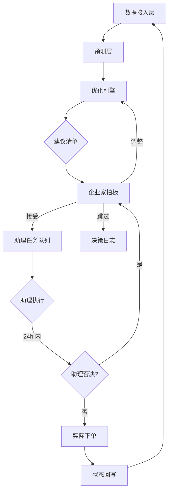
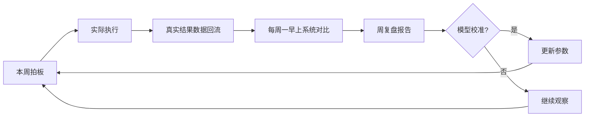

# FBA 总收益最大化决策引擎 · PRD

**版本**: v1.5（V1 吸收 R3 四方 challenge 后定稿）
**状态**: 草稿，含 5 个 [OPEN_QUESTION] 待企业家拍板
**作者**: PRD 大师协作产出（Lead PM + 工程/设计/商业/战略 四方评审 + 企业家拍板）
**日期**: 2026-05-23
**品类**: B 端自用工具 / 经济决策引擎

---

## ⚠️ 阅读须知

本 PRD 经历 3 轮多 Agent 辩论，定稿前还有 5 个 [OPEN_QUESTION] 待企业家拍板。**强烈建议先看：**

1. 第 9 章「风险与依赖」中的 [OPEN_QUESTION] 列表
2. 战略评审给企业家的金句（在 debate-log.md 中）
3. 假设清单 assumptions.md 的 A-001、A-003（核心假设）

特别提醒：战略评审 R3 留下未化解的 ROI 拷问——**"年化决策提升收益 < 100 万全周期成本？"** 这个账必须在投钱前算清楚。

---

## 1. 项目背景与收益

### 1.1 需求简介

200 SKU 的美国 FBA 业务，每天都在做"哪些 SKU 该补、补多少、走海运还是空运"的决策。当前依赖 Excel + 直觉，**SKU 数量超过人脑同时优化能力**，导致两类错误：

- 保守过头 → 资金积压 + FBA 仓储费过高
- 激进过头 → 缺货损失（直接销售 + 排名恢复期连带损失）

**本系统的核心价值**：用算法消化 50+ 维度同时优化，得出**总收益最大化**的发货决策。**核心价值是准确性，不是省时间**。

### 1.2 收益预估

#### 用户收益（量化）

| 指标 | 当前基线 | 目标（6 月） | 目标（12 月） | 依据等级 |
|------|---------|------------|-------------|---------|
| 月均缺货天数 / SKU | _TBD_ | 减少 50% | 减少 70% | D（需历史数据校准） |
| 库存周转天数 | _TBD_ | 减少 20% | 减少 30% | D |
| 物流总成本（含缺货损失）| _TBD_ | 减少 15% | 减少 25% | D |

#### 业务收益（量化）

- **总收益（销售收入 - 5 项成本）年化提升**：目标 +10% 以上（假设值，待企业家用真实数据校准）
- 假设当前年销售额 X 万美元，年化总收益提升 X × 10% = ? 万美元（假设值）

#### 不做风险

- SKU 持续增加（从 200 → 300+），人工决策能力会进一步崩溃
- 缺货损失累积（年化估算 _TBD_，待企业家根据历史填）

⚠️ **关键 OPEN_QUESTION (OQ-1)**: 年化收益是否能 cover 100 万+ 全周期成本？需要企业家在 PRD 通过前给出 ROI 估算。

---

## 2. 用户画像

### 2.1 用户角色矩阵

| 角色 | 身份 | 频次 | 关键场景 |
|------|------|------|---------|
| 决策者 | 企业家本人（刘润） | 周级（事件触发时即时） | 周报拍板 + 紧急决策 + 模型/策略战略调整 |
| 执行者 | 助理（业务运营） | 日级 | 按拍板清单实际下单海/空运 |

### 2.2 明确不是谁

- ❌ 不是 FBA 卖家运营人员的日常工具（不替代 Listing 优化、广告投放、客服）
- ❌ 不是给其他卖家用的 SaaS（v1 自用，v1.5+ 再考虑）
- ❌ 不是工厂/供应链人员的工具（不管上游下单生产）

### 2.3 用户故事

- **US-1**: 作为企业家，我希望**每周一早上**和**重大缺货预警随时**看到完整的"该发什么/多少/走什么物流"建议清单，以便用最少时间做最准确的决策
- **US-2**: 作为企业家，我希望每条建议都附带**清晰的成本/收益分解**（销售收入预估、资金占用、仓储费、缺货损失、在途成本、运费），以便我能 1 分钟看懂决策逻辑
- **US-3**: 作为企业家，我希望系统能在我**改变某个参数**（数量、物流方式）时**实时重算 landed cost**（由 FR-6 实现），以便我能调优后再拍板
- **US-4**: 作为企业家，我希望**关键参数（缺货损失系数等）变化 ±20% 时**，系统能告诉我决策是否稳定，以便我知道决策对哪个假设最敏感
- **US-5**: 作为助理，我希望每条拍板后的清单能在我的视图里**显示执行状态**（待发货/已下单/已发货/已入仓），以便闭环 + 出问题能及时退回给老板
- **US-6**: 作为企业家，我希望每周复盘时能看到**上周拍板 vs 系统建议**的偏差 + 实际结果，以便迭代我对系统的信任度
- **US-7**: 作为企业家，我希望系统能针对 v1 选定的"**高/中/低各 1-2 个 + 近期出过缺货的 2-3 个真实 SKU**"做**影子模式**对照（人工录入数据），以便用真实业务验证算法有效性，不靠虚拟数据自欺
- **US-8**: 作为企业家，我希望关键 SKU **60/90 天后可能断货**时收到提前预警，以便我能及时让工厂下单生产

---

## 3. 核心目标函数 ⭐ 特色章节

每次决策（事件触发或周节奏），对每个 SKU 求解：

```
Max: 总收益 (Total Profit)
   = Σ_t (预测销售收入_t)
     - Σ_t (库存资金占用成本_t)
     - Σ_t (FBA 仓储费_t)
     - Σ_t (缺货损失_t)
     - Σ_t (在途货物资金成本_t)
     - Σ_t (运费_t)
```

### 3.1 各项展开

| 项 | 公式 | 关键参数（带依据等级） |
|---|------|--------------------|
| 销售收入 | Σ_t (预测日销量_t × 售价 × min(1, 当日库存/预测日销量)) | 销量预测（D级）、售价（A级） |
| 库存资金成本 | (库存价值 + 在途货值) × 年化资金成本率 / 365 | 年化资金成本率（假设 10%，待企业家定，C 级行业基线） |
| FBA 仓储费 | 月度仓储费 + 长期仓储费（>271 天）+ 移除费 | FBA 费率表（A 级，从亚马逊获取） |
| 缺货损失 | 缺货天数 × 日销售额 × (1 + 排名恢复倍数) | 排名恢复倍数（C 级行业经验 2-4，待校准） |
| 在途货物成本 | 在途货值 × 年化资金成本率 / 365 × 在途天数 | 海运 30-45 天 / 空运 5-10 天 |
| 运费 | (海运单价 × 海运量) + (空运单价 × 空运量) | 货代报价（运营每周更新，D 级） |

### 3.2 决策变量

对每个 SKU s 和每个时间窗口 t：
- `x_s,t,sea` ∈ ℤ⁺: 该期走海运的件数
- `x_s,t,air` ∈ ℤ⁺: 该期走空运的件数

物流方式选择**不是单独决策**，是 x_sea 和 x_air 的相对大小决定的。

### 3.3 约束

- 每个 SKU 的库存 + 在途 + 新发货 ≥ 预测期内总需求 × (1 - 可容忍缺货率)
- FBA Restock Limit（基于 IPI）
- 总资金占用上限（企业家可设）
- 货代每次发货最低量约束（如 LCL 最低 1 CBM）

### 3.4 求解方式

⚠️ **重要修订（R3 工程评审 N1）**：原 V1 假设用 LP 求解，但**实际是 MINLP**（缺货损失是非线性 + 整数变量）。技术路径：

- **v1**: CP-SAT (Google OR-Tools，免费) 或 SCIP（学术免费），先做 2 周技术 spike 验证
- **v1.5**: 如果 spike 验证不通过，退化为"约束启发式 + 局部搜索"
- **不用** Gurobi（商业 license 贵）除非企业家专门授权

### 3.5 灵敏度分析

每次出决策同时输出**关键参数 ±20% 时的决策稳定性**：

- 排名恢复倍数从 2 → 8
- 年化资金成本率从 5% → 15%
- 销量预测从下界到上界

输出：**核心决策稳定率**（决策不变的 SKU 比例），用户能看到"哪些建议对参数敏感、值得人工复核"

---

## 4. 数据需求清单 ⭐ 特色章节

### 4.1 必需数据（v1 算法运行必须，按真实 FBA API schema 设计）

| # | 数据项 | 颗粒度 | 频率 | 来源 |
|---|-------|--------|------|------|
| D1 | FBA 当前库存 | SKU 级 | 实时 | Amazon Seller Central API |
| D2 | FBA 历史销量 | SKU × 日 | 日 | 同上 |
| D3 | SKU 主数据（名称/品类/状态） | SKU | 一次性+变更 | 内部 ERP |
| D4 | SKU 售价历史 | SKU × 日 | 日 | Amazon Seller Central |
| D5 | SKU 单位采购成本 | SKU | 一次性+变更 | 内部财务 |
| D6 | SKU 体积/重量 | SKU | 一次性 | 内部产品库 |
| D7 | FBA 仓储费率表 | 全品 | 按月更新 | Amazon |
| D8 | 当前在途库存（运输中） | SKU × 批次 | 实时 | 货代 / 内部 |
| D9 | 中国仓库存 | SKU | 实时 | 内部 ERP |
| D10 | 海运报价 | 路线 × 货量 | **每周手工录入**（R3 商业修订） | 运营每周跟 2-3 家固定货代谈出来 |
| D11 | 空运报价 | 路线 × 货量 | **每周手工录入** | 同上 |
| D12 | 海运/空运时效 | 路线 | 周 | 同上 |

⚠️ **R3 商业评审修订**：D10/D11/D12 不需要"实时 API"——FBA 卖家行业标准就是每周一次跟固定货代谈出价格表。**这砍掉了 V1 海运空运 API 接入的 3-6 个月专项工程**。

### 4.2 强烈建议（显著提升预测准确度）

| # | 数据项 | 颗粒度 | 频率 | 价值 |
|---|-------|--------|------|------|
| D13 | 广告投放数据 | SKU × 日 | 日 | 区分"自然 vs 投放"需求 |
| D14 | BSR (Best Sellers Rank) | SKU × 日 | 日 | 销量先行指标 |
| D15 | Listing 评分 / 评论数 | SKU | 周 | 转化率因子 |
| D16 | 关键词搜索量 | SKU 主词 × 日 | 日 | 需求趋势 |

### 4.3 可选（用于参数校准）

| # | 数据项 | 用途 |
|---|-------|------|
| D17 | 历史缺货事件 + 后续 30 天销量曲线 | 校准"排名恢复倍数"（关键参数） |
| D18 | 历史移除/弃货记录 | 校准长期仓储费触发 |

### 4.4 v1 mock 数据生成器

如果 v1 真实接入未就绪，用 mock 生成器：
- 可配置 200 SKU × 90 天数据
- 各项参数（销量分布/广告波动/价格变化/物流时效）可配置
- **数据 schema 严格按真实 FBA API 设计**，避免 v1.5 大重构（R3 工程 T7）

### 4.5 影子模式（FR-15）的真实 SKU

⚠️ **R3 商业修订**：v1 同步选 **5-7 个真实 SKU 影子运行**：
- 高销量稳定型：1-2 个
- 中销量波动型：1-2 个
- 长尾型：1 个
- 近期出过缺货事故：2 个

人工录入数据（每周 1 次），跟 mock 数据**逻辑隔离的优化引擎实例**（不共用资金池约束）—— R3 工程评审 challenge 商业评审的"数据双轨制陷阱"在此化解。

---

## 5. 功能需求

### 5.1 功能清单（吸收 R3 7 项修订）

| ID | 功能 | 优先级 | 实现 US | R3 修订点 |
|----|------|--------|---------|---------|
| FR-1 | 数据接入 Adapter（v1 含 mock 生成器 + 影子真实 SKU 手工录入） | 必做 | US-7 | R3 T7：按真实 schema 反向设计 |
| FR-2 | 销量预测（区间预测，含上下界 + 置信度） | 必做 | US-1 | R3 工程：不承诺 25% 误差 |
| FR-3 | 经济目标函数实现（5 项展开） | 必做 | US-2 | V1 新增 |
| FR-4 | MINLP 优化引擎（CP-SAT/SCIP） | 必做 | US-1 | R3 N1：MINLP 不是 LP |
| FR-5 | 灵敏度分析模块 | 必做 | US-4 | V1 新增 |
| FR-6 | 决策清单 + 可解释面板（30 秒/5 分钟/数学三层） | 必做 | US-2, US-3 | R3 设计：信息分层 wireframe |
| FR-7 | 助理操作视图 + 状态回写 | 必做 | US-5 | R3 商业：v1 必做 |
| FR-8 | 缺货预警系统（独立，不合并日报） | 必做 | US-8 | R3 工程：不合并到收件箱 |
| FR-9 | 周报 Dashboard（**事件触发 + 周节奏，不是每日**） | 必做 | US-1 | R3 商业：改"事件+周" |
| FR-10 | Mock/Real 模式切换 + UI 警示 | 必做 | - | R3 设计：避免资金事故 |
| FR-11 | 三策略回测（系统/保守/激进） | 必做 | - | V0 保留 |
| FR-12 | 周复盘报告（系统建议 vs 实际行动 vs 真实结果） | 必做 | US-6 | R3 商业：闭环 |
| FR-13 | 影子模式（5-7 个真实 SKU，**逻辑隔离引擎**） | 必做 | US-7 | R3 工程 + 商业修订 |
| FR-14 | 批量接受 80%+ 置信度建议 + **助理 24h 否决权 + 周复盘必看** | 应做 | US-5, US-6 | R3 商业：责任回路 |
| FR-15 | 60/90 天上游下单预警 | 应做 | US-8 | V0 保留 |
| FR-16 | SKU 自动分类（稳定/波动/季节性）+ 不同模型路由 | 应做 | - | V0 保留 |

### 5.2 详细功能说明（关键模块）

#### 5.2.1 FR-6 决策清单 + 可解释面板（核心交互）

**位置**：Dashboard 主页 → "本周建议清单"

**信息分层（R3 设计 wireframe）**：

| 层级 | 看时长 | 信息 |
|------|-------|------|
| **L1 摘要** | 30 秒 | 一行：「今日扫描 200 SKU，建议补货 5 个 SKU、总投入 X 万美元、预期总收益提升 Y%」 |
| **L2 清单** | 5 分钟 | 每条建议：SKU 名 + 数量 + 物流方式 + 一句话理由 + 「接受/调整/跳过」按钮 |
| **L3 数学** | 按需展开 | 该建议的目标函数各项贡献 + 灵敏度 + 替代方案对比 |

**交互逻辑**：

| 用户操作 | 系统响应 |
|--------|---------|
| 点"接受" | 写入助理任务队列 |
| 点"调整数量" | 实时重算该条 landed cost + 总收益，提示 +/- 多少 |
| 点"改物流" | 同上，提示风险 |
| 点"跳过" | 询问理由（用于学习），写入决策日志 |
| 点"批量接受 80%+" | 弹窗确认 → 全部入助理队列 → 通知"助理 24h 内有否决权" |

**异常场景**：
- 数据未更新：横幅"数据更新于 {时间}，建议等待最新数据"+ 模式切换器
- 优化引擎超时：显示部分结果 + "完整求解中"

#### 5.2.2 FR-8 缺货预警系统（独立于日报）

**触发条件**：
- 库存预计可用天数 < 安全天数阈值（按 SKU 配置，默认 14 天）
- 销量异常上升（7 日均值 / 30 日均值 > 1.5）
- 销量异常下降（7 日均值 / 30 日均值 < 0.5）

**推送**：企业微信应用（合规）或自建 Bot

**重要**：预警 ≠ 自动加入下一次决策。预警是触发"立刻看 Dashboard 做事件型决策"的信号。

#### 5.2.3 FR-9 周报 + 事件触发

**周节奏**：每周一早上 9 点固定周报
**事件触发**：库存阈值 / 销量异常 / 货代价格大变 → 立即跑决策 + 推送

⚠️ **R3 商业评审修订**：**不是每天日报**。200 SKU 健康业务真正决策日不超过每周 2-3 次，每日强制打开是伪需求。

---

## 6. 流程与状态图表

### 6.1 主决策流程



### 6.2 周复盘闭环



---

## 7. 边界与异常

### 7.1 数据边界

- 200 SKU 上限（v1，v1.5 支持更多）
- 历史数据 < 90 天的新 SKU：用"新品冷启动模型"（保守预测 + 高安全库存）
- mock 数据 vs 真实 SKU：UI 严格区分，不混算

### 7.2 时区

数据接入层定义"统一标准时间"（UTC），各源数据按各自时区入库时转换：
- 卖家时区：北京时间（决策展示）
- FBA 仓时区：美西时间（运营时间窗）
- 亚马逊销售：各站点本地时区（数据回写时转换）

### 7.3 优化引擎超时

单次求解时限 30 分钟。超时则降级：
- 输出当前最优解（可能不是全局最优）
- 标记"求解未完全收敛"
- 触发下次重新求解（增加时限或砍 SKU 数）

### 7.4 预警风暴

15 分钟内 > 10 个 SKU 触发预警：聚合为单条"批量预警，请立即查看 Dashboard"

---

## 8. 成功度量

**总览**：所有目标都有对应度量指标，跟踪如下：

| 指标 | 类型 | 跟踪的目标 | 基线 | 目标 | 时间窗 |
|------|------|----------|------|------|--------|
| 总收益年化提升 % | 业务 | "总收益提升 10%" | _TBD_ | +10% | 12 月 |
| 月均缺货天数/SKU | 业务+用户 | "缺货天数减少 50%" | _TBD_ | -50% | 6 月 |
| 库存周转天数 | 业务 | "库存周转减少 20%" | _TBD_ | -20% | 6 月 |
| 周决策时间 (用户) | 用户体验 | "周决策时间节省" | 2-3 小时/周 | <30 分钟/周 | 3 月 |
| 决策信任度自评 (用户) | 用户体验 | "决策信任度" | _TBD_ | >4/5 分 | 12 月 |
| CEO 周看决策时长 (用户) | 用户体验 | "心智负担降低" | _TBD_ | <1 小时 | 12 月 |

### 8.1 北极星指标

| 指标 | 基线 | 目标 | 时间窗 | 来源 | 验证方法 |
|------|------|------|--------|------|---------|
| 总收益提升 % | _TBD_（待企业家填） | +10% | 12 个月 | 财务实测 | 对比上一年同期 |
| 月均缺货天数/SKU | _TBD_ | -50% | 6 个月 | 系统统计 | SKU 历史对比 |
| 库存周转天数 | _TBD_ | -20% | 6 个月 | 财务/FBA | 同上 |

### 8.1.1 用户体验指标（对应 User Goals）

| 指标 | 基线 | 目标 | 时间窗 | 来源 |
|------|------|------|--------|------|
| 周决策时间节省 | 当前 2-3 小时 / 周 | < 30 分钟 / 周 | 上线 3 月 | 实测 |
| 决策信任度自评 | _TBD_ | > 4/5 分 | 12 月 | 周复盘自评 |
| 心智负担降低 | _TBD_ | CEO 每周看决策时间 < 1 小时 | 12 月 | 时间统计 |

### 8.2 v1 验证指标（虚拟+影子）

| 指标 | 验证方法 | 通过标准 |
|------|---------|---------|
| 决策合理性 | 虚拟数据 + 影子 SKU 90 天回测 | 系统 > 保守 > 激进的总收益排序成立 |
| 灵敏度健壮性 | 关键参数 ±20% | 核心决策稳定率 > 70% |
| 求解时间 | 200 SKU × 90 天窗口 × MINLP | 单次 < 30 分钟 |
| 可解释性 | 用户自评（5 分制） | 平均 > 4 |
| CEO 拍板时间/周 | 实测 | < 30 分钟/周（含批量接受） |

### 8.3 上线后验收

- 上线 12 个月：用实际财务数据回测，对比"如果当时按系统建议执行" vs "实际执行"
- 如果总收益提升 < 5%，启动"是否止损" 决策

---

## 9. 风险与依赖

### 9.1 5 个 [OPEN_QUESTION]（必须企业家拍板）⭐

| # | 问题 | 战略评审立场 | 其他方立场 | 待企业家决定 |
|---|------|-----------|----------|-------------|
| **OQ-1** | **ROI 算式**：年化决策提升收益 vs 100 万+ 全周期成本 | 不值；"30 万美元 vs 写第三本书" | 工程/设计/商业：未触及 | **必须算清楚才能投钱** |
| OQ-2 | 影子模式真实 SKU 数量：5-7 vs 20+ | 要么 20+ 要么别做 | 商业：高/中/低各 1-2 + 缺货事故 2-3 = 5-7 | 5-7 已纳入 PRD，是否够？ |
| OQ-3 | CEO 心智锁死风险 | 致命；"每天看库存日报的 CEO 写不出第三本书" | 未触及 | **个人选择** |
| OQ-4 | 频率：事件触发+周（已采纳）vs 每日 | - | 商业：周（已采纳） | 已选周，是否合适？ |
| OQ-5 | 团队配置：1+1 vs 算法团队 + ×2 工时 | ×2 | 工程：×2 + 2 周 spike | 资源决策 |

### 9.2 主要风险

| 风险 | 等级 | 缓解措施 |
|------|------|---------|
| MINLP 求解超时或不收敛 | 🔴 | 2 周技术 spike 验证；降级到启发式 |
| 影子模式真实 SKU 太少结论不显著 | 🟠 | 严格选 5-7 个含各档 + 缺货事故 |
| 缺货损失系数 3-5 倍误差大 | 🟠 | 灵敏度分析 + 上线后真实数据校准 |
| CEO 心智锁死 | 🟠 | 周节奏（不强制每日）+ 批量接受 + 助理执行 |
| 项目沉没成本陷阱 | 🟡 | 12 个月强制 ROI 复盘 + "止损"决策点 |

### 9.3 关键依赖

- 货代愿意每周报价（人工流程）
- 助理愿意配合状态回写
- 企业家愿意坚持周复盘
- 真实 SKU 历史数据可获取（用于校准）

---

## 10. 验收标准（5 维必须覆盖）

### 10.1 主流程

| 测试场景 | 前置条件 | 操作 | 期望结果 | 判定 |
|---------|---------|------|---------|------|
| 每周一早上看周报 | 系统正常运行，200 SKU 数据齐 | 打开 Dashboard | L1 摘要 30 秒可读，L2 清单 5 分钟可看完 | ✅/❌ |
| 拍板"接受"建议 | 收到建议清单 | 点"接受" | 助理任务队列出现该条，状态 = 待发货 | ✅/❌ |
| 调整数量后重算 | 看到建议 X 件 | 改成 Y 件 | landed cost 和总收益实时更新 | ✅/❌ |
| 助理 24h 内否决批量接受 | 批量接受了 10 条 | 助理点否决某条 | 该条退回老板决策队列 + 通知 | ✅/❌ |

### 10.2 异常分支

| 场景 | 期望 |
|------|------|
| 数据未更新 | 横幅警示 + 模式切换器 |
| 优化引擎超时 | 输出部分结果 + 标记 |
| 预警风暴（>10 SKU/15 分钟） | 聚合单条推送 |
| 缺货事件发生 | 自动启动复盘记录 |

### 10.3 多模式切换（Mock/Real）

| 场景 | 期望 |
|------|------|
| 从 Mock 切到 Real | 顶部斑马条消失，"演练数据"标签消失，确认弹窗"现在进入真实模式" |
| 从 Real 切到 Mock | 反向，加警示 |
| 影子 SKU 与 Mock SKU 同屏展示 | 严格区分（不同色块/Tab） |

### 10.4 平台兼容

- Web Dashboard：Chrome / Edge / Safari 最新版
- 移动端预警：企业微信应用（iOS/Android）
- 数据导出：Excel / CSV

### 10.5 回归影响

- 当前 Excel 手工流程：v1 上线后 30 天保留并行，确保切换无缝
- 改了核心算法：影子模式 SKU 历史对比，确保结果不退化

---

## 11. 依据清单

### 11.1 用户依据

- 企业家自述（conversation.md 完整对话存档）
- 7 个用户故事（US-1 至 US-8）反映自用场景

### 11.2 竞品依据

详见 `evidence/competitors.md`：
- SoStocked / RestockPro / SKU Compass / Helium 10 / Sellerboard / AMZ Prep / Prediko
- 核心结论：现有工具都不解 V1 的 5 项完整目标函数，仅做"补多少+何时补"局部最优

### 11.3 行业 Benchmark

详见 `evidence/benchmark.md`：
- EOQ + ROP + Safety Stock 经典算法
- BSR + 广告联动作为销量预测特征
- 海运 25-42 天 / 空运 2-14 天，成本差 4-16 倍
- "68% 的发货/促销补货场景，空运在 landed cost 上反而更优"

### 11.4 内部假设

详见 `assumptions.md`，7 条核心假设，每条带依据等级 + 证伪条件 + 验证方法。

### 11.5 辩论记录

详见 `debate-log.md`，3 轮多 Agent 辩论完整过程：
- R1 四方独立挑刺
- R2 Lead PM 回应 + 企业家定位修正
- R3 四方互相 challenge + 收敛

---

## 12. 附录

### 12.1 术语表

| 术语 | 含义 |
|------|------|
| SKU | Stock Keeping Unit，库存最小单位 |
| FBA | Fulfillment by Amazon，亚马逊代发货仓 |
| Landed Cost | 到岸总成本（含运费+关税+派送+持有等所有成本） |
| BSR | Best Sellers Rank，亚马逊销售排名 |
| ROP | Reorder Point，再订货点 |
| EOQ | Economic Order Quantity，经济订货量 |
| (s, S) | 库存策略：跌到 s 就补到 S |
| MINLP | 混合整数非线性规划（解决既有整数变量又有非线性约束的优化问题）|
| IPI | Inventory Performance Index，亚马逊库存表现指标 |
| 排名恢复倍数 | 缺货损失中除直接销售损失外的连带损失系数（行业经验 2-4） |
| 影子模式 | 用真实 SKU 跟系统建议做人工对照（不实际执行系统建议）|

### 12.2 关联文件

- 场景锚点：`scene-anchor.md`
- 假设清单：`assumptions.md`
- 竞品分析：`evidence/competitors.md`
- 行业基线：`evidence/benchmark.md`
- 辩论记录：`debate-log.md`
- 完整对话：`conversation.md`
- V0 / V1 方案历史：`proposal-v0.md` / `proposal-v1.md`

---

## 13. 一致性自检

跑 `py prd-master/validators/check_consistency.py projects/fba-smart-restock/PRD.md` 查看实时结果。

期望：所有 US-N → FR 映射 PASS，所有业务目标 → 指标 PASS。

（脚本输出会作为一致性证明留档，详见 check 跑出的 stdout）

---

## 14. 总判断（给企业家的一句话）

> **这个 PRD 在认知层面是完美的——目标函数清晰、数据需求明确、多 Agent 充分博弈过。但战略评审 R3 留下一刀未化解：年化收益是否 cover 100 万+ 全周期成本？这个账你必须自己算。如果答案是否，请把这个 PRD 当作"PRD 大师如何防止做错事"的演示案例归档；如果答案是是，立刻进入 2 周技术 spike 验证 MINLP 可行性。**

— Lead PM + 工程 + 设计 + 商业 + 战略 五方共同署名

---

**版本历史**:
- V0 (proposal-v0.md): 补货 workflow 工具，被 R1 四方否定
- V1 (proposal-v1.md): 重定位为经济决策引擎，化解 R1 但留 R3 新质疑
- v1.5 (本 PRD): 吸收 R3 7 项修订，留 5 个 [OPEN_QUESTION] 待企业家拍板
