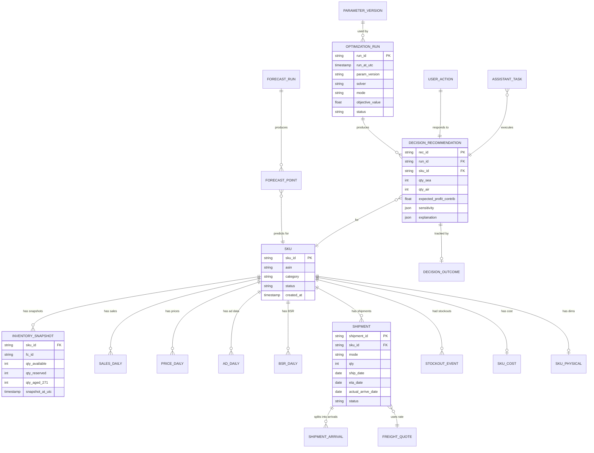
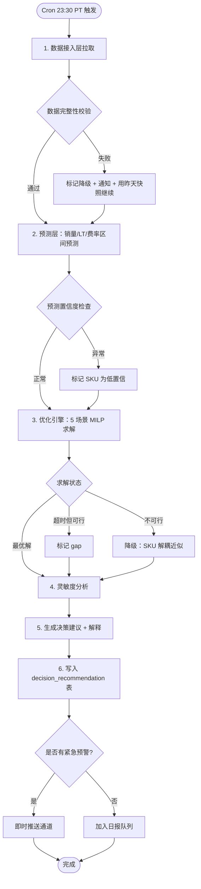
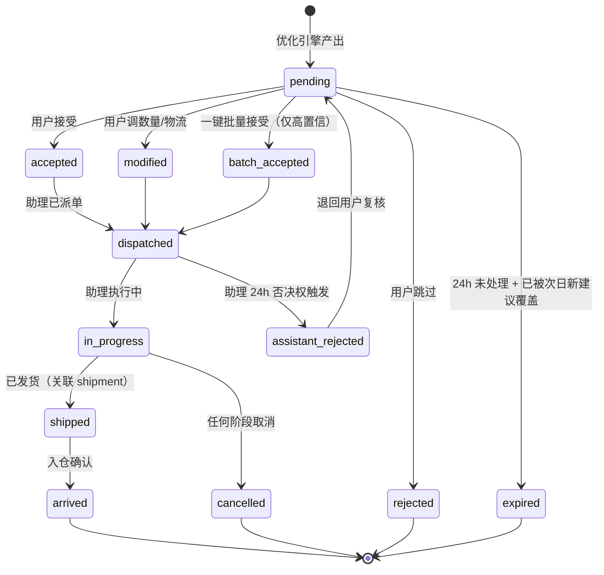
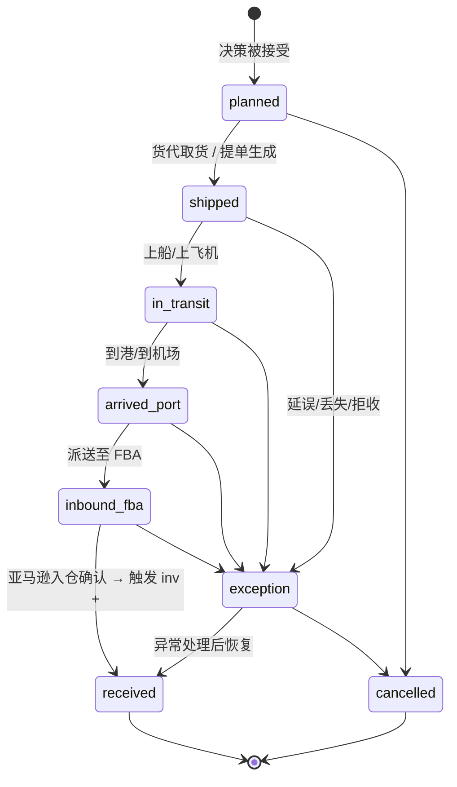
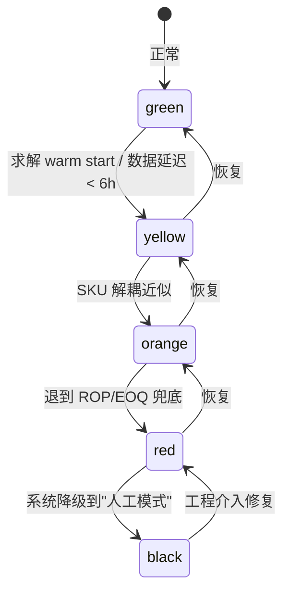
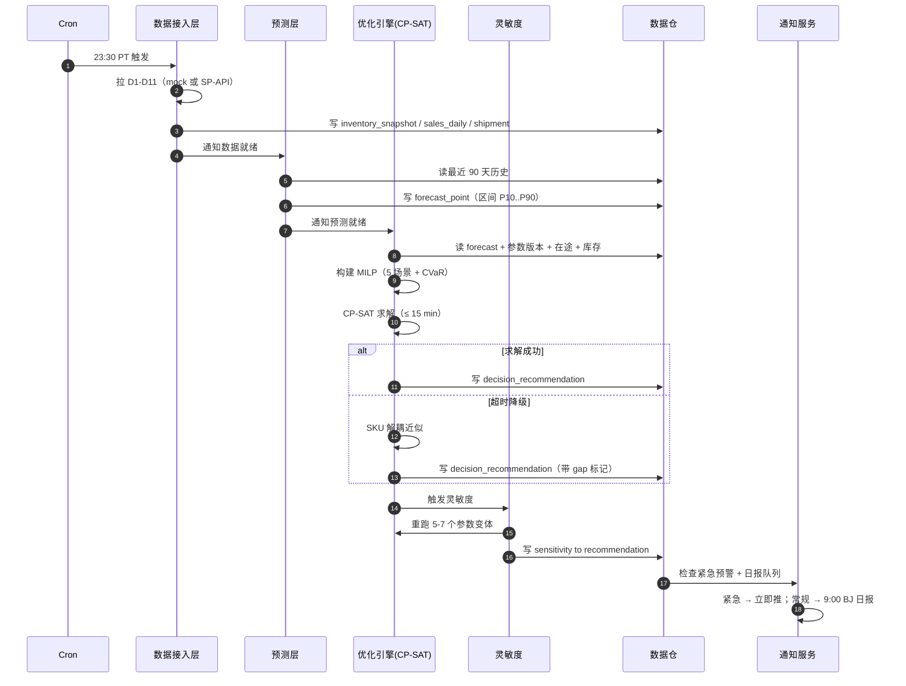
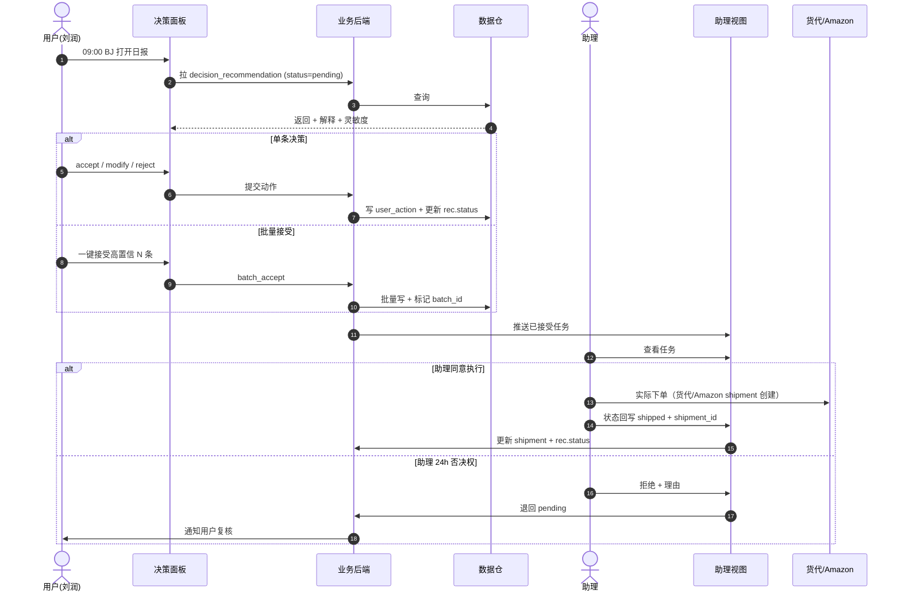
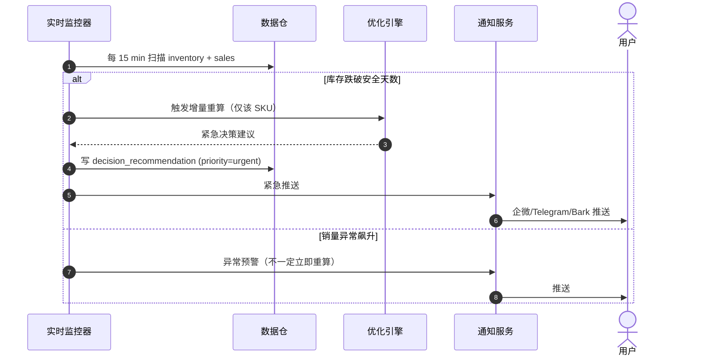

# r1-architect.md · 架构师主笔章节

**视角**: 架构师（系统/模块/数据/流程）
**版本**: R1 草稿
**日期**: 2026-05-23
**约束**: 本文件只覆盖 §3 算法、§4 数据、§6 流程、§9.A-C 风险与依赖。其他章节由 PM/工程主笔。

---

## §3 核心算法 / 目标函数

### 3.1 数学形式（目标函数 + 决策变量 + 约束）

#### 3.1.1 决策变量（每日重解，规划期 H 天）

对每个 SKU `s ∈ S`（|S| ≈ 200）、每个发货日 `t ∈ {0, 1, ..., H-1}`（H = 90，但只有 t=0 的决策真正下单，t>0 是"未来计划"用于看清当前决策的代价）：

| 变量 | 类型 | 含义 |
|------|------|------|
| `x_sea[s,t]` | 非负整数 | 第 t 天走海运发货的件数 |
| `x_air[s,t]` | 非负整数 | 第 t 天走空运发货的件数 |
| `y_sea[s,t]` | 二元 (0/1) | 是否启动一次海运批次（启动成本/最小批量触发） |
| `y_air[s,t]` | 二元 (0/1) | 是否启动一次空运批次 |
| `inv[s,d]` | 连续非负 | 第 d 天 FBA 在仓库存（推导，非自由变量） |
| `short[s,d]` | 连续非负 | 第 d 天缺货件数（= max(0, demand - inv)） |
| `aged[s,d]` | 连续非负 | 第 d 天库龄 > 271 天的库存（推导） |

> **明确写出**：`y` 系列变量是整数，且通过大 M 约束跟 `x` 耦合 —— **这一刻起，问题就不是 LP 而是 MILP**（混合整数线性规划）。

#### 3.1.2 目标函数（每日重解一次，规划期 H 天的滚动总收益）

```
Max  Z = Σ_{s∈S} Σ_{d=0..H-1} [
            revenue[s,d]                       (1) 销售收入
          - capital_inv[s,d]                   (2) 在仓库存资金占用
          - capital_intransit[s,d]             (3) 在途货物资金占用
          - fba_storage[s,d]                   (4) FBA 月度仓储费
          - fba_aged_fee[s,d]                  (5) 长期仓储附加费
          - stockout_loss[s,d]                 (6) 缺货损失（含排名恢复尾巴）
          - freight[s,t]                       (7) 海/空运运费
          - launch_cost[s,t]                   (8) 启动成本（订舱/订机最小费用）
        ]
```

其中：

```
(1) revenue[s,d]         = price[s,d] × min(demand[s,d], inv[s,d])
(2) capital_inv[s,d]     = cost[s] × inv[s,d] × r_capital / 365
(3) capital_intransit[s,d] = cost[s] × intransit[s,d] × r_capital / 365
(4) fba_storage[s,d]     = volume[s] × inv[s,d] × storage_rate(month_of(d)) / 30
(5) fba_aged_fee[s,d]    = volume[s] × aged[s,d] × aged_rate(age_bucket) / 30
(6) stockout_loss[s,d]   = short[s,d] × price[s,d] × (1 + rank_recovery_factor[s])
                          + Σ_{k=1..R} short[s,d] × price[s,d+k] × decay[k]   ← 排名恢复尾巴
(7) freight[s,t]         = sea_rate[t] × weight[s] × x_sea[s,t]
                          + air_rate[t] × weight[s] × x_air[s,t]
(8) launch_cost[s,t]     = sea_min_charge × y_sea[s,t] + air_min_charge × y_air[s,t]
```

#### 3.1.3 约束

| # | 约束 | 形式 |
|---|------|------|
| C1 | 库存递推 | `inv[s,d] = inv[s,d-1] - sold[s,d-1] + arrive_sea[s,d] + arrive_air[s,d]` |
| C2 | 到货时延 | `arrive_sea[s,d] = x_sea[s, d - LT_sea]`（LT_sea = 35±5 天，含入仓） |
| C3 | 销售上限 | `sold[s,d] ≤ min(demand[s,d], inv[s,d])` |
| C4 | 缺货定义 | `short[s,d] ≥ demand[s,d] - inv[s,d]` |
| C5 | FBA Restock Limit | `Σ_d inv[s,d] ≤ IPI_cap(s)`（按品类/IPI） |
| C6 | 资金总池 | `Σ_s Σ_d cost[s] × (inv[s,d] + intransit[s,d]) ≤ B_capital` |
| C7 | 启动耦合 | `x_sea[s,t] ≤ M × y_sea[s,t]` 且 `x_sea[s,t] ≥ min_lot × y_sea[s,t]` |
| C8 | 货代周容量 | `Σ_s weight[s] × x_sea[s,t] ≤ container_cap_per_week` |
| C9 | 整数性 | `x ∈ ℤ⁺, y ∈ {0,1}` |
| C10 | 库龄推导 | `aged[s,d] = FIFO 推导`（仅当 d - 入仓日 > 271）|

> **关于非线性**：目标函数原始式里 `min(demand, inv)` 和 `max(0, demand - inv)` 都是分段线性，可以通过引入 `sold` 和 `short` 辅助变量 + C3/C4 不等式松弛为线性。**这正是把表面 MINLP 降级为 MILP 的关键技巧**。仓储费的"按月分档"也用 SOS1 或额外二元变量线性化。

### 3.2 求解方式（求解器选型 + 性能预算 + 退化方案）

#### 3.2.1 问题规模估算

- 决策变量：200 SKU × 90 天 × 2 物流方式 × (1 连续 + 1 二元) ≈ **72,000 变量**
- 衍生变量：inv / short / aged 各 200 × 90 = 18,000 × 3 = 54,000
- 约束：C1-C10 总数级别 200 × 90 × 10 ≈ 180,000
- **MILP 规模 = 中等偏大**，求解时间高度敏感于二元变量数量（200 × 90 × 2 = 36,000 个 y）

#### 3.2.2 求解器选型决策

| 求解器 | License | MILP 性能 | 集成成本 | 是否推荐 |
|--------|---------|-----------|---------|---------|
| **OR-Tools CP-SAT** (Google, Apache-2.0) | 免费商用 | 中等规模 MILP 强；并行优秀 | Python 原生 | ✅ **首选** |
| SCIP (ZIB, Apache-2.0) | 免费商用（2022 起）| 接近 Gurobi 的 60-70% | PySCIPOpt 中等 | 🟡 备选 |
| Gurobi | 商用 license（~$10K+/年/seat）| 业界最强 | gurobipy 简单 | 🟡 仅当 CP-SAT/SCIP 性能不达标且预算允许 |
| CBC (COIN-OR) | 免费 | 弱（大规模 MILP 易卡） | PuLP/Pyomo | ❌ 仅 baseline 对照 |
| HiGHS | 免费 | LP 强、MILP 弱于 SCIP | pyomo/highspy | ❌ |

**选择 CP-SAT，权衡说明**：

- **选 CP-SAT 而不是 Gurobi**：Gurobi 性能更强，但 license 成本（$10K+/年/seat）+ 闭源对自用项目都不值；CP-SAT 在 200 SKU × 90 天的规模上经验性可在分钟级出解。**代价**：若 SKU 涨到 1000+ 性能不一定够，到那时考虑切换 SCIP/Gurobi。
- **选 CP-SAT 而不是 SCIP**：CP-SAT 对约束编程范式友好（启动成本/最小批量这类逻辑约束表达自然），并行调度好；SCIP 是更"经典"的 branch-and-bound。**代价**：CP-SAT 对纯连续变量支持弱（要离散化）—— 本问题决策变量本来就是整数，无影响。
- **选 MILP 而不是 stochastic programming / RL**：v1 在确定性 MILP 上闭环；区间预测的处理见 §3.5；强化学习留 v1.5。**代价**：v1 无法直接表达"需求的概率分布"，只能用 scenario-based robust（§3.5）打补丁。

#### 3.2.3 性能预算

| 场景 | SKU 数 | 期望求解时间 | 硬超时 |
|------|--------|------------|--------|
| 日常每日跑（baseline）| 200 | < 5 分钟 | 15 分钟 |
| 灵敏度多场景（参数 ±20%, 5-7 个场景）| 200 × 7 | < 30 分钟 | 1 小时 |
| 周末全量回测（90 天）| 200 × 90 | < 4 小时 | 8 小时 |

**性能预算前提**：CP-SAT 默认 8 workers 并行，64 GB RAM，SSD。

#### 3.2.4 退化方案（求解器超时或不收敛时）

按降级顺序：

1. **第一档：Warm start + 时间限制** — 用昨天的解作 hint，CP-SAT 设 `max_time_in_seconds`，超时返回当前最优可行解 + gap 标记
2. **第二档：SKU 解耦近似** — 把全局资金/容量约束松弛为"按 SKU 配额预分", 每个 SKU 独立求解（200 个小 MILP 并行，每个 < 10 秒）。**代价**：失去全局最优性，资金分配可能次优 5-15%
3. **第三档：贪心 + ROP/EOQ 兜底** — 完全退到经典库存学公式（ROP = 平均日销 × LT + 安全库存；EOQ 决批量），物流方式按 §3 benchmark 3.4 的临界点表硬决策。**代价**：决策质量回退到行业平均水平，但永远能给出建议
4. **第四档：人工模式** — 报告"系统降级中"，给用户库存全景 + 临界 SKU 清单，让用户用 Excel 决策

> **降级是一等公民**：UI 必须显示当前所在档位（绿/黄/橙/红），不能让用户以为永远在档 1。

### 3.3 参数校准策略

| 参数 | v1 来源 | 校准方法 | 重校频率 |
|------|---------|---------|---------|
| `rank_recovery_factor[s]` | 默认 3.0（benchmark 中位） | v1 用 mock 配置；v1.5 用真实历史缺货事件回归 | 季度 |
| `r_capital` (年化资金成本率) | 用户输入，默认 10% | 财务输入 | 半年 |
| `LT_sea`, `LT_air` 均值/方差 | mock 配置（35±5, 7±2）| v1.5 从在途订单实际入仓时间回归 | 月 |
| `sea_min_charge`, `air_min_charge` | 货代表 | 半人工维护（见 §9.B）| 月 |
| `IPI_cap(s)` | 亚马逊 API（v1.5）；v1 设 ∞ | 真实接入后取 Restock Limit 报表 | 周 |
| `demand[s,d]` 预测 | 见 §3.5 | — | 每日重训 |

**校准原则**：
- 所有参数版本化，每日决策记录其使用版本号
- 参数突变（> 30% 变化）触发"参数审查"流程，决策日报顶部标红
- 校准代码与求解代码隔离（不同模块，独立测试覆盖率）

### 3.4 灵敏度分析方法

**方法选择：OAT（One-At-a-Time）+ 关键参数对组合扫描**

| 参数 | 扰动幅度 | 关注输出 |
|------|---------|---------|
| `rank_recovery_factor` | {1.5, 2, 3, 4, 6, 8} | 海/空运决策切换点 |
| `r_capital` | {6%, 10%, 15%} | 备货量上下波动 |
| `sea_rate`, `air_rate` | ±20% | 物流方式切换点 |
| `demand` 预测中位值 | ±15%, ±30% | 缺货件数 / 总收益 |
| `LT_sea` | ±10 天 | 安全库存推荐量 |

**输出形态**：
1. **决策稳定性矩阵**：每个 SKU × 每个参数 → "决策不变 / 数量调整 / 物流方式翻转"三态
2. **关键参数标记**：若某 SKU 的决策对 `rank_recovery_factor` ±50% 才翻转 → 标"稳健"；若 ±10% 就翻转 → 标"敏感"，进入"人工确认"队列
3. **Tornado 图**：每条 SKU 一张图，按参数对总收益影响排序

> **不做 Sobol/Monte Carlo 全局灵敏度分析**：计算成本 O(n²) 级别，对 v1 是过度工程。**代价**：发现不了参数间的高阶交互效应，但对自用工具阶段够用。

### 3.5 区间预测如何接入优化引擎（正面回应 R3 N2）

**问题**（debate-log R3 N2）：销量预测层输出"区间预测（含上下界）"，但 MILP/CP-SAT 求解器只吃点估计。如何对接？

**v1 方案：Scenario-based Robust Optimization（场景法鲁棒优化）**

不引入 stochastic programming 的复杂度，而是把"区间预测"离散化为 3-5 个场景，每个场景独立求解，然后用决策规则聚合。

#### 3.5.1 场景生成

预测层为每个 SKU × 每天输出三元组 `(demand_lo, demand_mid, demand_hi)`（如 P10 / P50 / P90 分位数）。

构造 5 个全局场景：

| 场景 | 含义 | 销量取值 | 权重 |
|------|------|---------|------|
| S1 | 悲观 | 全部 SKU 取 P10 | 0.15 |
| S2 | 偏悲观 | 全部 SKU 取 P25 | 0.20 |
| S3 | 基线 | 全部 SKU 取 P50 | 0.30 |
| S4 | 偏乐观 | 全部 SKU 取 P75 | 0.20 |
| S5 | 乐观 | 全部 SKU 取 P90 | 0.15 |

> **简化假设**：所有 SKU 的不确定性正相关（"市场整体好/坏"）。**代价**：忽略 SKU 间的独立波动，对自然分散的品类可能高估风险。但比独立场景（5^200 个组合）实际可解。

#### 3.5.2 两阶段决策

**Stage 1（当下决策，所有场景共享）**：t=0 的 `x_sea[s,0]`、`x_air[s,0]`、`y_sea[s,0]`、`y_air[s,0]` —— **真正下单的决策**
**Stage 2（未来计划，按场景分支）**：t > 0 的所有变量按场景独立优化

目标函数：

```
Max  Σ_k w_k × Z_k
其中 Z_k = 场景 k 下的总收益
约束 stage-1 变量在所有场景中相同（non-anticipativity）
```

#### 3.5.3 鲁棒性补丁：CVaR 约束

仅最大化期望值会让极端缺货风险被平均掉。加一条 CVaR（条件风险价值）约束：

```
最差 25% 场景下的平均缺货损失 ≤ user_tolerance
```

用户在 UI 上可调 `user_tolerance`（"保守 / 平衡 / 激进"三档），架构师只暴露接口，业务由 PM 章节定义。

#### 3.5.4 求解规模影响

- 单场景：200 × 90 × ~10 = 180K 变量
- 5 场景：900K 变量（stage-1 共享，stage-2 ×5）
- CP-SAT 经验：900K MILP 在 8 worker 上约 10-30 分钟。**性能预算仍可行，但接近边界**

**退化**：若 5 场景超时 → 退到 3 场景（P25/P50/P75），再不行退到点估计（用 P50）+ 加固定 20% 安全 buffer。

#### 3.5.5 为什么不直接用 Stochastic Programming / Chance-Constrained MILP

| 方案 | 表达力 | v1 成本 | 拒选理由 |
|------|--------|---------|---------|
| 2-stage SP with scenario tree | 强 | 高 | 已用（上述方案是 SP 的简化版） |
| Chance-Constrained MILP | 强 | 高 | 需要 PSCC 求解器或大量场景采样，CP-SAT 不原生支持 |
| Distributionally Robust Optimization | 最强 | 极高 | 学界前沿，v1 不必要 |
| Markov Decision Process / RL | 替代范式 | 极高 | v1.5 探索 |

**最终选择**：上述 §3.5.1-3.5.4 的"场景法 + CVaR"是 SP 的工程实用化版本，是 v1 平衡复杂度和效果的最佳点。**代价**：把"区间"压成 5 个分位点，丢失了完整分布信息，但对自用决策已足够。

---

## §4 数据需求 + 数据模型

### 4.1 必需 / 建议 / 可选数据清单

#### 4.1.1 必需（v1 算法不能运行就缺）

| ID | 数据项 | 粒度 | 频率 | 来源（v1 mock / v1.5 真实）|
|----|-------|------|------|------------------------|
| D1 | FBA 在仓库存 | SKU × FC | 实时 | Mock / Amazon SP-API `getInventorySummaries` |
| D2 | FBA 销量历史 | SKU × 日 × FC | 日 | Mock / `getOrderItems` + `getOrders` 聚合 |
| D3 | SKU 主数据（SKU/ASIN/品类/重量/体积） | SKU | 变更触发 | Mock / 内部 PIM |
| D4 | 售价历史 | SKU × 日 | 日 | Mock / SP-API listings |
| D5 | 单位采购成本 | SKU | 变更触发 | Mock / 内部财务 |
| D6 | 在途库存（含批次/物流方式/预计到港）| SKU × 批次 | 实时 | Mock / 货代 + 内部 |
| D7 | FBA 仓储费率表（标准/危险品/月度/旺季）| 品类 × 月 | 月 | Mock / Amazon 公开 |
| D8 | 海运报价（路线 × 重量 × 时效）| 路线 | 周 | Mock / 货代半人工维护 |
| D9 | 空运报价 | 路线 | 周 | Mock / 货代半人工维护 |
| D10 | 中国仓库存 | SKU | 实时 | Mock / 内部 ERP |
| D11 | IPI / Restock Limit | 卖家账号 | 周 | Mock / SP-API restock report |

#### 4.1.2 强烈建议（显著提升预测准确度）

| ID | 数据项 | 粒度 | 频率 | 价值 |
|----|-------|------|------|------|
| D12 | 广告投放数据（spend/impr/CTR/CVR/ACoS）| SKU × 日 | 日 | 拆分"自然 vs 投放"需求 |
| D13 | BSR | SKU × 日 | 日（高频）| 销量先行指标 |
| D14 | Listing 评论数 / 平均星级 | SKU | 周 | 长期需求漂移 |
| D15 | 历史缺货事件 + 之后 30 天销量曲线 | SKU × 事件 | 事件触发 | 校准 rank_recovery_factor |

#### 4.1.3 可选（v2+ 增量价值）

| ID | 数据项 | 用途 |
|----|-------|------|
| D16 | 同类竞品 BSR | 季节性/行业基线 |
| D17 | Google Trends / 关键词搜索 | 外部需求信号 |
| D18 | 历史移除/弃货记录 | 长期仓储费校准 |

#### 4.1.4 明确不要

- 客户评论文本（不影响补货）
- 广告关键词竞价（属于广告优化范畴）
- Listing 文案 / 主图

### 4.2 核心实体关系（ER 图）



### 4.3 Schema 草案（字段含义 + 类型描述）

> 不写 SQL DDL；只描述字段意图和工程约定。

#### 4.3.1 SKU 主表（`sku`）

| 字段 | 类型 | 说明 |
|------|------|------|
| sku_id | string PK | 内部唯一标识，永不复用 |
| asin | string | Amazon 标识，可能为空（未上架） |
| category | string | 用于 FBA 费率分档 |
| status | enum | active / discontinued / paused |
| created_at | timestamp UTC | |
| metadata | json | 自由扩展，不参与算法 |

#### 4.3.2 库存快照（`inventory_snapshot`）

| 字段 | 类型 | 说明 |
|------|------|------|
| sku_id | string FK | |
| fc_id | string | FBA 仓识别（多 FC 时聚合或分项）|
| qty_available | int | 可售 |
| qty_reserved | int | 已锁定（订单/调拨）|
| qty_aged_271 | int | 库龄 > 271 天的件数（长仓费触发）|
| qty_aged_365 | int | 库龄 > 365 天 |
| snapshot_at_utc | timestamp | **统一 UTC**；源数据若不带时区按"亚马逊站点本地时区"折算 |
| source | enum | mock / sp_api / manual |
| ingestion_run_id | string | 追溯到哪次拉取 |

#### 4.3.3 销量日表（`sales_daily`）

| 字段 | 类型 | 说明 |
|------|------|------|
| sku_id | string FK | |
| marketplace | string | US / CA / UK 等 |
| sales_date_local | date | **站点本地日期**（不是 UTC 日期）|
| qty_sold | int | |
| revenue_local_currency | decimal(12,2) | |
| currency | string(3) | 用于多站点统一汇兑 |
| is_back_filled | bool | 因延迟数据回补的标记 |

> **关键决策**：销量日期用"站点本地日期"，因为业务语义是"美国 5 月 23 日卖了多少"；预测和决策都按本地日期对齐。**但所有时间戳类字段统一 UTC**。两套日期系统在数据治理层显式映射。

#### 4.3.4 在途/发货（`shipment`）

| 字段 | 类型 | 说明 |
|------|------|------|
| shipment_id | string PK | |
| sku_id | string FK | （单 SKU；多 SKU 合一票要拆行）|
| mode | enum | sea_fcl / sea_lcl / air |
| qty | int | |
| ship_date | date | |
| eta_date | date | 计划到达 |
| actual_arrive_date | date | 实际入仓（用于 LT 反校准）|
| status | enum | planned / shipped / in_transit / arrived_port / inbound_fba / received / cancelled |
| freight_quote_id | string FK | 锁定下单时的报价 |
| created_by | enum | system_recommendation / manual |
| rec_id | string FK | 若来自系统建议 |

#### 4.3.5 预测点（`forecast_point`）

| 字段 | 类型 | 说明 |
|------|------|------|
| forecast_run_id | string FK | |
| sku_id | string FK | |
| target_date_local | date | 预测的目标日 |
| p10, p25, p50, p75, p90 | decimal | 区间预测分位数 |
| model_version | string | |
| features_snapshot | json | 哪些特征参与了预测（可追溯）|

#### 4.3.6 决策建议（`decision_recommendation`）

| 字段 | 类型 | 说明 |
|------|------|------|
| rec_id | string PK | |
| run_id | string FK | |
| sku_id | string FK | |
| qty_sea | int | |
| qty_air | int | |
| recommended_ship_date | date | |
| expected_profit_contrib | decimal | 该决策对总目标的贡献 |
| confidence_band | enum | high / medium / low |
| sensitivity | json | `{rank_factor: stable, capital_rate: flips_at_15%, ...}` |
| explanation | json | 结构化决策理由，UI 渲染用 |
| param_version | string FK | |
| status | enum | pending / accepted / modified / rejected / expired |

#### 4.3.7 用户动作（`user_action`）

| 字段 | 类型 | 说明 |
|------|------|------|
| action_id | string PK | |
| rec_id | string FK | |
| actor | string | 用户/助理 ID |
| action_type | enum | accept / modify / reject / batch_accept |
| modified_qty_sea | int | |
| modified_qty_air | int | |
| reason_code | enum | 可选，用于事后学习 |
| created_at_utc | timestamp | |

#### 4.3.8 参数版本（`parameter_version`）

| 字段 | 类型 | 说明 |
|------|------|------|
| param_version | string PK | semver 风格，e.g. `2026.05.23-r3` |
| r_capital | decimal | |
| rank_recovery_factor_default | decimal | |
| rank_recovery_factor_per_sku | json | 校准后的覆盖 |
| created_at_utc | timestamp | |
| created_by | string | |
| change_summary | text | |

### 4.4 数据治理

#### 4.4.1 时区与日期

- **所有时间戳字段一律存 UTC**，类型 `timestamp with time zone`
- **业务日期字段**（销售日、发货日、到货日）存"业务关心的本地日期"，并伴随 `timezone` 元字段（如 `America/Los_Angeles`）
- 每个销量记录的 `sales_date_local` = 在该 marketplace 时区下 `order_purchase_date_utc` 折算后的本地日历日
- **求解器内部**统一用 UTC 天数偏移（避免 DST 边界 bug）
- **凌晨跑批的时刻**按"美西时间 23:30"触发（因为 95% 销量在美西时区聚合），早上 9 点北京时间用户看到的是"前一天美西的完整数据"

#### 4.4.2 PII 与敏感数据

- **本系统不存储客户 PII**（订单层数据仅聚合到 SKU × 日，丢弃 order_id、买家信息、地址）
- **采购成本 / 利润率属敏感商业数据**：
  - 数据库字段加密静态存储（应用层 AES-GCM，密钥走 KMS）
  - UI 渲染时按角色脱敏（助理视图不显示 unit_cost 和 expected_profit）
  - 导出/日志中禁止明文落地
- **凭证 / API key**（v1.5 真接 SP-API 时）走密钥管理服务（KeyVault / AWS Secrets Manager），不进代码、不进 .env 落盘
- 决策日志保留 2 年（法务/审计/复盘）；销量/库存原始数据保留 5 年（财务/税务）；中间计算缓存 90 天

#### 4.4.3 编码与一致性

- 文本字段统一 UTF-8（含中文 SKU 名）
- 数字字段**全部用 decimal 而非 float**（财务类计算）
- 货币显式分两列：`amount` + `currency(ISO 4217)`，禁止隐式汇率
- 内部建模币种：USD（结算货币），中文 RMB 数据按"快照日中间价"折算并保留 `fx_rate` 字段（可追溯）

#### 4.4.4 一致性策略

- **写入路径**：单点写入（数据接入层），下游全是只读视图 / 物化表
- **强一致区**：决策建议、用户动作、参数版本（事务边界，PostgreSQL serializable）
- **最终一致区**：销量/库存/价格快照（按日批量摄入，T+1 容忍）
- **快照不可变**：每次摄入打 `ingestion_run_id`，修正历史数据走"插入新版本 + 软删旧版本"，不就地 UPDATE，保证回测可复现

#### 4.4.5 保留策略

| 数据类 | 保留 | 归档 |
|--------|------|------|
| 销量/库存原始快照 | 5 年 | 5 年后冷存 S3 Glacier |
| 决策建议 + 用户动作 | 2 年 | 2 年后冷存 |
| 中间预测点 | 90 天 | 删除（可重算） |
| 模型/参数版本 | 永久 | 不归档（小） |
| 日志/审计 | 1 年 | 1 年后删 |

### 4.5 Mock / 真实 / 影子模式的数据隔离

#### 4.5.1 三种模式

| 模式 | v1 | v1.5 | 说明 |
|------|----|----|------|
| **mock** | ✅ | ✅（保留） | 所有数据来自虚拟生成器，与真实账户完全隔离 |
| **real** | ❌ | ✅ | 完整真实数据接入 |
| **shadow** | ✅（关键）| ✅ | 真实 SKU 的真实数据进入系统，但系统输出仅供对比，不指挥真实下单 |

#### 4.5.2 隔离机制（关键架构决策）

**采用"namespace + tenant_id"双层隔离**，**不是物理分库**：

- 每张表加 `tenant_id` 字段：`mock_v1` / `real_main` / `shadow_pilot_001` 等
- 所有查询强制走 `tenant_id` 过滤（应用层 + 数据库 row-level security 双保险）
- 求解器一次只跑一个 tenant，**不跨 tenant 共享决策变量**（避免商业评审 R3 提出的"双轨制资金池怎么算"问题）

**为什么不物理分库**：
- 工程成本 ×2，运维复杂度 ×3
- 影子模式的对比指标需要跟 mock 同库 join 查询
- tenant_id 隔离 + RLS 在自用规模下已经足够安全

**代价**：
- 误删风险更高（一条错误 SQL 可能跨 tenant）→ 通过 ORM 强制 tenant filter + 审计日志缓解
- 性能上 tenant 索引必须设计良好（每张大表 `tenant_id` 必为第一列复合索引）

#### 4.5.3 影子模式专属约束

- 影子 tenant 的"决策建议"必须有醒目 UI 标记（紫色边框 + "SHADOW - 不要执行"水印）
- 影子模式禁止生成 `assistant_task`（不会派单给助理）
- 影子 tenant 的资金池约束 `B_capital` 是该 SKU 单独的"假想配额"（如各 SKU 各 5 万 USD），不是全局 200 万池
- 影子 tenant 的真实库存数据通过"人工录入 + 周校准"维持（PM 章节定义流程）

#### 4.5.4 数据生成器架构（mock 模式）

- 生成器配置文件版本化（YAML，git 管理）
- 每次 mock 生成打 `mock_seed` + `mock_config_version`，保证可重放
- 生成器与求解器完全解耦（独立进程 / 独立测试套件），避免"自己出题自己答"的批评
- 生成器内置"挑战集"：节假日尖峰、断货事件、广告突发、Lead Time 异常等场景，独立于"正常分布"

---

## §6 流程图 + 状态机 + 时序图

### 6.1 核心决策流程（每日批跑）



### 6.2 关键状态机

#### 6.2.1 决策建议生命周期



#### 6.2.2 在途批次（Shipment）状态



#### 6.2.3 系统运行档位（降级状态）



> UI 必须显示当前档位；颜色与状态机一致。

### 6.3 跨模块时序图

#### 6.3.1 每日批跑



#### 6.3.2 用户拍板 + 助理执行



#### 6.3.3 预警事件触发



---

## §9.A 架构风险（架构选择层）

| # | 架构选择 | 风险 | 缓解 |
|---|---------|------|------|
| A1 | 用 MILP（CP-SAT）而非 LP | 求解时间不可预测；某些场景可能不收敛 | 性能预算 + 4 档降级；warm start；周末跑全量回测验证 |
| A2 | Scenario-based robust（5 场景）而非 stochastic programming | 离散化损失分布信息；CVaR 对极端事件不够保守 | 用户可调风险偏好；季节性事件单独建模（v1.5） |
| A3 | tenant_id 软隔离而非物理分库 | 误删/串数据风险；查询忘加 tenant filter | ORM 强制注入 + 数据库 row-level security + 审计日志 |
| A4 | 销量日期用本地、时间戳用 UTC（双日期系统） | 开发者认知负荷高；边界 bug | 统一日期工具库 + lint 规则禁裸 `datetime.now()` |
| A5 | 求解器选 CP-SAT 而非 Gurobi | 200 SKU 性能基本够，1000 SKU 时可能不够 | 性能监控 + SKU 数报警阈值；预留 Gurobi 适配层 |
| A6 | Mock 数据生成器与求解器同 repo | 心理上"自己出题自己答" | 生成器独立模块 + 独立 owner + 挑战集 + 影子模式真数据对照 |
| A7 | 决策建议 24h 过期 | 用户出差 1 天后决策窗口丢失 | 过期不删除，仅状态变更；用户回来可看历史 + 系统重新生成新建议 |
| A8 | 助理 24h 否决权（流程而非系统硬性） | 助理沉默接受错误决策 | 周复盘必看 batch_accept 清单 + 助理操作审计 |
| A9 | 单点数据接入层（无冗余） | 接入层宕机 → 整链阻塞 | 写入幂等 + 上次成功快照可重用 + 健康监控 |
| A10 | 决策可解释性靠结构化 JSON 渲染 | 模型升级后解释 schema 漂移 | 解释 schema 版本化；UI 兼容多版本；老建议保留旧解释 |

---

## §9.B 外部依赖

| 依赖 | 失败模式 | 降级方案 | 监控 |
|------|---------|---------|------|
| **Amazon SP-API**（v1.5）| 限流 / 鉴权失效 / 接口变更 | 用最近成功的快照（最多 T+2）继续运行；标黄；通知工程 | 调用成功率 / 延迟 / 配额使用率告警 |
| **货代报价**（半人工 + 可能 API） | 货代不提供 API / 报价过期 | 半人工维护的报价表 fallback；超过 7 天未更新 → UI 警示 + 用最后已知值 | 报价表 freshness 监控（天数） |
| **CP-SAT 求解器** | 求解超时 / 内存爆 / 不可行 | 降级 4 档（见 §3.2.4） | 求解时间 + gap + 内存 + 不可行率 |
| **数据库 (PostgreSQL)** | 单点宕机 / 磁盘满 | 主从 + 自动 failover；磁盘水位告警 80% | 连接数 / 锁等待 / 复制延迟 |
| **通知通道（企微 / Telegram / Bark）** | API 限流 / token 过期 / 服务降级 | 多通道并行（至少 2 个）；每条消息记录送达状态；可补发 | 推送成功率（按通道） |
| **货代实际入仓时间反馈** | 货代不主动回传 / 助理忘记录 | 默认按计划 ETA 推进；7 天未确认入仓 → 异常事件 + 提醒 | 在途状态老化天数分布 |
| **亚马逊 IPI / Restock Limit API** | 数据延迟 / 突然下调 | 用最近值 + 留 10% 安全 buffer；下调 > 20% → 顶部警示 | 上限变化幅度告警 |
| **mock 数据生成器** | 配置漂移 / 随机种子丢失 | 配置 git 管理 + 每次运行存档 seed | 生成器版本一致性检查 |
| **广告平台数据**（v1.5） | 接口延迟 / 数据缺失 | 该特征置 NaN；预测层模型容忍缺失值 | 特征覆盖率告警 |
| **NTP 时间源** | 时钟漂移 → 日切错位 | chronyd / w32time + 每日校准；漂移 > 5 秒告警 | 系统时间差监控 |

---

## §9.C 可扩展性瓶颈（200 SKU 现状 → 1000 SKU）

| 维度 | 200 SKU 现状 | 1000 SKU 时 | 瓶颈/方案 |
|------|------------|------------|---------|
| MILP 求解时间 | 5-15 min | 估计 1-3h（指数级，依赖二元变量数）| 切换 Gurobi 或 SKU 分组并行求解 |
| 灵敏度分析 | 30 min（7 场景） | 数小时 | 仅对 top 20% 经济价值 SKU 做完整灵敏度；其余抽样 |
| 数据存储 | < 10 GB | 50-100 GB | PostgreSQL 单实例够；冷数据归档 |
| 预测训练 | 200 模型每日 < 30 min | 1000 模型 2-3h | 改 global model（跨 SKU embedding）+ 增量训练 |
| UI 渲染 | 200 行清单一屏 | 1000 行 → 信息过载 | 按经济价值/紧急度分层 + 折叠分组 + 搜索 |
| 助理执行带宽 | 每天 < 10 单 | 每天可能 50+ 单 | 批量执行支持 + 自动化对接货代 API |
| 决策日志 | 2 年 ~ 150K 条 | 2 年 ~ 750K 条 | 仍单表可承（< 1M 索引良好），不需分库 |
| Tenant 数（多卖家 SaaS）| 1 | 100+ | 现 tenant_id 模型支持，但 RLS 性能要测；可能需分库分表 |
| 求解器内存 | < 8 GB | 32-64 GB | 垂直扩容或分布式求解（CP-SAT 不原生支持，需切换求解器） |
| 货代接入复杂度 | 1-2 家 | 5-10 家 | 报价层抽象成 plugin，每家独立 adapter |

**判断**：v1 架构对 500 SKU 友好；600-800 SKU 是黄线；1000 SKU 必须切求解器（Gurobi）或改全局优化为"SKU 分组顺序求解"。

---

## ⚠️ 待 R2 跟其他主笔对齐的章节边界

我预见以下章节会与 PM / 工程师主笔冲突或需要拼接，**在 R2 集成会议前先标出**：

| # | 我的章节 | 可能冲突方 | 冲突点 / 待对齐 |
|---|---------|-----------|---------------|
| E1 | §3.5 CVaR 风险偏好（保守/平衡/激进三档） | PM | PM 章节会定义这个用户参数的"业务命名"和默认值；我只暴露接口 |
| E2 | §4.5 影子模式 tenant 隔离 | PM（用户故事）+ 工程（工时） | PM 决定哪些 SKU 进 shadow；工程师评估真实数据录入的工时；架构只保证隔离机制 |
| E3 | §6.1 降级到 "ROP/EOQ 兜底" 后 UI 如何告知用户 | PM（界面文案）+ 设计 | 我只定义档位状态机；具体 UI/文案非我边界 |
| E4 | §6.2 助理 24h 否决权 | PM（流程） | 状态机里已留状态；流程细则（谁批准/SLA/升级）归 PM |
| E5 | §3.2 求解性能预算 vs 工程师"4-6 月工时估算" | 工程师 | 工程评审 R3 已指出工时 ×2，求解器选型 + spike 必须算入；估算章节交由工程主笔 |
| E6 | §4.4 决策建议保留 2 年 / 销量 5 年 | PM（业务）+ 工程（成本） | 保留时长有合规和存储成本权衡，需 PM 拍板 |
| E7 | §9.B 通知通道多渠道（企微/TG/Bark）| PM + 设计 | 架构上是 plugin 模型，但默认通道、消息模板、聚合规则归 PM/设计 |
| E8 | §6.1 每日批跑 vs 商业评审 R3 "事件触发+周节奏" | PM | 这是范围问题，不是架构问题。架构两套都能支持，等 PM 拍板模式 |
| E9 | §3.5 区间预测的"分位数"输出格式 | 工程师（预测层实现）| 我假设预测层输出 P10/P25/P50/P75/P90；具体模型选型（XGBoost quantile / Prophet interval / LightGBM quantile loss）是工程师决策 |
| E10 | §4.3 SKU 主数据来自"内部 PIM"假设 | PM | 若用户没有 PIM，需 PM 决定 v1 是用 Excel 导入 + 手维护，还是引入轻量 PIM 模块 |
| E11 | §3.1 启动成本 / 最小批量参数来源 | PM | 货代最低订舱费、最小重量这些参数怎么收集、谁维护，归 PM |
| E12 | §9.C 可扩展性 vs 商业模式 | PM | 若 v1.5 不打算 SaaS，多 tenant 设计是过度工程，需 PM 确认 |

**集成建议**：R2 时先把 E1/E2/E5/E8 四个最大冲突点摆上桌，其余按章节拼接即可。

---

**END r1-architect.md**
