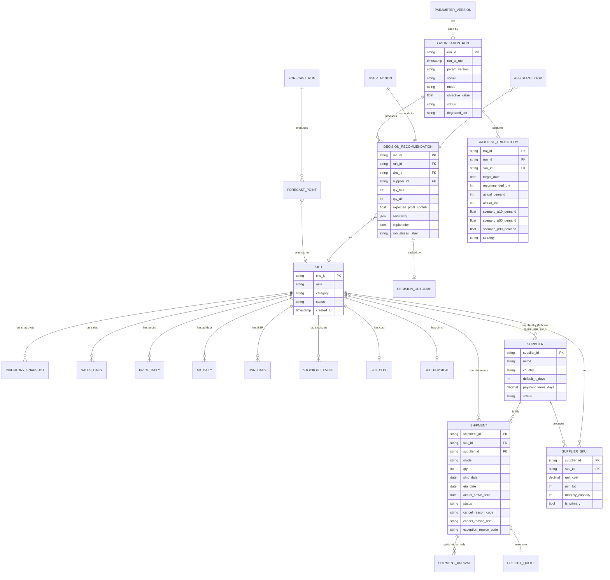
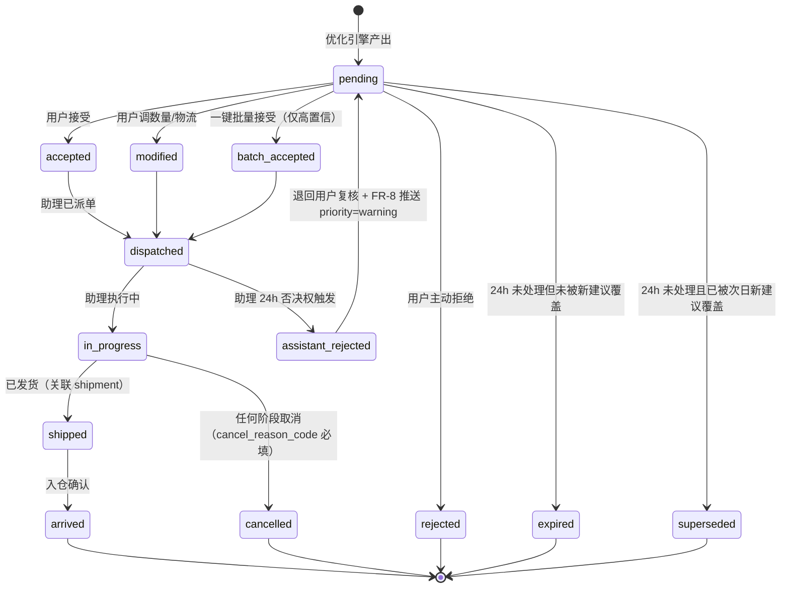
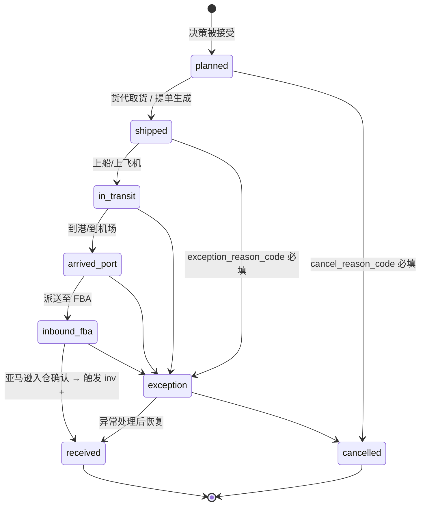
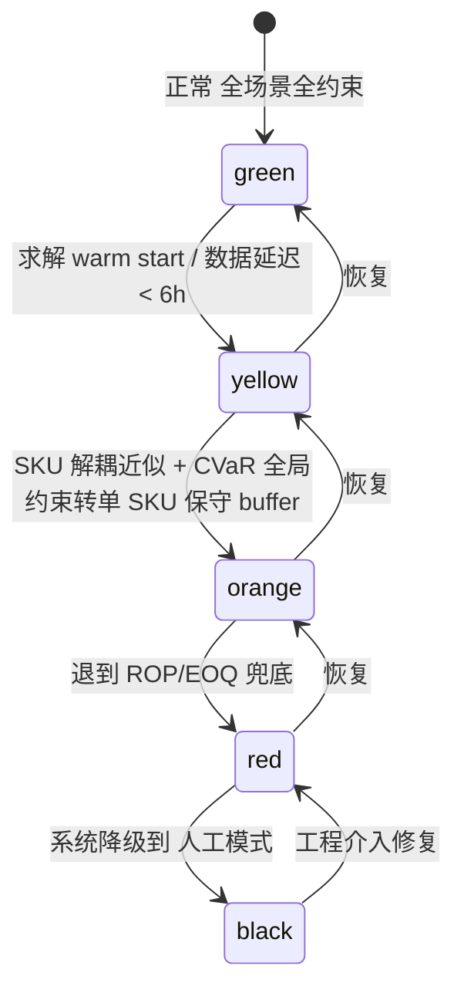
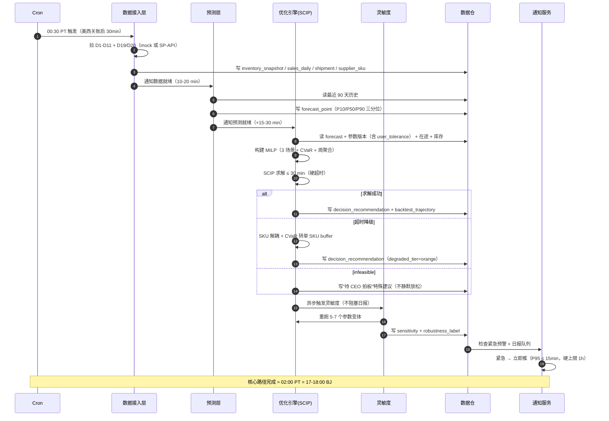

# r3-architect.md · 架构师 R3 修订版

**视角**: 架构师（系统/模块/数据/流程）
**版本**: R3 终稿（基于 R1 + R2 review 修订）
**日期**: 2026-05-23
**约束**: 本文件只覆盖 §3 算法、§4 数据、§6 流程、§9.A-C 风险与依赖。其他章节由 PM/工程主笔。

---

## §3 核心算法 / 目标函数

### 3.1 数学形式（目标函数 + 决策变量 + 约束）

#### 3.1.1 决策变量（每日重解，规划期 H 天，**周聚合 13 周**）

**重要变更**（应工程 E-ARCH-1 + PM 性能预算）：v1 把决策时间粒度从"日级"改为"周聚合"。理由：(a) 200 SKU 健康业务实际每周 2-3 次发货，日级决策粒度本来就过细；(b) 周聚合后二元变量数从 36000 降到约 5200，CP-SAT 求解时间可控；(c) 仍保留"日级库存推演"用于约束验证，只是不在"哪天发"上做日级决策。

对每个 SKU `s ∈ S`（|S| ≈ 200）、每个发货周 `w ∈ {0, 1, ..., W-1}`（W = 13 周 ≈ 90 天）：

| 变量 | 类型 | 含义 |
|------|------|------|
| `x_sea[s,w]` | 非负整数 | 第 w 周走海运发货的件数 |
| `x_air[s,w]` | 非负整数 | 第 w 周走空运发货的件数 |
| `y_sea[s,w]` | 二元 (0/1) | 是否启动一次海运批次（启动成本/最小批量触发） |
| `y_air[s,w]` | 二元 (0/1) | 是否启动一次空运批次 |
| `inv[s,d]` | 连续非负 | 第 d 天 FBA 在仓库存（推导，**日级演算**，非自由变量） |
| `short[s,d]` | 连续非负 | 第 d 天缺货件数（推导） |
| `aged[s,d]` | 连续非负 | 第 d 天库龄 > 271 天的库存（推导） |

> **整数规模口径（统一）**：二元变量 `y` = 200 SKU × 13 周 × 2 物流方式 = **5,200 个**；整数变量 `x` = 5,200 个；连续推导变量（inv/short/aged）= 200 × 90 × 3 = 54,000 个。**总自由整数/二元变量约 10,400**，连续推导变量另算。这是 R3 统一口径，覆盖 R1 §3.2.1 的"36000 个 y"和 E-ARCH-1 引用的 72K 变量。

> **关于"真正下单"**：只有 w=0 的决策真正下单（stage-1），w>0 是"未来计划"用于看清当前决策的代价（stage-2）。

#### 3.1.2 目标函数（每日重解一次，规划期 13 周的滚动总收益）

```
Max  Z = Σ_{s∈S} Σ_{d=0..H-1} [
            revenue[s,d]                       (1) 销售收入
          - capital_inv[s,d]                   (2) 在仓库存资金占用
          - capital_intransit[s,d]             (3) 在途货物资金占用
          - fba_storage[s,d]                   (4) FBA 月度仓储费
          - fba_aged_fee[s,d]                  (5) 长期仓储附加费
          - stockout_loss[s,d]                 (6) 缺货损失（含排名恢复尾巴）
        ] - Σ_{s∈S} Σ_{w=0..W-1} [
          + freight[s,w]                       (7) 海/空运运费（按周聚合）
          + launch_cost[s,w]                   (8) 启动成本（订舱/订机最小费用）
        ]
```

其中（关键公式同 R1，仅 freight/launch_cost 改为按周聚合）：

```
(7) freight[s,w]    = sea_rate[w] × weight[s] × x_sea[s,w]
                      + air_rate[w] × weight[s] × x_air[s,w]
(8) launch_cost[s,w] = sea_min_charge × y_sea[s,w] + air_min_charge × y_air[s,w]
```

（其余 (1)-(6) 同 R1 §3.1.2，d = 日级演算）

#### 3.1.3 约束（同 R1 §3.1.3，C2/C7 时间索引改 w）

| # | 约束 | 形式 |
|---|------|------|
| C1 | 库存递推（日级） | `inv[s,d] = inv[s,d-1] - sold[s,d-1] + arrive_sea[s,d] + arrive_air[s,d]` |
| C2 | 到货时延 | `arrive_sea[s,d] = x_sea[s, week_of(d) - LT_sea_weeks]`，LT_sea = 5±1 周 |
| C3 | 销售上限 | `sold[s,d] ≤ min(demand[s,d], inv[s,d])` |
| C4 | 缺货定义 | `short[s,d] ≥ demand[s,d] - inv[s,d]` |
| C5 | FBA Restock Limit | `Σ_d inv[s,d] ≤ IPI_cap(s)` |
| C6 | 资金总池 | `Σ_s Σ_d cost[s] × (inv[s,d] + intransit[s,d]) ≤ B_capital` |
| C7 | 启动耦合 | `x_sea[s,w] ≤ M × y_sea[s,w]` 且 `x_sea[s,w] ≥ min_lot × y_sea[s,w]` |
| C8 | 货代周容量 | `Σ_s weight[s] × x_sea[s,w] ≤ container_cap_per_week` |
| C9 | 整数性 | `x ∈ ℤ⁺, y ∈ {0,1}` |
| C10 | 库龄推导 | `aged[s,d] = FIFO 推导`（仅当 d - 入仓日 > 271）|

### 3.2 求解方式（求解器选型 + 性能预算 + 退化方案）

#### 3.2.1 问题规模估算（R3 统一口径）

| 配置 | 二元变量 | 整数变量 | 连续变量 | 约束数 |
|------|---------|---------|---------|--------|
| **v1 baseline（点估计单场景，周聚合）** | 5,200 | 5,200 | 54,000 | ~120,000 |
| **v1 robust 3 场景**（见 §3.5） | 5,200 (共享) | 5,200 (共享) | 162,000 | ~360,000 |
| v1.5 日级粒度（如未来需要） | 36,000 | 36,000 | 54,000 | ~180,000 |

> 整段以"周聚合 + 3 场景"为 v1 目标配置，对应 §3.2.3 的性能预算和 §3.5 的 robust 设计。

#### 3.2.2 求解器选型决策（R3 终稿：SCIP）

**冲突背景**（E-ARCH-2）：R1 架构选 CP-SAT，工程 §5.5 写默认 SCIP。R3 必须二选一。

**R3 决定：v1 用 SCIP（PySCIPOpt），与工程师 §5.5 对齐。**

| 求解器 | License | MILP 性能 | 集成成本 | v1 选择 |
|--------|---------|-----------|---------|---------|
| **SCIP (ZIB, Apache-2.0)** | 免费商用（2022 起） | 接近 Gurobi 60-70%；经典 B&B 对 MILP 标准 | PySCIPOpt + Pyomo 生态成熟 | ✅ **v1 选定** |
| OR-Tools CP-SAT | 免费商用 | 中等规模 MILP 强；并行优秀 | Python 原生 | 🟡 备选（spike 不达标则切回） |
| Gurobi | 商用（~$10K+/年/seat） | 业界最强 | gurobipy 简单 | 🟡 v1.5 SKU 上千时再评估 |
| CBC / HiGHS | 免费 | MILP 性能弱 | — | ❌ 仅 baseline 对照 |

**选 SCIP 而非 CP-SAT 的取舍说明**：
- **优势**：(a) PySCIPOpt 与 Pyomo / PuLP 生态兼容，工程师调试工具链成熟；(b) 求解日志结构化、gap 追踪直观，对"档位降级 + 可解释决策"需求友好；(c) 经典 branch-and-bound 范式与场景法 robust 优化（§3.5）的两阶段建模对齐自然。
- **代价**：(a) CP-SAT 在"启动成本/最小批量"这类逻辑约束上表达更原生，SCIP 需用大 M 线性化（已用过的成熟手法）；(b) 并行调度上 CP-SAT 略好，但 v1 规模下 SCIP 单进程也够。
- **退路**：v1 第一周开工前由工程师跑 **200 SKU × 13 周 × 3 场景的 spike POC**（不超过 3 天），若 SCIP 实际求解时间 > 30 min 即切 CP-SAT 重做建模层。建模层用 **Pyomo 中间表达**，求解器后端可切换，避免二选一锁死。

#### 3.2.3 性能预算（R3 统一时间表，与工程 §5.5 + PM §10.1.1 对齐）

| 场景 | SKU × 周 × 场景 | 期望求解时间 | 硬超时 | 用户感知承诺 |
|------|------------|------------|--------|------------|
| 日常每日跑（点估计单场景） | 200 × 13 × 1 | < 3 分钟 | 10 分钟 | — |
| 日常每日跑（3 场景 robust，**v1 默认**） | 200 × 13 × 3 | **15-25 分钟** | **30 分钟** | 见下方"流水线总时长" |
| 灵敏度（经济参数扰动 5-7 场景） | 200 × 13 × 7 | 30-60 分钟 | 90 分钟 | — |
| 周末全量回测（90 天） | 200 × 13 × 90 | 2-4 小时 | 6 小时 | — |

**矛盾解决**（PM 评 §3.2.3 + E-ARCH-1）：R1 §3.2.3 写"< 5 分钟"和 §3.5.4 写"10-30 分钟"是因为没区分"单场景"和"多场景 robust"。R3 把 v1 默认配置定为 "3 场景 robust，硬超时 30 分钟"，**§3.2.3 表格的"5 分钟"删除/降级为"点估计单场景"行**。这也意味着 PM 评 §3.2.3 "1 小时 baseline" 和工程 §5.5 "1800 s 硬超时" 都收敛到 **30 分钟硬超时**。

**流水线总时长承诺（与 PM US-1 / §10.1.1 对齐）**：
- 数据接入：10-20 min
- 预测层：15-30 min
- 优化引擎（3 场景）：15-25 min
- 灵敏度（异步可后跑）：30-60 min（不阻塞日报）
- 后处理 + 写库：5 min
- **凌晨流水线"核心路径"总时长 ≤ 90 min**（不含异步灵敏度）

凌晨调度时刻见 §4.4.1 的修订（不再是 23:30 PT，改为"BJ 6:00 前完成"反推启动）。

**性能预算前提**：SCIP 8 cores、32 GB RAM、SSD。

#### 3.2.4 退化方案（求解器超时或不收敛时）

按降级顺序：

1. **第一档 (green/yellow)：Warm start + 时间限制** — 用昨天的解作 hint，SCIP 设 `limits/time = 1800`，超时返回当前最优可行解 + gap 标记
2. **第二档 (orange)：SKU 解耦近似 + 单 SKU 保守 buffer** — 把全局资金/容量约束松弛为按 SKU 配额预分，每个 SKU 独立求解（200 个小 MILP 并行，每个 < 10 秒）。**代价**：失去全局最优性 5-15%。**关键补丁**（E-ARCH-7）：降级到档 2 后 CVaR 全局风险约束失效，**自动改为单 SKU 保守 buffer**（如 P10 销量 + 20% 安全 stock），并在 §6.2.3 状态机里把档位徽章文案改成"风险偏好暂时降级为单 SKU 保守，您可能看到比平时更多的备货建议"
3. **第三档 (red)：贪心 + ROP/EOQ 兜底** — 完全退到经典库存学公式（ROP = 平均日销 × LT + 安全库存；EOQ 决批量），物流方式按临界点表硬决策。**代价**：决策质量回退到行业平均
4. **第四档 (black)：人工模式** — 报告"系统降级中"，给用户库存全景 + 临界 SKU 清单，让用户用 Excel 决策

**Infeasible 处理（不静默放松）**（PM 评工程师 §5.5）：当模型 infeasible（Restock Limit < 必须补量 或资金不够），**系统不自动放松、不下单**，而是产出一条特殊的 FR-6 行："本日 N 条建议无法在当前预算/Restock Limit 下满足，需 CEO 批准"，给三选项：①批准临时多花 X% 资金 ②跳过这批 ③改其他 SKU 节省。**架构层不预设放松优先级**——CVaR、资金、Restock Limit 谁先放，必须由 CEO 在该次会话里拍板。

> **降级是一等公民**：UI 必须显示当前所在档位（green/yellow/orange/red/black 五档），不能让用户以为永远在档 1。工程师 §5.7 FR-6 必须在顶部摘要卡片旁加"系统档位徽章"（E-ARCH-6 跟进项）。

### 3.3 参数校准策略（同 R1 §3.3，无修订）

略（参见 r1-architect.md §3.3）。新增校准规则：参数审计 silent 失败（PM 评工程师 §5.4 FR-3 兜底 max(0.1, x)）改为 **后端 reject + return 400**，不在数据库或决策日志里 silently 写入 fallback 值；参数版本号必须记录用户的真实输入（即使是非法值），以保证可解释。

### 3.4 灵敏度分析方法（口径修订，区分销量 robust 与经济参数灵敏度）

**重要厘清**（PM 评 §3.5.1 vs §8.2 口径混淆）：

| 机制 | 针对 | 何时跑 | 输出 |
|------|------|--------|------|
| **§3.5 场景法 robust** | **销量需求**不确定性（区间预测 P10/P50/P90） | 每次决策跑 | 一个鲁棒决策（stage-1 共享，stage-2 分支） |
| **§3.4 灵敏度分析** | **经济参数**（缺货倍数、资金成本率、运费）扰动 | 每次决策后异步 | 每条决策的"稳健度"标签（高/中/低）+ 翻转点表 |

两套机制名字相似但**输入维度和输出形态完全不同**，工程师和 PM 验收时按表分。

#### 3.4.1 灵敏度参数表（与 PM §8.2 验收口径对齐）

| 参数 | 扰动幅度 | 关注输出 |
|------|---------|---------|
| `rank_recovery_factor` | {1.5, 2, 3, 4, 6, 8} | 海/空运决策切换点 |
| `r_capital` | {6%, 10%, 15%} | 备货量上下波动 |
| `sea_rate`, `air_rate` | ±15%、±20% | 物流方式切换点（与 PM E-PM-5 "X=15%" 对齐：< 15% 标黄不重跑，≥ 15% 触发重跑） |
| `LT_sea` | ±1 周 | 安全库存推荐量 |

#### 3.4.2 输出形态 + PM §8.2 "核心决策稳定率 > 70%" 口径对齐

- **决策稳定性矩阵**：每个 SKU × 每个经济参数 → "决策不变 / 数量调整 ±20% / 物流方式翻转"三态
- **PM §8.2 "核心决策稳定率 > 70%" 口径定义**：
  - 范围：**top-30 SKU**（按 v1 经济价值排序），不是全 200
  - "稳定" = 在 {rank_recovery_factor 倍数 ±50%，r_capital ±20%} 联合扰动下，决策"物流方式不翻转"且"数量变化 ≤ 20%"
  - 阈值：≥ 70%（即 top-30 中至少 21 条 SKU 稳定）
- **Tornado 图**：每条 SKU 一张，按参数对总收益影响排序
- **稳健度标签**（喂给工程师 §5.7 FR-6 决策清单）：高（任一参数 ±50% 才翻转）/ 中（±30% 翻转）/ 低（±10% 翻转，进入"人工确认"队列）

### 3.5 区间预测如何接入优化引擎（R3 修订：3 分位点 + 3 场景）

#### 3.5.1 分位点与场景生成（R3 修订）

**冲突解决**（E-ARCH-1 + PM 评 §3.5.1 + 工程 §5.5 N6）：架构师 R1 用 5 分位点（P10/P25/P50/P75/P90），工程师写 3 分位点（P10/P50/P90）。R3 **统一减到 3 分位点 + 3 场景**，理由：
- 5 场景 robust 求解时间 10-30 min 接近边界；3 场景缩到 5-15 min 留出余量
- 工程师 §5.5 FR-2 预测模型默认输出 3 分位点，分位回归只训 3 个 head（不是 5 个），训练成本降低 40%
- 离散化误差从 5 个点降到 3 个点不显著（场景法本来就丢分布信息）

| 场景 | 含义 | 销量取值 | 权重 |
|------|------|---------|------|
| S1 | 悲观 | 全部 SKU 取 P10 | 0.25 |
| S2 | 基线 | 全部 SKU 取 P50 | 0.50 |
| S3 | 乐观 | 全部 SKU 取 P90 | 0.25 |

> **场景法的简化假设**（同 R1）：所有 SKU 不确定性正相关。**代价**：忽略 SKU 间独立波动。**为什么不独立场景**：3^200 组合不可解；自然分散品类 v1.5 可考虑用 copula 抽样。

#### 3.5.2 两阶段决策（同 R1，时间索引改 w）

- **Stage 1（当下决策，所有场景共享）**：w=0 的 `x_sea[s,0]`、`x_air[s,0]`、`y_sea[s,0]`、`y_air[s,0]` —— **真正下单的决策**
- **Stage 2（未来计划，按场景分支）**：w > 0 的所有变量按场景独立优化

**与工程师 §5.5 N6 "p10/p90 各跑一次得到对照解" 的对齐**：工程师原方案是 3 次独立单场景求解 + 事后展示差异；R3 改为 **1 次 3 场景联合求解（stage-1 共享）**，输出**唯一一条决策**进入 FR-7 助理待办，3 场景的"差异度"作为"决策稳健度"标签（高/中/低）呈现给 CEO。**助理执行的是 stage-1 的统一决策，不是 3 套**。

#### 3.5.3 鲁棒性补丁：CVaR 约束（R3 命名改为业务友好）

**冲突解决**（PM 评 §3.5.3 命名 + E-ARCH-6 落地 + E-ARCH-7 降级失效）：

仅最大化期望值会让极端缺货风险被平均掉。加一条 CVaR 约束：

```
最差 25% 场景下的平均缺货损失 ≤ user_tolerance
```

**用户参数命名（R3 终稿，落到 UI）**：

| 内部代号 | UI 显示名 | UI 副标题 | 业务含义 | v1 默认 |
|---------|----------|---------|---------|--------|
| CVaR 紧 | **「优先不缺货」** | "极端场景下平均缺货损失 ≤ 营收 5%" | 风险偏好保守 | — |
| CVaR 中 | **「平衡收益」** | "兼顾缺货风险与资金效率" | 风险偏好中性 | ✅ **v1 默认** |
| CVaR 松 | **「优先省钱」** | "可能极端缺货但总收益期望更高" | 风险偏好激进 | — |

**落地要求**（E-ARCH-6 工程跟进）：
- 工程师 §5.4 FR-3 参数管理页"全局参数"区块**必须**加这个三选一控件
- PM §10.5 "默认值表" **必须**加一行确认默认值为「平衡收益」
- 工程师 §5.7 FR-6 决策清单顶部摘要卡片**必须**显示当前档位（如"当前：平衡收益"）

**降级时 CVaR 失效告知**（E-ARCH-7）：当系统进入 §3.2.4 档 2 (orange)，CVaR 全局约束自动转为单 SKU 保守 buffer，UI 顶部档位徽章必须显示**"风险偏好暂时降级"**+ 一句话解释（见 §3.2.4）。

#### 3.5.4 求解规模影响（R3 修订）

- 单场景（点估计）：200 × 13 × 2 × 2 = 10.4K 整数/二元变量
- **3 场景（stage-1 共享）**：stage-1 = 10.4K，stage-2 = 10.4K × 3 = 31.2K，合计 **~42K 整数/二元 + 162K 连续推导**
- SCIP 经验：~42K MILP 在 8 cores 上 **15-25 分钟**（与 §3.2.3 性能预算自洽）

**退化**：若 3 场景超时 → 退到点估计（P50）+ 固定 20% 安全 buffer。这就是 §3.2.4 第二档之前的"轻度降级"。

#### 3.5.5 为什么不直接用 Stochastic Programming / Chance-Constrained MILP

（同 R1 §3.5.5）

---

## §4 数据需求 + 数据模型

### 4.1 必需 / 建议 / 可选数据清单

同 R1 §4.1（D1-D18 清单未变）。**新增实体**（应 PM review 补 supplier）：

| ID | 数据项 | 粒度 | 频率 | 来源（v1 mock / v1.5 真实）|
|----|-------|------|------|------------------------|
| D19 | **供应商主数据**（工厂 ID / 起订量 / 账期 / 产能 / 默认 LT） | supplier | 变更触发 | Mock / 内部采购系统 |
| D20 | **供应商-SKU 关系**（哪家供应商生产哪个 SKU、单价、最小批量、产能上限） | supplier × SKU | 变更触发 | Mock / 内部 |

理由：FR-15 "导出工厂下单建议 CSV" 需要按 supplier 聚合；§3.1 启动成本和最小批量 (`min_lot`) 实际依赖 supplier 配置；多供应商场景下决策推荐还需选 supplier。

### 4.2 核心实体关系（R3 修订 ER 图）



### 4.3 Schema 草案（R3 新增/修订）

#### 4.3.1 SKU 主表 / 4.3.2 库存快照 / 4.3.3 销量日表

同 R1 §4.3.1 - §4.3.3，无修订。

#### 4.3.4 在途/发货（`shipment`，**R3 新增取消/异常原因字段**）

| 字段 | 类型 | 说明 |
|------|------|------|
| shipment_id | string PK | |
| sku_id | string FK | |
| supplier_id | string FK | **新增**：哪家供应商出货 |
| mode | enum | sea_fcl / sea_lcl / air |
| qty | int | |
| ship_date | date | |
| eta_date | date | 计划到达 |
| actual_arrive_date | date | 实际入仓（用于 LT 反校准）|
| status | enum | planned / shipped / in_transit / arrived_port / inbound_fba / received / cancelled / exception |
| **cancel_reason_code** | enum | **新增**（PM review）：capital_shortage / restock_limit / supplier_oos / ceo_override / assistant_veto / forecast_change / other |
| **cancel_reason_text** | string(500) | **新增**：自由文本说明 |
| **exception_reason_code** | enum | **新增**：customs / damaged / lost / port_delay / fc_reject / other |
| freight_quote_id | string FK | |
| created_by | enum | system_recommendation / manual |
| rec_id | string FK | |

> **PM review 对齐**：reason_code 与 user_action.reason_code 用同一套枚举字典，便于跨表追溯。

#### 4.3.5 预测点（`forecast_point`，**R3 减到 3 分位点**）

| 字段 | 类型 | 说明 |
|------|------|------|
| forecast_run_id | string FK | |
| sku_id | string FK | |
| target_date_local | date | |
| **p10, p50, p90** | decimal | **R3 改：仅 3 分位点**（去掉 p25/p75，与 §3.5.1 + 工程师 §5.5 对齐） |
| model_version | string | |
| features_snapshot | json | |

#### 4.3.6 决策建议（`decision_recommendation`，**R3 新增稳健度 + 供应商**）

| 字段 | 类型 | 说明 |
|------|------|------|
| rec_id | string PK | |
| run_id | string FK | |
| sku_id | string FK | |
| **supplier_id** | string FK | **新增**：推荐从哪家供应商订货 |
| qty_sea | int | |
| qty_air | int | |
| recommended_ship_date | date | |
| expected_profit_contrib | decimal | |
| confidence_band | enum | high / medium / low |
| **robustness_label** | enum | **新增**：high / medium / low（来自 §3.4.2 灵敏度，UI 渲染"决策稳健度"） |
| sensitivity | json | |
| explanation | json | |
| param_version | string FK | |
| status | enum | pending / accepted / modified / rejected / **superseded** / **expired** |

> **PM 评 A7 跟进**：状态枚举里 `superseded`（被新决策覆盖）和 `expired`（用户没拍板就过期）必须分开，UI 视觉区分。R3 §6.2.1 状态机更新对应。

#### 4.3.7 用户动作（`user_action`）

同 R1 §4.3.7。reason_code 枚举与 shipment.cancel_reason_code 共用字典。

#### 4.3.8 参数版本（`parameter_version`，**R3 新增 CVaR 偏好字段**）

| 字段 | 类型 | 说明 |
|------|------|------|
| param_version | string PK | |
| r_capital | decimal | |
| rank_recovery_factor_default | decimal | |
| rank_recovery_factor_per_sku | json | |
| **user_tolerance** | enum | **新增**：tight / balanced / loose（对应 UI"优先不缺货 / 平衡收益 / 优先省钱"，默认 balanced） |
| **cvar_alpha** | decimal | **新增**：CVaR 置信水平（默认 0.25） |
| created_at_utc | timestamp | |
| created_by | string | |
| change_summary | text | |

#### 4.3.9 **新增：供应商主表 (`supplier`)**

| 字段 | 类型 | 说明 |
|------|------|------|
| supplier_id | string PK | |
| name | string | |
| country | string | 中国/越南/其他 |
| default_lt_days | int | 默认生产周期 |
| payment_terms_days | decimal | 账期（影响资金占用计算） |
| status | enum | active / paused / blacklisted |
| created_at_utc | timestamp | |

#### 4.3.10 **新增：供应商-SKU 关系表 (`supplier_sku`)**

| 字段 | 类型 | 说明 |
|------|------|------|
| supplier_id | string FK | |
| sku_id | string FK | |
| unit_cost | decimal | |
| min_lot | int | 该 supplier 该 SKU 的最小批量（喂给 §3.1 C7 约束） |
| monthly_capacity | int | 月产能上限 |
| is_primary | bool | 主供应商标记（多供应商时优先选） |
| effective_from | date | |
| effective_to | date | nullable，支持时间维度切换 |

复合主键 `(supplier_id, sku_id, effective_from)`。

#### 4.3.11 **新增：回测轨迹表 (`backtest_trajectory`)**（应 PM 要求）

PM US-10 三策略回测需要"系统建议 vs 实际销量"的完整轨迹存储，便于 §5.13 周复盘和 §8.3 事后正确率计算。

| 字段 | 类型 | 说明 |
|------|------|------|
| traj_id | string PK | |
| run_id | string FK | 哪次 optimization_run 产生的 |
| sku_id | string FK | |
| target_date | date | 该轨迹点对应的目标日 |
| **recommended_qty** | int | 该 target_date 系统建议的库存目标量 |
| recommended_ship_qty_sea | int | 该日海运到货量 |
| recommended_ship_qty_air | int | 该日空运到货量 |
| **actual_demand** | int | 实际销量（T+14 后回填） |
| **actual_inv** | int | 实际库存（T+1 回填） |
| actual_short | int | 实际缺货 |
| scenario_p10_demand | float | 当时预测的 P10 |
| scenario_p50_demand | float | 当时预测的 P50 |
| scenario_p90_demand | float | 当时预测的 P90 |
| **strategy** | enum | system / conservative_rop / aggressive_eoq / manual（**支持 US-10 三策略对比**） |
| computed_at_utc | timestamp | 评分计算时刻 |
| is_in_challenge_set | bool | 是否属于"挑战集"场景（节假日尖峰/断货/广告突发等，喂给 §10.B L5） |

> **设计意图**（对应 PM 评 §4.5.4 挑战集 + 工程 E-PM-3 mock 上算正确率失真）：
> - `strategy` 字段支持同一份历史数据跑三策略轨迹对比，CEO 评审时直接看图
> - `is_in_challenge_set` 标记：评分时**正常分布**和**挑战集**两份指标分开报，CEO 必须看到挑战集表现
> - mock 模式下该表照写，但 §8.3 事后正确率**只在影子 SKU 真实数据上计算**（mock 上只算结构相似性指标）

### 4.4 数据治理

#### 4.4.1 时区与日期（**R3 重写，应 E-ARCH-4 修订调度时刻**）

**冲突解决**（E-ARCH-4）：R1 §4.4.1 写"凌晨 23:30 PT 触发 → 9:00 BJ 看日报"是错的。23:30 PT 启动 → 流水线 90 min 后完成 = **次日 01:00 PT = 北京时间当天 17:00（PDT）/ 18:00（PST）**，CEO 9:00 BJ 看到的根本不是"昨天美西的数据"而是"前天美西的数据"。

**R3 新调度方案**：
- **数据完整性优先**：美西全天销售在 24:00 PT 关账后才完整 → 启动时刻 = **次日 00:30 PT**（关账后 30 分钟，等数据库同步窗口）
- **完成时刻承诺**：00:30 PT + 90 min 流水线 = **02:00 PT 完成** = 北京时间当天 17:00（PDT）/ 18:00（PST）
- **用户看报时刻调整**：CEO 9:00 BJ 看到的报告 = **"前一天美西全天 + 今天 BJ 实时库存"**，UI 必须**明确标注数据时间窗**（"基于美西 5/22 全天 + BJ 5/23 09:00 库存"），不留歧义
- **若要 CEO 在 BJ 9:00 看到"今天美西"销量**：技术上不可能（美西当天还没过完），是 PM 的预期管理问题
- **cron 实现**：用 UTC cron 表达式 + IANA tz 库（`America/Los_Angeles`），夏令时自动跟随
- **夏令时切换日测试**：FR-1 / FR-4 必须有 3 月第二周日 + 11 月第一周日的 e2e 测试（E-ARCH-4 跟进）

**时区双系统（同 R1）**：
- 所有 timestamp 字段一律 UTC
- 业务日期字段（销售日/发货日/到货日）存"本地日期" + 伴随 `timezone` 元字段
- 求解器内部用 UTC 周/天偏移（避免 DST 边界 bug）

#### 4.4.2 PII 与敏感数据（**R3 修订：v1 只做列脱敏，不上 KMS+AES-GCM**）

**冲突解决**（E-ARCH-5）：R1 §4.4.2 要求"DB 字段 AES-GCM 静态加密 + KMS 密钥轮换"，工程师 §5.8 实际只做 schema 级隔离 + 助理 role 过滤列。两套不等价。

**R3 决定（v1 简化）**：
- ❌ **不上**：AES-GCM 静态加密 + KMS（自用项目过度工程，KMS 集成隐藏 2-3 周工程量）
- ✅ **必做**：**应用层列脱敏**（按 role 控制 GraphQL/REST 返回字段，助理 token 永远拿不到 unit_cost、expected_profit）
- ✅ **必做**：审计日志（任何访问 unit_cost 字段的查询都进 audit 表）
- ✅ **必做**：导出 CSV 时按 role 二次脱敏（FR-15 工厂下单建议导出，给助理的版本不带成本）
- 🟡 **v1.5 评估**：若做 SaaS 或被审计要求，再上 AES-GCM + KMS

**仍保留**（同 R1）：
- 不存 PII（订单只聚合到 SKU × 日）
- 凭证/API key 走 KeyVault / AWS Secrets Manager
- 保留：决策日志 2 年热 + 5 年冷存；销量/库存 90 天热 + 5 年冷存（与 §4.4.5 对齐）

#### 4.4.3 编码与一致性（**R3 强化货币双列约束**）

- 文本字段统一 UTF-8
- 数字字段全部用 decimal 而非 float（财务类）
- **货币显式分两列：`amount` + `currency(ISO 4217)`，禁止隐式汇率**（E-ARCH-6 落地：此约定必须写入工程师 §5.1 通用约定表，所有涉及金额的字段强制双列）
- 内部建模币种：USD（结算货币），RMB 数据按"快照日中间价"折算并保留 `fx_rate` 字段

#### 4.4.4 一致性策略

同 R1 §4.4.4，无修订。

#### 4.4.5 保留策略（R3 对齐工程 §5.2）

**冲突解决**（E-ARCH-8）：架构师 R1 说销量 5 年；工程师 §5.2 说 90 天 + 归档 2 年。

**R3 终稿（两段管理）**：

| 数据类 | 热存 | 冷存 | 合计保留 |
|--------|------|------|---------|
| 销量/库存原始快照 | **90 天**（满足每日决策 + 90 天回测窗口） | **S3 Glacier 5 年**（财务/税务） | 5 年 |
| 决策建议 + 用户动作 | **2 年热**（高频复盘） | **S3 Glacier 5 年**（审计/法务追溯） | 7 年 |
| 操作日志 | 1 年热 | **5 年冷存**（不是"永久"，对齐工程师 §5.7 修订） | 5 年 |
| 中间预测点 | 90 天 | 删除（可重算） | 90 天 |
| 模型/参数版本 | 永久 | 不归档（小） | 永久 |
| backtest_trajectory（**新表**） | 2 年热 | 5 年冷存 | 7 年 |

> **合规边界**：以上时长按"中国跨境电商企业 + 美国销售方"双边税务/审计的常见要求（5-7 年）保守取值。**真实合规要求需 PM 跟法务确认**（进 OQ）。

### 4.5 Mock / 真实 / 影子模式的数据隔离（**R3 重写：删 tenant_id，用 schema 隔离**）

**冲突解决**（E-ARCH-3）：R1 §4.5.2 用 tenant_id + RLS 软隔离是为"未来 SaaS"做投资；PM §10.4 已声明 v1.5 不承诺扩展。R3 砍掉 tenant_id，改用 PostgreSQL schema 物理隔离（与工程师 §5.11 FR-10 自洽）。

#### 4.5.1 三种模式（同 R1）

| 模式 | v1 | v1.5 | 说明 |
|------|----|----|------|
| **mock** | ✅ | ✅（保留） | 虚拟数据 |
| **real** | ❌ | ✅ | 完整真实数据 |
| **shadow** | ✅（关键） | ✅ | 真实数据进系统，但输出仅供对比 |

#### 4.5.2 隔离机制（**R3 终稿：PostgreSQL schema 级隔离**）

**采用 PostgreSQL schema 物理隔离**（同库不同 schema）：

- `mock` schema：所有 mock 数据
- `shadow` schema：所有 shadow SKU 真实数据
- `real` schema：v1 留空，v1.5 启用
- 求解器一次只跑一个 schema 的数据，**不跨 schema join**（避免污染）
- 应用层通过连接字符串 `search_path` 切换 schema，**不需要 ORM 注入 tenant_id**

**为什么 schema 而不是物理分库**：
- 不需要 ×2 运维成本
- 同实例同 PostgreSQL，备份/监控/迁移工具链共用
- 影子模式对比需要跟 mock 同库查询：通过 **跨 schema 视图（只读）** 满足，不破坏隔离

**为什么 schema 而不是 tenant_id（R1 方案）**：
- 不需要每张表加 tenant_id 字段 + 每个查询强制 filter + RLS 维护
- 不为不存在的 SaaS 多付一倍工程税（E-ARCH-3）
- 误删风险更低（DELETE 误跨 schema 比误跨 tenant 难得多）

**代价**：
- 多卖家 SaaS 场景需要重新设计（v1.5 若做 SaaS，预计 2-3 周迁移工时，是合理代价）
- schema 切换有少量连接开销（可忽略）

#### 4.5.3 影子模式专属约束（同 R1，无修订）

- 影子 schema 的决策建议必须有醒目 UI 标记（紫色边框 + "SHADOW - 不要执行"水印）
- 影子模式禁止生成 `assistant_task`
- 影子模式资金池约束是每 SKU 单独"假想配额"，不是全局池
- 影子真实库存通过"人工录入 + 周校准"维持（PM 章节定义流程）

#### 4.5.4 数据生成器架构（**R3 强化挑战集**）

- 生成器配置版本化（YAML，git 管理）
- 每次生成打 `mock_seed` + `mock_config_version`
- 生成器与求解器完全解耦
- **挑战集明确进 §10.B L5（极端场景数据集）**（PM 评 §4.5.4 跟进）：
  - 节假日尖峰（黑五/Prime Day/双十一）
  - 突发断货事件 + 排名恢复尾巴
  - 广告投放突发
  - Lead Time 异常（港口拥堵 / 海关查验）
  - 供应商缺货 / 产能不足
- **FR-11 三策略回测必须分两份输出**：一份"正常分布"，一份"挑战集"，CEO 验收时**两套都要满足"系统 > 保守 > 激进"**

---

## §6 流程图 + 状态机 + 时序图

### 6.1 核心决策流程（每日批跑，**R3 修订调度时刻**）

```mermaid
flowchart TD
    Start([Cron 00:30 PT 触发，美西关账后 30min]) --> M1[1. 数据接入层拉取]
    M1 --> M1a{数据完整性校验}
    M1a -- 失败 --> Fail1[标记降级 + 通知 + 用昨天快照继续]
    M1a -- 通过 --> M2[2. 预测层：销量/LT/费率区间预测 P10/P50/P90]
    Fail1 --> M2
    M2 --> M2a{预测置信度检查}
    M2a -- 异常 --> Flag2[标记 SKU 为低置信]
    M2a -- 正常 --> M3
    Flag2 --> M3[3. 优化引擎：3 场景 MILP SCIP 求解]
    M3 --> M3a{求解状态}
    M3a -- 最优解 --> M4
    M3a -- 超时但可行 --> Flag3[标记 gap]
    M3a -- infeasible --> Halt[不静默放松，产出"待 CEO 拍板"特殊建议]
    M3a -- 不可行不可降级 --> Fail3[降级：SKU 解耦近似 + 单 SKU 保守 buffer + CVaR 告知]
    Flag3 --> M4
    Halt --> M4
    Fail3 --> M4[4. 灵敏度分析 异步可后跑]
    M4 --> M5[5. 生成决策建议 + 解释 + 稳健度标签]
    M5 --> M6[6. 写入 decision_recommendation + backtest_trajectory]
    M6 --> M7{是否有紧急预警?}
    M7 -- 是 --> Push[即时推送通道]
    M7 -- 否 --> Daily[加入日报队列]
    Push --> End([完成 02:00 PT 前])
    Daily --> End
```

### 6.2 关键状态机

#### 6.2.1 决策建议生命周期（**R3 修订：区分 superseded 和 expired**）



> **PM 评 A7 跟进**：UI 历史列表必须视觉区分 `expired`（"过期未处理"，灰色）vs `superseded`（"已被新建议替代"，浅蓝）vs `rejected`（"主动拒绝"，红色），CEO 出差回来不困惑。
> **PM 评工程师 §5.15 跟进**：`assistant_rejected → pending` 转换必须触发 FR-8 推送 priority=warning，CEO 才能知道助理退回了。

#### 6.2.2 在途批次（Shipment）状态（**R3 加 cancel_reason**）



#### 6.2.3 系统运行档位（**R3 修订：5 档 + UI 文案要求**）



**UI 文案要求**（E-ARCH-6 + E-ARCH-7 跟进）：

| 档位 | UI 徽章颜色 | 顶部摘要卡片文案 |
|------|-----------|----------------|
| green | 绿 | 「系统正常 · 风险偏好：平衡收益」 |
| yellow | 黄 | 「轻度降级（数据延迟 / warm start）· 决策仍可用」 |
| orange | 橙 | 「降级中 · 风险偏好暂时降级为单 SKU 保守，您可能看到比平时更多的备货建议」 |
| red | 红 | 「严重降级 · 系统使用经典库存公式兜底，建议人工复核」 |
| black | 黑 | 「人工模式 · 系统不下建议，请用库存全景 + 临界 SKU 清单自行决策」 |

工程师 §5.7 FR-6 必须实现 5 档徽章，紧贴 Mock/Real 徽章。

### 6.3 跨模块时序图

#### 6.3.1 每日批跑（**R3 修订时刻**）



#### 6.3.2 用户拍板 + 助理执行（同 R1，无修订）

略（参见 r1-architect.md §6.3.2，状态机更新已在 §6.2.1 + §6.2.2 覆盖）。

#### 6.3.3 预警事件触发（同 R1，无修订，SLA 已在 §3.2.3 / §6.3.1 标注）

略（参见 r1-architect.md §6.3.3）。

---

## §9.A 架构风险（R3 修订表）

| # | 架构选择 | 风险 | 缓解 |
|---|---------|------|------|
| A1 | 用 MILP（SCIP）而非 LP | 求解时间不可预测；某些场景可能不收敛 | 性能预算 + 4 档降级；warm start；周末跑全量回测验证 |
| A2 | Scenario-based robust（**3 场景**）而非 stochastic programming | 离散化损失分布信息；CVaR 对极端事件不够保守 | 用户可调 user_tolerance（3 档）；季节性事件单独建模（v1.5）；降级档 2 时 CVaR 自动转单 SKU buffer + UI 告知 |
| A3 | **PostgreSQL schema 级隔离**（R3 改）而非 tenant_id 软隔离 | v1.5 若做 SaaS 需重新设计 | v1.5 SaaS 决策时再迁移（2-3 周工时是合理代价，v1 不预付） |
| A4 | 销量日期用本地、时间戳用 UTC（双日期系统） | 开发者认知负荷高；DST 边界 bug | 统一日期工具库 + lint 禁裸 `datetime.now()` + **夏令时切换日 e2e 测试**（R3 新增） |
| A5 | 求解器选 **SCIP**（R3 改）而非 Gurobi/CP-SAT | 200 SKU 性能基本够，1000 SKU 时可能不够；CP-SAT 在逻辑约束上更原生 | 性能监控 + spike POC 前置验证；Pyomo 中间表达保求解器可切换 |
| A6 | Mock 数据生成器与求解器同 repo | 心理上"自己出题自己答" | 生成器独立模块 + 独立 owner + **挑战集进 L5** + 影子模式真数据对照 + **mock 上不算"事后正确率"**（只算结构相似性） |
| A7 | 决策建议 24h 过期 | 用户出差 1 天后决策窗口丢失 | **状态机区分 expired vs superseded**（R3 新增），UI 视觉区分；用户回来可看历史 + 系统重新生成 |
| A8 | 助理 24h 否决权（流程而非系统硬性） | 助理沉默接受错误决策 | 周复盘必看 batch_accept 清单 + 助理操作审计 + **退回触发 FR-8 推送给 CEO**（R3 新增） |
| A9 | 单点数据接入层（无冗余） | 接入层宕机 → 整链阻塞 | 写入幂等 + 上次成功快照可重用 + 健康监控 |
| A10 | 决策可解释性靠结构化 JSON 渲染 | 模型升级后解释 schema 漂移 | 解释 schema 版本化；UI 兼容多版本；老建议保留旧解释 |
| **A11** | **v1 仅做应用层列脱敏**（R3 新增，替代 KMS+AES-GCM）| 数据库拖库时 unit_cost 明文泄露 | v1 自用项目可接受；v1.5 做 SaaS 或被审计要求时上 KMS + AES-GCM |
| **A12** | **infeasible 不静默放松**（R3 新增）| 用户每天可能看到"待拍板"特殊建议增加心智负担 | 文案优化"今日资金/仓位不够，需您拍板"+ 三选项；周内频次报警阈值 ≥ 3 次进入复盘 |
| **A13** | **凌晨 00:30 PT 调度**（R3 改）| 流水线挂 → BJ 9:00 无报；时差使用户看到的是"昨天美西"而非"今天美西" | 数据时间窗 UI 明确标注；流水线挂触发"用昨天快照 + 红条" |

---

## §9.B 外部依赖（同 R1 + 新增条目）

同 R1 §9.B 全表。**新增**：

| 依赖 | 失败模式 | 降级方案 | 监控 |
|------|---------|---------|------|
| **供应商主数据** | 采购系统不同步 / 起订量变更未告知 | 用最后已知 supplier_sku 配置 + 标黄；新 SKU 默认无 supplier 不进推荐 | supplier_sku.effective_to 老化告警 |
| **法务/合规咨询**（数据保留 5-7 年）| 卖家所在国/亚马逊后台政策变化 | 按当前最严要求执行 + 季度复审 | 政策变更人工监测 |

---

## §9.C 可扩展性瓶颈（**R3 简化：聚焦 v1，不为 1000 SKU SaaS 预投入**）

**冲突解决**（E-ARCH-3 + PM 评 §9.C）：R1 §9.C 整张表围绕 200 → 1000 SKU 做容量规划，跟 PM "v1 200 SKU、v1.5 不承诺扩展" 脱节。R3 简化为"200 SKU 的当前压力 + v1.5 触发线"。

| 维度 | 200 SKU 当前 | 黄线（需复盘）| v1.5 触发动作 |
|------|------------|------------|--------------|
| MILP 求解时间 | 15-25 min（3 场景 SCIP） | > 30 min | 切 Gurobi 或减场景到 1 |
| 灵敏度分析 | 异步 30-60 min | > 90 min | 仅 top 20% 经济价值 SKU 跑全灵敏度 |
| 数据存储 | < 10 GB（v1） | > 50 GB | 冷数据归档 S3 Glacier |
| 预测训练 | 200 模型每日 < 30 min | > 60 min | 改 global model + 增量训练 |
| UI 渲染 | 200 行清单一屏 | > 400 行 | 分层折叠 + 搜索 |
| 助理执行带宽 | 每天 < 10 单 | > 30 单 | 批量执行 + 货代 API |
| 决策日志 | 2 年 ~ 150K 条 | > 500K 条 | 仍单表可承（< 1M 索引良好），不分库 |
| 求解器内存 | < 8 GB | > 24 GB | 垂直扩容 |
| 货代接入复杂度 | 1-2 家 | > 5 家 | 报价层抽象成 plugin |

> **判断（R3 终稿）**：v1 架构对 **200-400 SKU** 完全友好（覆盖 v1 + v1.5 可能的小幅扩张）。**SaaS 多租户 / 1000+ SKU 是另立项目**，v1 不预投入 tenant_id / RLS / 分布式求解。

---

# R3 修订记录

## 处理来自 PM 的 review

| PM review | 处理 | 改在哪 |
|----------|------|--------|
| [需要改] §3.2.3 性能预算 "< 5 分钟" vs §3.5.4 "10-30 分钟" 矛盾 | ✅ 接受 | §3.2.3 重写性能预算表，分"单场景"和"3 场景 robust"两行；§3.5.4 改为 3 场景 15-25 min；硬超时统一 30 min；新增"凌晨流水线核心路径 ≤ 90 min"承诺 |
| [需要改] §3.5.3 CVaR 命名（保守/平衡/激进） | ✅ 接受 | §3.5.3 改为「优先不缺货 / 平衡收益 / 优先省钱」三档，每档副标题说明后果，默认「平衡收益」；要求 PM §10.5 默认值表确认；要求工程师 §5.4 FR-3 落地控件、§5.7 FR-6 顶部摘要卡片显示当前档位 |
| [冲突] §3.5.1 5 场景（销量）vs §3.4 灵敏度（经济参数）口径混淆 | ✅ 接受 | §3.4 章首加机制对比表，明确两套机制输入/输出/何时跑；§3.4.2 给出 PM §8.2 "70% 稳定率" 的精确口径：top-30 SKU + 联合扰动 + "物流不翻转且数量变化 ≤ 20%" |
| [需要改] §4.5.4 挑战集进 L5 | ✅ 接受 | §4.5.4 明确挑战集进 §10.B L5；FR-11 三策略回测必须分"正常分布"和"挑战集"双输出；§4.3.11 backtest_trajectory 加 is_in_challenge_set 字段 |
| [冲突] §6.1 cron 23:30 PT vs PM §10.1.1 BJ 9:00 看日报 | ✅ 接受（E-ARCH-4 同问题） | §4.4.1 重写：调度时刻改 **00:30 PT**（美西关账后 30 min）；流水线 90 min 完成 → 02:00 PT = BJ 17-18:00；UI 必须明确标注"数据时间窗"；CEO BJ 9:00 看到的是"昨天美西全天 + 今天 BJ 实时库存"。**此为产品决策协同点，转 §9.1 OQ-A 请 PM 确认 CEO 是否接受这个数据时间窗** |
| [需要改] §4.3.4 shipment 加 cancel_reason | ✅ 接受 | §4.3.4 新增 cancel_reason_code / cancel_reason_text / exception_reason_code；与 user_action.reason_code 共用枚举字典；§6.2.2 状态机标注 reason_code 必填 |
| [建议] §9.A A7 expired 用户告知 | ✅ 接受 | §6.2.1 状态机区分 expired vs superseded vs rejected；A7 风险表更新；UI 视觉区分要求转 PM §10 |
| [OPEN_QUESTION] §9.C 1000 SKU vs v1 200 SKU | ✅ 接受砍掉 tenant_id 倾向（与 E-ARCH-3 合并处理） | §4.5.2 删 tenant_id，改 PostgreSQL schema 隔离；§9.C 表简化为"200 SKU 当前 + 黄线 + v1.5 触发"，不再预测 1000 SKU；A3/A5/A11 风险表更新 |

## 处理来自工程师的 review

| 工程师 review | 处理 | 改在哪 |
|--------------|------|--------|
| [E-ARCH-1] §3.2.3 5min vs §3.5.4 10-30min 自相矛盾 | ✅ 接受 | §3.2.3 重写，v1 默认配置 = "3 场景 robust 硬超时 30 min"；§3.5 减到 3 场景；变量数统一周聚合口径（§3.1.1 + §3.2.1）；与工程师 §5.5 "1800 s 硬超时"对齐 |
| [E-ARCH-2] 求解器分歧：架构 CP-SAT vs 工程 SCIP | ✅ 接受工程师选择 | §3.2.2 改为 v1 SCIP（与工程师 §5.5 一致）；建模层用 Pyomo 保后端可切换；要求工程师跑 spike POC（3 天预算），不达标切 CP-SAT；A5 风险表更新 |
| [E-ARCH-3] §4.5.2 tenant_id 是为不存在的 SaaS 预投资 | ✅ 接受 | §4.5.2 重写：删 tenant_id + RLS，改 PostgreSQL schema 隔离（mock/shadow/real 三 schema）；§9.C 不再做 1000 SKU 容量规划；A3 风险表更新 |
| [E-ARCH-4] §4.4.1 凌晨调度 + 夏令时撞死 | ✅ 接受 | §4.4.1 重写调度方案：00:30 PT 启动 + 90 min 流水线 + UI 明示数据时间窗 + 夏令时切换日 e2e 测试要求；§6.1 / §6.3.1 流程图同步修订；A4 / A13 风险表更新 |
| [E-ARCH-5] §4.4.2 AES-GCM + KMS 与工程 §5.8 列脱敏不等价 | ✅ 接受简化 | §4.4.2 重写：v1 只做应用层列脱敏 + 审计日志 + 导出二次脱敏，不上 KMS+AES-GCM；v1.5 评估；要求写入工程师 §5.1 通用约定；A11 风险表新增 |
| [E-ARCH-6] §3.5.3 CVaR 三档 PM/工程都没落地 | ✅ 接受落地要求 | §3.5.3 改命名 + 落地清单（PM §10.5 默认值、工程师 §5.4 FR-3 控件、工程师 §5.7 FR-6 摘要卡片）；§4.3.8 parameter_version 表加 user_tolerance + cvar_alpha 字段；§6.2.3 档位徽章 5 档 UI 文案表（含 black 档） |
| [E-ARCH-7] 降级到档 2 时 CVaR 全局约束失效 silent | ✅ 接受 | §3.2.4 第二档明确"CVaR 自动转单 SKU 保守 buffer（P10 + 20%）"；§6.2.3 orange 档徽章文案"风险偏好暂时降级为单 SKU 保守"；A2 / A12 风险表更新；infeasible 处理改为"不静默放松，产出待 CEO 拍板特殊建议" |
| [E-ARCH-8] §4.4.5 保留策略与工程 §5.2 不一致 | ✅ 接受两段管理 | §4.4.5 重写：销量原始快照 90 天热 + 5 年冷；决策建议 2 年热 + 5 年冷；操作日志 1 年热 + 5 年冷（不"永久"）；合规具体年限转 OQ-B 请 PM 跟法务确认 |

---

## 转给 Controller 的 OPEN_QUESTION

**OQ-A · 数据时间窗与用户预期对齐**
背景：架构师 §4.4.1 R3 修订调度时刻为美西 00:30 PT 启动，CEO 北京时间 9:00 看到的报告 = "昨天美西全天 + 今天 BJ 实时库存"。但 PM US-1 用户预期"每天早上 9:00 看到一份发货清单"未明确"今天还是昨天的数据"。
争议：CEO 是否接受"昨天美西销量 + 今天 BJ 库存"这种混合时间窗？或要 PM 重写 US-1 明确数据时间窗？
需 Controller 或企业家裁决：v1 数据时间窗的产品语义。

**OQ-B · 数据保留合规年限**
背景：架构师 §4.4.5 按"中国跨境电商企业 + 美国销售方"的常见审计要求保守取 5-7 年。R1 工程师 §5.2 写 90 天 + 归档 2 年偏短。
争议：真实合规要求需 PM 跟法务确认（卖家所在国增值税审计 / 亚马逊后台政策 / 公司财务制度三方约束）。
需 PM 输出法务确认结果，再回填 §4.4.5 终稿年限。

**OQ-C · 周节奏 vs 每日 + 事件触发（与 PM 评工程师 ADR-06 同问题）**
背景：架构师 R3 把决策粒度改为"周聚合"是基于性能（变量数 5200 vs 36000）+ 业务现实（200 SKU 每周 2-3 次发货）。但 PM US-1 / §10.1.1 写"每天早上 9:00 打开发货清单"暗示**每日决策节奏**。
分歧：
- 架构层：周聚合是变量数和求解时间的硬约束，必须保留
- 业务层：CEO 是否真的需要"每天看到新建议"？还是"每天看到当前最新的周计划"也接受？
- 工程师 ADR-06 已提"周决策 + 事件触发预警"作为替代节奏
需 Controller 或企业家裁决：v1 决策节奏是"每日跑 + 周聚合输出" 还是"每周跑 + 事件触发"。
**架构师立场**：技术上"每日跑模型 + 周聚合决策变量 + 每日刷新清单"是可行的，相当于每日重新求解一次 13 周周计划，CEO 每天看到的是"今天起未来 13 周的滚动计划，本周下单内容"——这套兼容 US-1。但需要 PM 在 §10.1.1 显式定义这个用户语义。

---

**END r3-architect.md**
