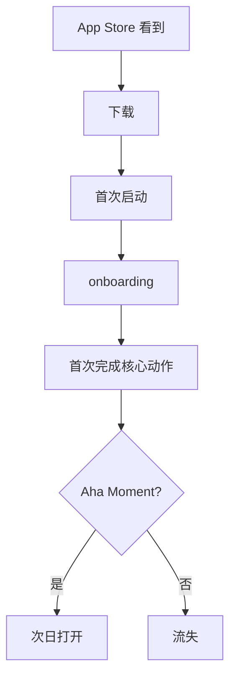

# {产品名} · PRD

**版本**: v1
**状态**: 草稿
**作者**: PRD 大师协作产出
**日期**: {YYYY-MM-DD}
**品类**: C 端移动 App

---

## 0. 阶段路线图与 MVP 定义

> 放在 PRD 最前面。让任何人读第一眼就看懂：MVP 做什么、做完用户拿到什么、要验证什么。

| 阶段 | 验证目标 | 功能模块 | 交付物（做完用户拿到什么） |
| :--- | :--- | :--- | :--- |
| 阶段一 MVP | {验证什么核心假设} | F1、F2、F3 | 用户能完成…… |
| 阶段二 | …… | F4、F5 | …… |
| 阶段三 | …… | F6—F10 | …… |

> **MVP 完成定义**：完成 F1、F2、F3 三个模块后，MVP 即视为完成。

---

## 1. 项目背景与收益

### 1.1 需求简介

### 1.2 收益预估

#### 用户收益（量化）

- {解决多少用户的什么痛点}
- {单用户体验改进的可量化值}

#### 业务收益

- DAU 6 个月达 {N} 万
- MAU 12 个月达 {M} 万
- 留存：次日 {x}% / 7 日 {y}% / 30 日 {z}%
- 营收路径：{广告 / 订阅 / 内购 / 电商}

#### 不做风险

---

## 2. 用户画像

### 2.1 用户分层

| 角色 | 画像 | 渠道 | 高频场景 | 占比 |
|------|------|------|---------|------|
| 核心用户 | 18-25 学生 ... | 小红书 + AppStore | ... | 40% |
| 扩展用户 | 25-35 上班族 | 抖音 + 应用宝 | ... | 35% |
| 边缘用户 | 35+ 兴趣用户 | 微信社群 | ... | 25% |

### 2.2 明确不是谁

### 2.3 用户故事

- **US-1**: 作为 {角色}, 我希望 {动作}, 以便 {价值}
- **US-2**: ...

---

## 3. 功能需求

### 3.1 功能清单

| ID | 功能 | 所属阶段 | 优先级 | 一句话 | 实现 US |
|----|------|---------|--------|--------|--------|

### 3.2 详细功能说明

#### 3.2.1 {功能 A}（FR-1）

**位置**：{Tab → 子模块 → 入口}
**目标**：

**界面元素与展示规则**：

| 元素 | 类型 | 默认态 | 操作后 | 禁用条件 |
|------|------|--------|--------|---------|

**交互逻辑**：

**异常场景**：

**移动端专项**：
- 手势：...
- 横竖屏：...
- 不同尺寸适配（iPhone SE / 标准 / Pro Max / 折叠屏）：...
- 性能：首屏加载 < {ms}
- 离线行为：...
- 推送权限引导：...

---

## 4. 流程图

### 4.1 核心用户旅程

---

## 5. 边界与异常

### 5.1 弱网/无网

### 5.2 权限与隐私

- 相机/相册/位置/通讯录权限申请：何时申请、不给怎么办
- 用户隐私政策：...

### 5.3 平台合规

- AppStore 审核风险点：...
- 安卓应用市场审核：...
- 未成年保护：...

---

## 6. 成功度量

### 6.1 北极星指标

| 指标 | 基线 | 目标 | 时间窗 | 来源 |
|------|------|------|--------|------|
| 7 日留存 | _TBD_ | >25% | 上线 3 月 | 行业基线 |

### 6.2 关键指标

| 指标 | 类型 | 基线 | 目标 | 时间窗 | 来源 |
|------|------|------|------|--------|------|
| 次日留存 | 用户 | _TBD_ | >40% | 上线 1 月 | Sensor Tower |
| DAU/MAU | 用户 | _TBD_ | >20% | 上线 3 月 | 同上 |
| 注册转化 | 用户 | _TBD_ | >50% | 上线 1 月 | QuestMobile |
| 平均使用时长 | 用户 | _TBD_ | >5min | 上线 3 月 | 同上 |
| 付费转化 | 业务 | _TBD_ | >2% | 上线 6 月 | RevenueCat |
| AppStore 评分 | 业务 | _TBD_ | >4.5 | 上线 3 月 | 直接看 |

---

## 7. 风险与依赖

---

## 8. 验收标准（5 维）

### 8.1 主流程
### 8.2 异常
### 8.3 设备/系统兼容
### 8.4 网络场景
### 8.5 回归影响

---

## 9. 依据清单

---

## 10. 附录

### 10.1 推送策略

| 推送类型 | 触发条件 | 文案 | 频次上限 |
|---------|---------|------|---------|

### 10.2 ASO 关键词候选

| 关键词 | 搜索量 | 竞争度 | 我们排名预期 |
|--------|--------|--------|-------------|

### 10.3 关联资料
- 设计稿
- 假设清单
- 调研

---

## 11. 一致性自检
