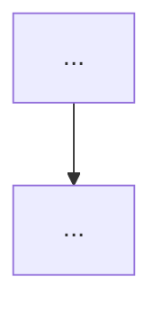

# {产品名} · 开发版（PRD-dev，给程序员 + AI 编码助手）

**版本**: v{N}
**完整 PRD**: PRD.md（含战略/商业/教学内容）
**阅读时长**: 30 分钟
**目的**: 让程序员或 Claude Code/Codex 能直接据此写代码

---

## 1. 项目一句话

{产品名} = 解决 {痛点} 的 {产品形态}

## 2. 用户故事（精简版）

> 完整版见 PRD §2，下面只列 Top 10 P0 用户故事

- **US-1（必做）**: 作为 X，我希望 Y，以便 Z（由 FR-N 实现）
- **US-2（必做）**: ...
- **US-3（必做）**: ...
（仅列 P0 必做 US，应做/可做的不列）

## 3. 功能需求（精简版）

> 完整 FR 列表见 PRD §5，下面是必做 FR 清单 + 1 句话 + 关键边界

| FR ID | 功能 | 一句话 | 关键边界 / 边界数值 |
|-------|------|--------|--------------------|
| FR-1 | ... | ... | ... |

## 4. 核心算法 / 目标函数（如适用）

> 完整数学形式见 PRD §3

```
{算法/目标函数的数学形式}
```

**求解方式**: {选型 + 性能预算}
**关键参数**: {3-5 个最关键的参数 + 取值范围}

## 5. 数据模型（开发版）

> 完整 ER 图 + 字段说明见 PRD §4

### 5.1 核心实体（必做）

| 实体 | 字段（简） | 关系 |
|------|----------|------|
| {Entity-1} | id, name, ... | {1:N to Entity-2} |
| {Entity-2} | ... | ... |

### 5.2 关键约束

- 时区: UTC 存储，按用户时区展示
- PII: {哪些字段是 PII，怎么脱敏}
- 一致性: {强一致 vs 最终一致 哪些}

## 6. 关键流程（核心 1-2 个）

> 完整流程图见 PRD §6

### 6.1 核心决策流程



## 7. 验收标准（核心 P0 测试场景）

> 完整 5 维 AC 见 PRD §10

### 7.1 主流程（必过）

| AC ID | 场景 | 自动化优先级 |
|-------|------|-------------|

### 7.2 异常分支（必过）

| AC ID | 场景 | 自动化优先级 |
|-------|------|-------------|

## 8. 技术栈建议

- **后端**: {建议技术栈 + 理由}
- **前端**: {建议 + 理由}
- **数据库**: {建议}
- **核心库**: {3-5 个必须的库}
- **基础设施**: {部署/CI/CD 建议}

## 9. 工时预估

| 模块 | 工时 | 优先级 |
|------|------|--------|

## 10. 给 AI 编码助手的 5 个"开工提示"

1. **第一步先做这个**: {最值得 spike 验证的)
2. **数据 schema 按这个设计**: {引用 §5}
3. **核心算法用这个库**: {引用 §4}
4. **遇到这些边界问题怎么办**: {引用 PRD §7}
5. **验收按这个跑**: {引用 §7}

## 11. 详细补充

每个章节标"详细见 PRD §X.Y"，不重复写完整内容。

PRD.md 是完整版（{N} 行），本文是浓缩版（约 500 行）。
