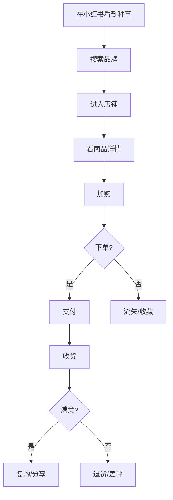

# {产品/项目名} · PRD

**版本**: v1
**状态**: 草稿
**日期**: {YYYY-MM-DD}
**品类**: C 端电商

---

## 0. 阶段路线图与 MVP 定义

> 放在 PRD 最前面。让任何人读第一眼就看懂：MVP 做什么、做完用户拿到什么、要验证什么。

| 阶段 | 验证目标 | 功能模块 | 交付物（做完用户拿到什么） |
| :--- | :--- | :--- | :--- |
| 阶段一 MVP | {验证什么核心假设} | F1、F2、F3 | 用户能完成…… |
| 阶段二 | …… | F4、F5 | …… |
| 阶段三 | …… | F6—F10 | …… |

> **MVP 完成定义**：完成 F1、F2、F3 三个模块后，MVP 即视为完成。

---

## 1. 项目背景与收益

### 1.1 需求简介

### 1.2 收益预估

#### 用户收益
- {解决了用户购物中什么痛点}

#### 业务收益（量化）
- GMV：6 月 {X} 万 / 12 月 {Y} 万
- 客单价目标：{Z} 元
- 复购率目标：{x}%
- 流量来源占比：{自然/付费/达人/直播}

#### 不做风险

---

## 2. 用户画像

| 角色 | 画像 | 客单价 | 复购周期 | 主要渠道 | 占比 |
|------|------|--------|---------|---------|------|

---

## 3. 功能/产品规划

### 3.1 SKU 规划

| SKU | 价格 | 主推卖点 | 目标毛利率 | 备货量 |
|-----|------|---------|----------|--------|

### 3.2 详情页规划

| 页面元素 | 内容要点 | 数据/证据支撑 |
|---------|---------|--------------|

### 3.3 用户故事

- **US-1**: 作为 {用户角色}, 我希望 {购物体验}, 以便 {达成目标}

### 3.4 功能/能力清单（FR）

| ID | 能力 | 所属阶段 | 优先级 | 实现 US |
|----|------|---------|--------|---------|

---

## 4. 用户购物旅程

---

## 5. 营销/获客策略

### 5.1 流量结构

| 渠道 | 占比目标 | 单次成本 | 转化率 | 备注 |
|------|---------|---------|--------|------|
| 自然搜索 | ... | - | ... | SEO |
| 付费投放 | ... | ... | ... | 千川/巨量 |
| 达人种草 | ... | ... | ... | 小红书/抖音 |
| 直播 | ... | ... | ... | 自播+达人 |
| 私域 | ... | - | ... | 企微/社群 |

### 5.2 内容种草矩阵

| 平台 | 内容形式 | 频次 | KPI |
|------|---------|------|-----|

### 5.3 大促策略

| 大促 | 主推 SKU | 折扣 | 备货量 | 流量加持 |
|------|---------|------|--------|---------|

---

## 6. 供应链与履约

### 6.1 供应链

- 自有 / OEM / 经销
- 备货周期
- 缺货补货机制

### 6.2 物流

- 仓储位置
- 物流合作方
- 时效承诺
- 异常处理（破损/丢件/延误）

### 6.3 售后

- 退换货政策
- 客服话术
- 投诉处理流程

---

## 7. 成功度量

| 指标 | 基线 | 目标 | 时间窗 | 来源 |
|------|------|------|--------|------|
| GMV | 0 | {X} | 6 月 | 自定 |
| 客单价 (AOV) | _TBD_ | {Y} | 上线 3 月 | 行业 |
| 转化率 | _TBD_ | >2% | 上线 3 月 | 艾瑞行业基线 |
| 复购率 | _TBD_ | >{X}% | 上线 6 月 | 友盟+ |
| 退货率 | _TBD_ | <{Y}% | 上线 3 月 | 平台均值 |
| ROAS | _TBD_ | >3 | 上线 3 月 | 投放成本 |

---

## 8. 风险与依赖

### 8.1 平台风险
- 平台规则变化
- 抽佣变化
- 流量算法调整

### 8.2 供应链风险
- 缺货
- 质量波动
- 物流中断

### 8.3 合规
- 食品/药品/化妆品资质
- 广告法（绝对化用语）
- 数据隐私

---

## 9. 验收标准

### 9.1 主流程（下单到收货）
### 9.2 异常（退货/投诉/客服）
### 9.3 大促压力测试
### 9.4 合规审核
### 9.5 回归影响

---

## 10. 依据清单

---

## 11. 附录

---

## 12. 一致性自检
