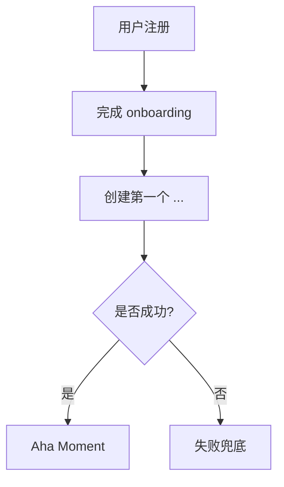
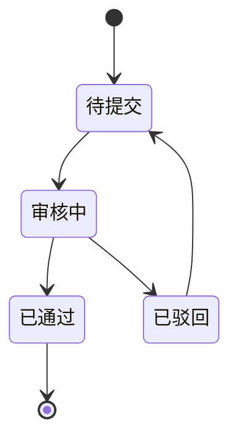

# {产品名} · PRD

**版本**: v1
**状态**: 草稿
**作者**: PRD 大师协作产出
**日期**: {YYYY-MM-DD}
**品类**: B 端 SaaS

---

## 0. 阶段路线图与 MVP 定义

> 放在 PRD 最前面。让任何人读第一眼就看懂：MVP 做什么、做完用户拿到什么、要验证什么。

| 阶段 | 验证目标 | 功能模块 | 交付物（做完用户拿到什么） |
| :--- | :--- | :--- | :--- |
| 阶段一 MVP | {验证什么核心假设} | F1、F2、F3 | 用户能完成…… |
| 阶段二 | …… | F4、F5 | …… |
| 阶段三 | …… | F6—F10 | …… |

> **MVP 完成定义**：完成 F1、F2、F3 三个模块后，MVP 即视为完成。

---

## 1. 项目背景与收益

### 1.1 需求简介（一句话）

{为什么做、做什么、期望效果}

### 1.2 收益预估

#### 用户收益（量化）

- {把 xxx 从 x 提升到 y} —— 依据：{A/B/C/D/E 等级} —— 来源：{...}
- ...

#### 业务收益（量化）

- {ARR 6 个月内达 X 万 / MRR Month-over-Month 增长 Y%}
- {客户数从 0 → Z}
- 依据：{...}

#### 不做风险

- {不做的后果，量化}

---

## 2. 用户画像

### 2.1 角色与权限矩阵（B 端必须）

| 角色 | 典型职位 | 公司规模 | 行业 | 决策权 | 使用频次 | 关键场景 |
|------|---------|---------|------|--------|---------|---------|
| 决策者 | CFO/HR VP | 100-1000 人 | ... | 拍板买 | 月级 | 看 ROI、看汇报 |
| 管理者 | HR Manager | 同上 | 同上 | 推动落地 | 周级 | 配置、培训、督促 |
| 使用者 | 员工 | 同上 | 同上 | 无 | 日级/周级 | 完成核心动作 |

### 2.2 明确不是谁

- ❌ {排除角色 1，理由}
- ❌ {排除场景 1，理由}

### 2.3 用户故事

- **US-1**: 作为 {角色}, 我希望 {动作}, 以便 {价值}
- **US-2**: ...

每个 US 必须有对应 FR 实现（一致性校验会跑）。

---

## 3. 功能需求

### 3.1 功能清单

| ID | 功能 | 所属阶段 | 优先级 | 一句话说明 | 实现 US |
|----|------|---------|--------|----------|---------|
| FR-1 | ... | 阶段一(MVP) | 必做 | ... | US-1 |
| FR-2 | ... | 阶段一(MVP) | 必做 | ... | US-1, US-2 |
| FR-3 | ... | 阶段二 | 应做 | ... | US-3 |
| FR-4 | ... | 阶段二 | 可做 | ... | US-4 |

（用"必做/应做/可做"代替 P0/P1/P2）

### 3.2 详细功能说明（共享层）

#### 3.2.1 通用约定

- 时区：...
- 时间格式：...
- 国际化：...
- 数据权限模型：...（行级别 / 字段级别 / 数据隔离）

### 3.3 详细功能说明（模块层）

#### 3.3.1 {功能 A}（FR-1）

**位置**：{入口路径}
**目标**：{核心业务目标，一句话}

**界面元素与展示规则**：

| 元素 | 类型 | 默认态 | 操作后 | 禁用条件 |
|------|------|--------|--------|---------|
| ... | 按钮 | "..." | ... | ... |

**交互逻辑**：

- 用户操作 → 系统响应 → 下一状态
- ...

**异常场景**：

- 网络异常：...
- 权限不足：...
- 数据不存在：...

**边界与限制**：

- 最大数量：...
- 防抖间隔：...
- 状态保持时长：...

---

## 4. 流程与状态图表

### 4.1 核心用户旅程（Mermaid）



### 4.2 关键状态机（如有）



---

## 5. 边界与异常场景

### 5.1 数据边界

- 空数据：...
- 超大数据：...
- 异常数据：...

### 5.2 并发与冲突

- 同一资源多人编辑：...
- 异步操作冲突：...

### 5.3 第三方依赖失败

- {依赖服务 A} 挂了：降级方案
- ...

---

## 6. 成功度量

### 6.1 北极星指标

| 指标 | 当前基线 | 6 月目标 | 12 月目标 | 来源 |
|------|---------|---------|----------|------|
| NDR (Net Dollar Retention) | _TBD_ | >100% | >120% | 行业基线 OpenView |

### 6.2 关键指标矩阵

| 指标 | 类型 | 基线 | 目标 | 时间窗 | 数据来源 |
|------|------|------|------|--------|---------|
| 注册到激活转化 | 用户 | _TBD_ | >40% | 上线后 3 个月 | 行业基线 |
| 月流失率 | 业务 | _TBD_ | <5%/月 | 同上 | 行业基线 |
| MRR | 业务 | 0 | $X | 上线后 6 个月 | 公司目标 |
| NPS | 用户 | _TBD_ | >30 | 上线后 6 个月 | 行业基线 |

**铁律**：每个指标必须有 基线 + 目标 + 时间窗 + 来源。

---

## 7. 风险与依赖

### 7.1 技术风险

- 风险 1：...（影响：高/中/低，缓解措施）
- ...

### 7.2 商业风险

- 风险 1：...

### 7.3 外部依赖

- 依赖 1：...（SLA、替代方案）
- ...

---

## 8. 验收标准（5 维必须覆盖）

### 8.1 主流程

| 测试场景 | 前置条件 | 操作 | 期望结果 | 判定 |
|---------|---------|------|---------|------|
| 注册并完成 onboarding | 全新用户 | ... | ... | ✅/❌ |

### 8.2 异常分支

| 场景 | 前置 | 操作 | 期望 |
|------|------|------|------|

### 8.3 权限与角色

| 场景 | 角色 | 操作 | 期望 |
|------|------|------|------|

### 8.4 兼容性

| 平台/浏览器 | 期望 |
|-----------|------|

### 8.5 回归影响

| 已有功能 | 改了 X 是否影响 | 验证方式 |
|---------|----------------|---------|

---

## 9. 依据清单

### 9.1 用户依据

- 依据 1：{访谈/调研/数据}（来源 + 链接）

### 9.2 竞品依据

- 见 evidence/competitors.md

### 9.3 行业 Benchmark

- 见 evidence/benchmark.md

### 9.4 内部假设

- 见 assumptions.md（必读，每条都需上线后验证）

---

## 10. 附录

### 10.1 术语表

| 术语 | 含义 |
|------|------|

### 10.2 关联资料

- 设计稿：...
- 调研记录：...
- 竞品分析：evidence/competitors.md
- 假设清单：assumptions.md
- 辩论记录：debate-log.md
- 跟企业家对话存档：conversation.md

---

## 11. 一致性自检（自动生成，校验通过才算定稿）

由 `check_consistency.py` 跑后填入：

```
Consistency check:
- User Stories → FR mapping:
  - US-1 → FR-1, FR-2 [PASS]
  - ...
- Business Goals → Metrics:
  - "ARR 6 月达 X 万" → Metric "MRR" [PASS]
  - ...
- User Goals → Metrics:
  - ...
- Persona / Goal / US alignment: [PASS]
```
